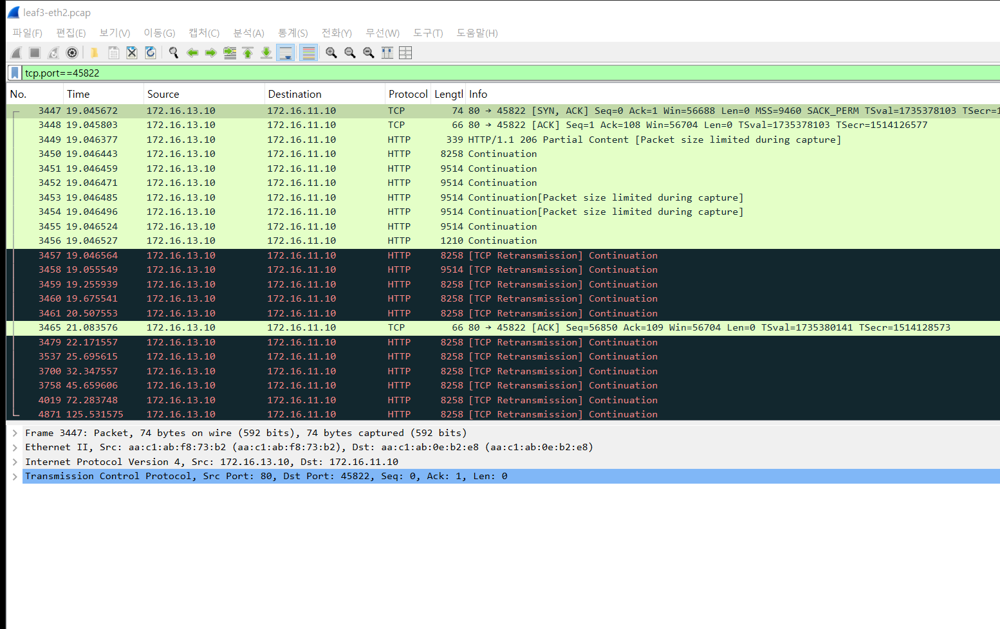

<div align="center">


*A hands-on Clos fabric lab: eBGP underlay, ECMP, failure convergence measured in numbers,
BFD tuning, and a VXLAN/EVPN overlay — fully reproducible with scripts.*


<br>

### [설계와 이유](docs/DESIGN.md) · [장애 시나리오](#장애-시나리오) · [변경 기록](CHANGELOG.md)

<br>

<table>
<tr>
<th width="50%"><a href="docs/DESIGN.md">EVPN-VXLAN 패브릭 — 어떻게, 왜 이렇게 지었나 →</a></th>
<th width="50%"><a href="#장애-시나리오">장애 시나리오 — 고장 내고 패킷으로 읽기 →</a></th>
</tr>
<tr>
<td><a href="docs/DESIGN.md"></a></td>
<td><a href="experiments/01-hidden-mtu-meets-spine-failure/README.md"></a></td>
</tr>
<tr>
<td align="left">

- 스파인 2 · 리프 4 · 서버 6, **장비마다 AS 하나인 eBGP 언더레이**
- 리프가 VTEP — 랙이 달라도 **같은 L2를 VXLAN으로**, MAC은 **BGP EVPN이 광고**
- eBGP 패브릭에서 EVPN이 조용히 실패하는 함정: **RT 불일치, 스파인의 넥스트홉 변경**
- 주소·AS·포트는 전부 **장비 번호에서 계산**

</td>
<td align="left">

- [01 숨은 MTU 결함 + 스파인 장애](experiments/01-hidden-mtu-meets-spine-failure/README.md) — 61% → **0%**, ping은 내내 정상
- [02 물리 계층 불량](experiments/02-physical-corruption/README.md) — 비트 하나가 `172.16` → `172.0`
- [03 L2 루프](experiments/03-broadcast-storm/README.md) — ARP 하나가 3초에 **136만 개**
- [04 DNS 장애](experiments/04-dns-failure/README.md) — 같은 고장, 실패까지 0.2초 / **10.8초**
- [05 ECMP 분산](experiments/05-ecmp-hash/README.md) — 같은 흐름이 **다른 스파인으로**
- [06 링크 다운](experiments/06-link-down-convergence/README.md) — 0.20초, 스파인의 valley path
- [07 스파인 먹통 + BFD](experiments/07-spine-freeze-bfd/README.md) — **7.61초 → 1.15초**
- [08 패킷의 일생](experiments/08-packet-life-evpn/README.md) — 주소록 한 줄이 50바이트 상자가 되기까지
- [10 마이크로버스트](experiments/10-microburst/README.md) — 70% 손실인데 **드랍 0, 알람 0**
- [12 RoCEv2](experiments/12-roce/README.md) — 손실 1%에 TCP는 그대로, RoCE는 **-75%**

</td>
</tr>
</table>

</div>

## 프로젝트 개요

clos-fabric은 현대 데이터센터의 표준 구조인 Clos(spine-leaf) 패브릭을 노트북 위 FRR 컨테이너 12대(스파인 2 · 리프 4 · 서버 6)로 재현한 실습 랩이다.
RFC 7938 방식의 eBGP 언더레이 위에 ECMP, BFD, VXLAN/EVPN 오버레이를 쌓았고, 구성에서 끝내지 않고 장애를 직접 넣어 **숫자로 검증**했다.
골조가 갖춰진 지금은 그 위에서 장애를 하나씩 재현하고, **패킷 캡처와 모니터링으로 장애가 어떻게 보이는지 읽어내는 것**에 집중하고 있다.

| 패킷 캡처 — 장애 지점의 흐름을 Wireshark로 | 모니터링 — 같은 장애를 Grafana로 |
|---|---|
|  |  |
| 잘못된 DNS 레코드: 이름 해석은 성공하고, 없는 주소로 보낸 SYN이 재전송 끝에 Host unreachable로 끝난다 — [실험 04](experiments/04-dns-failure/README.md) | MTU 장애: BGP 세션은 16/16으로 멀쩡한데 링크 드랍과 MTU 불일치 알람이 울린다 — [실험 01](experiments/01-hidden-mtu-meets-spine-failure/README.md) |

<details>
<summary><b>English summary</b></summary>
<br>

A 12-container Clos (spine-leaf) datacenter fabric built with FRRouting and containerlab: 2 spines, 4 leaves, 6 servers. The underlay follows RFC 7938 — eBGP with one private AS per device, ECMP enabled via <code>multipath-relax</code>. On top of it I injected failures and measured convergence: a link cut converges in <b>0.2s</b>, a silently frozen spine blackholes traffic for <b>7.6–8.8s</b> (hold-timer bound), and adding <b>BFD (300ms×3)</b> cuts that to <b>0.8–1.2s</b>. ECMP load-sharing was measured per-link with 40 UDP flows, showing why <code>fib_multipath_hash_policy=1</code> is mandatory. A VXLAN/EVPN overlay stretches one L2 segment across racks, including the eBGP-specific pitfalls (route-target mismatch, next-hop rewriting). Design rationale lives in <a href="docs/DESIGN.md">docs/DESIGN.md</a>, experiments and evidence in <a href="docs/EXPERIMENTS.md">docs/EXPERIMENTS.md</a>. Everything is reproducible with the scripts in this repo.

</details>

## 장애 시나리오

패브릭의 골조는 고정해 두고, 그 위에서 장애를 하나씩 재현해 번호를 붙여 쌓는다.
실험 하나가 디렉터리 하나이고, 끝나면 베이스를 원래 값으로 되돌린다 — 규칙과 추가 방법은 [experiments/](experiments/README.md).
01~08번과 10·12번은 모두 장애 지점 앞뒤를 동시에 캡처해 **Wireshark 화면으로 패킷 흐름을 읽는** 장이다. 원본 pcap도 함께 있다.

| # | 실험 | 주입하는 장애 | 본 것 |
|---|---|---|---|
| 01 | [숨은 MTU 결함 + 스파인 장애](experiments/01-hidden-mtu-meets-spine-failure/README.md) | spine2 포트 MTU 1500인 채로 spine1이 조용히 죽음 | 평소엔 HTTP 61%만 성공하던 회색 장애가 spine1이 죽자 **0%**. 작은 ping은 내내 정상. 리프는 hold timer 8.8초 뒤에야 spine1을 뺐고, 알람은 결함 +9초, 먹통 +9초. 같은 장애로 모니터링 1차(세션만, **알람 0**) → 2차(데이터플레인, 알람 2) → 3차(블랙박스 프로브)를 비교 |
| 02 | [물리 계층 불량](experiments/02-physical-corruption/README.md) | leaf3→h3 구간에 비트 깨짐 4% / 몰려오는 손실 | 받는 쪽에서 체크섬 오류 프레임(주소 비트가 뒤집혀 `172.0.13.10`), 보내는 쪽에서 Dup ACK와 재전송. 몰린 손실은 ping 9개 연속 소실 |
| 03 | [L2 루프·브로드캐스트 스톰](experiments/03-broadcast-storm/README.md) | VXLAN 브리지에 veth 양 끝을 꽂음 | ARP 하나가 3초에 **136만 개**. MAC 표 오염으로 유니캐스트 100% 손실, EVPN이 남의 MAC을 광고해 MAC Mobility 순번 폭주 |
| 04 | [DNS 장애](experiments/04-dns-failure/README.md) | 잘못된 레코드 / 프로세스 중지 / 53번 DROP | 셋 다 IP 접속은 정상. 실패까지 3.3초 / **0.2초** / **10.8초** — 고장 방식마다 패킷 모양이 다르다 |
| 05 | [ECMP 분산](experiments/05-ecmp-hash/README.md) | 해시 정책 0 / 1 / 3에서 UDP 흐름 40개를 두 번씩 | 정책 0은 **40:0**. 정책 1은 갈리지만 같은 5-tuple을 다시 보내면 **18개가 다른 스파인으로** — 서버 소켓의 해시값을 그대로 쓴다. 헤더만 보는 정책 3은 0개 |
| 06 | [링크 다운 수렴](experiments/06-link-down-convergence/README.md) | 지금 쓰는 스파인 링크를 leaf1에서 내림 | 끊김 **0.20초**. leaf1은 0.011초에 남은 링크로 돌렸고, 끊김은 반대편 leaf4가 BGP로 듣기까지의 시간. spine1은 철회 대신 **valley path**(AS 4개)를 광고 |
| 07 | [스파인 무응답과 BFD](experiments/07-spine-freeze-bfd/README.md) | 링크는 up인 채 spine1을 얼림, BFD 전후 | **7.61초 → 1.15초**. 마지막 KEEPALIVE에서 정확히 9.003초 뒤 Hold Timer Expired, 마지막 BFD에서 0.900초 뒤 BFD Down. 얼린 스파인의 커널은 TCP ACK를 계속 보냈다 |
| 08 | [패킷의 일생](experiments/08-packet-life-evpn/README.md) | v1 → v3(EVPN-VXLAN)와 h1 → h3(순수 L3)를 같은 리프·스파인 위에서 | Type-2 하나가 leaf1의 fdb에 `dst 10.255.1.3`으로 내려앉고, 98바이트 프레임이 148바이트 상자로 스파인을 지난다(바깥 TTL만 −1). 같은 서브넷 확장·0.35초 이사·같은 IP의 두 테넌트를 얻는 대신 50바이트, MTU 함정(기본값에서 TCP 0 Mbit/s), 언더레이가 멀쩡해도 죽는 오버레이를 낸다 |
| 10 | [마이크로버스트](experiments/10-microburst/README.md) | 평균 90Mbit/s를 고르게 / 300개씩 몰아서 100Mbit·버퍼 64KB 포트로 | 고르게 보내면 손실 0, 몰아서 보내면 **70% 넘게 손실**. 버퍼 드랍은 큐 통계에만 쌓여 모니터링은 드랍 0·알람 0, 5초 평균 송신 속도는 오히려 90 → 25Mbit/s로 낮아 보였다. 1ms로 세면 순간 2,330Mbit/s |
| 12 | [RoCEv2: 깔고, 보고, 튜닝하기](experiments/12-roce/README.md) | Soft-RoCE를 커널에 올려 g1~g4(VRF)를 leaf에 붙임. 손실 주입, 3:1 인캐스트, QP 수 | 손실 1%에 RoCE **−75%**(TCP는 거의 그대로) — NAK 뒤 빠진 PSN부터 전부 다시 보내는 go-back-N. 얕은 큐 인캐스트는 포트의 6~9%로 붕괴(송신자가 65ms 타이머만 기다림). 타이머를 줄이면 드랍만 4배, 버퍼를 키우면 지연 100배, **송신 창 4**로 드랍 0·포트의 76~92%·ping 0.2ms |

예정: 09 세션 테이블 고갈, 11 비대칭 라우팅 + 상태 기반 방화벽, 15 EVPN 패브릭 위의 5G 코어 — 전체 목록은 [experiments/](experiments/README.md).

## 빠른 시작

준비물: 리눅스 + Docker + [containerlab](https://containerlab.dev) (이 랩은 WSL2 Ubuntu에서 개발·측정했다. 컨테이너 12대, 메모리 500MB 남짓)

```bash
git clone https://github.com/Sangmok-Woo/clos-fabric && cd clos-fabric
./scripts/deploy.sh up      # 12대 기동, BGP 세션 8개 자동 수립
./scripts/check.sh          # 세션·ECMP·서버 간 통신 점검
```

## 스크립트

| 명령 | 하는 일 |
|---|---|
| `./scripts/deploy.sh up\|down\|redeploy` | 랩 기동 / 철거 |
| `./scripts/check.sh` | BGP 세션·ECMP·서버 간 통신·BFD 상태 점검 |
| `./scripts/ecmp-hash.sh` | 해시 정책 0/1 에서 링크별 트래픽 분산 측정 |
| `./scripts/failover.sh link\|freeze` | 장애 주입 후 끊긴 시간 측정 |
| `./scripts/bfd-apply.sh on\|off` | BFD 적용/해제 |
| `./scripts/evpn-apply.sh` | VXLAN + BGP EVPN 구성 및 검증 |
| `./scripts/day.sh` | 30일 장애 훈련 진행기 — 오늘의 고장 / 정답·해설·자동복구 |
| `./scripts/listen-range-test.sh` | 스파인 이웃을 동적(listen range)으로 바꿔보고 원복 |
| `./scripts/unnumbered-test.sh` | spine1↔leaf1 한 링크만 BGP unnumbered로 바꿔 fe80 넥스트홉 확인 후 원복 |
| `./scripts/in.sh <노드> <명령>` | 호스트의 도구(tcpdump 등)를 컨테이너 네트워크 안에서 실행 |

## Roadmap

- [ ] **설정 생성기** — `fabric.yml`의 숫자(스파인 수·리프 수)만 바꾸면 토폴로지와 FRR 설정 전체가 재생성되게. 주소·AS·포트가 전부 계산식이라([DESIGN §3~4](docs/DESIGN.md)) 코드로 옮기기만 하면 된다
- [ ] **BGP unnumbered 전면 전환** — 검증은 끝났고([EXPERIMENTS §4](docs/EXPERIMENTS.md)), 재배포 때 링크 IP를 걷어낸다
- [x] **모니터링** ✅ — Prometheus + Grafana. 자작 수집기가 세션·경로·BFD를 긁고, 기대값을 토폴로지에서 계산해 알람. 감지 시간 실측(BFD 없음 14.1초 → 있음 6.2초). 2차로 인터페이스 드랍·MTU·TCP 재전송, 3차로 블랙박스 링크 프로브 추가([실험 01](experiments/01-hidden-mtu-meets-spine-failure/README.md)). → [monitoring/](monitoring/README.md)
- [x] **MTU** ✅ — 스파인 한 포트의 MTU 결함이 다른 스파인 장애 때 드러나는 과정을 재현·측정. → [실험 01](experiments/01-hidden-mtu-meets-spine-failure/README.md)
- [ ] **쿠버네티스 연동** — Calico/Cilium이 리프와 BGP 피어링해 파드 네트워크를 패브릭에 직접 태우기

## 문서

| 문서 | 무엇을 적나 |
|---|---|
| [docs/DESIGN.md](docs/DESIGN.md) | **설계 기준과 이유** — 왜 spine-leaf·eBGP인가, 주소·AS·포트가 전부 계산식인 이유, 운영 원칙 |
| [docs/EXPERIMENTS.md](docs/EXPERIMENTS.md) | **실험과 실측** — 측정 방법, ECMP·수렴·BFD·EVPN의 숫자와 함정, 검증으로 내린 결정 2건 |
| [experiments/README.md](experiments/README.md) | **장애 시나리오** — 번호 붙인 실험 목록, 실험 디렉터리 규칙, 새 실험 추가 방법 |
| [monitoring/README.md](monitoring/README.md) | **관측 시나리오** — Prometheus+Grafana 구성, 자작 수집기, 감지 시간 실측 |
| [CHANGELOG.md](CHANGELOG.md) | 무엇이 언제 바뀌었나 — 검증·결정·변경의 시간 순 기록 |

---

<div align="center">
<sub>FRRouting + containerlab으로 노트북 위에 세운 랩 — 이 README의 모든 수치는 저장소의 스크립트로 재현할 수 있다.</sub>
</div>
