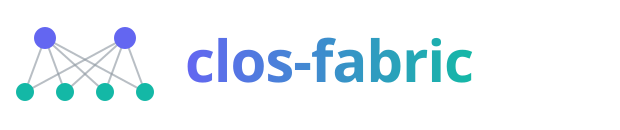
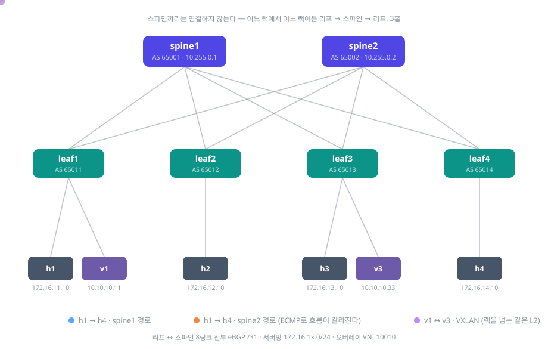
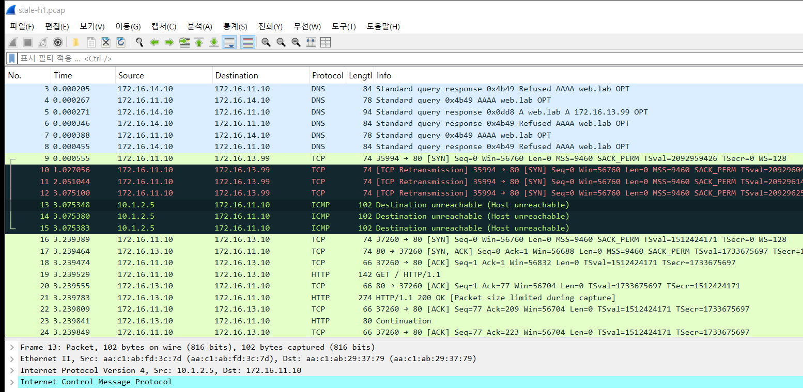
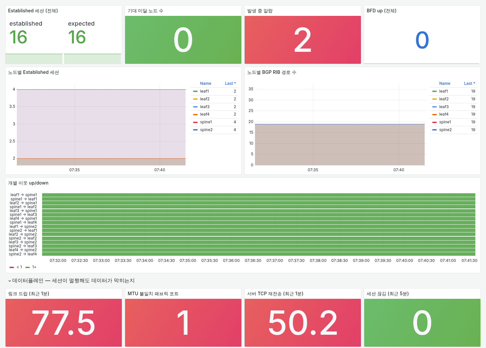

<div align="center">



*A hands-on Clos fabric lab: eBGP underlay, ECMP, failure convergence measured in numbers,
BFD tuning, and a VXLAN/EVPN overlay — fully reproducible with scripts.*


<br>

[**설계와 이유**](docs/DESIGN.md) · [**실험과 실측**](docs/EXPERIMENTS.md) · [**장애 시나리오**](#장애-시나리오) · [**빠른 시작**](#빠른-시작) · [**Roadmap**](#roadmap) · [**변경 기록**](CHANGELOG.md)



</div>

## 프로젝트 개요

clos-fabric은 현대 데이터센터의 표준 구조인 Clos(spine-leaf) 패브릭을 노트북 위 FRR 컨테이너 12대(스파인 2 · 리프 4 · 서버 6)로 재현한 실습 랩이다.
RFC 7938 방식의 eBGP 언더레이 위에 ECMP, BFD, VXLAN/EVPN 오버레이를 쌓았고, 구성에서 끝내지 않고 장애를 직접 넣어 **숫자로 검증**했다.
골조가 갖춰진 지금은 그 위에서 장애를 하나씩 재현하고, **패킷 캡처와 모니터링으로 장애가 어떻게 보이는지 읽어내는 것**에 집중하고 있다.

| 패킷 캡처 — 장애 지점의 흐름을 Wireshark로 | 모니터링 — 같은 장애를 Grafana로 |
|---|---|
|  |  |
| 잘못된 DNS 레코드: 이름 해석은 성공하고, 없는 주소로 보낸 SYN이 재전송 끝에 Host unreachable로 끝난다 — [실험 06](experiments/06-dns-failure/README.md) | MTU 장애: BGP 세션은 16/16으로 멀쩡한데 링크 드랍과 MTU 불일치 알람이 울린다 — [실험 02](experiments/02-observability-gap/README.md) |

<details>
<summary><b>English summary</b></summary>
<br>

A 12-container Clos (spine-leaf) datacenter fabric built with FRRouting and containerlab: 2 spines, 4 leaves, 6 servers. The underlay follows RFC 7938 — eBGP with one private AS per device, ECMP enabled via <code>multipath-relax</code>. On top of it I injected failures and measured convergence: a link cut converges in <b>0.2s</b>, a silently frozen spine blackholes traffic for <b>7.6–8.8s</b> (hold-timer bound), and adding <b>BFD (300ms×3)</b> cuts that to <b>0.8–1.2s</b>. ECMP load-sharing was measured per-link with 40 UDP flows, showing why <code>fib_multipath_hash_policy=1</code> is mandatory. A VXLAN/EVPN overlay stretches one L2 segment across racks, including the eBGP-specific pitfalls (route-target mismatch, next-hop rewriting). Design rationale lives in <a href="docs/DESIGN.md">docs/DESIGN.md</a>, experiments and evidence in <a href="docs/EXPERIMENTS.md">docs/EXPERIMENTS.md</a>. Everything is reproducible with the scripts in this repo.

</details>

## 실측 결과

| 실험 | 조건 | 결과 |
|---|---|---|
| 링크 다운 복구 | 케이블 단선 (인터페이스 다운 감지) | **0.2초** |
| 스파인 무응답 복구 | BFD 없음 — BGP 타이머(3/9초)에 의존 | 7.6초 |
| 스파인 무응답 복구 | **BFD 300ms×3 적용** | **0.8초 (약 10배 개선)** |
| ECMP 분산 (흐름 40개) | 해시가 IP만 볼 때 → L4 포트까지 볼 때 | 41:1 (몰빵) → **12:30 (분산)** |
| 랙을 넘는 L2 | VXLAN VNI 10010 + BGP EVPN | v1 ↔ v3 통신, 원격 MAC을 leaf3 VTEP으로 학습 |

> 첫 측정과 재측정(8.8초/1.2초)의 차이, 측정 방법, 전체 출력은 [docs/EXPERIMENTS.md](docs/EXPERIMENTS.md)에 있다.

### 같은 장애, BFD 전후

<div align="center">

</div>

위 터미널은 실제 실행 출력을 그대로 재생한 것이다. 스파인을 조용히 얼리는 같은 장애를 BFD 적용 전후로 두 번 주입했다 — 전체 출력과 타임라인 해설은 [docs/EXPERIMENTS.md](docs/EXPERIMENTS.md).

## 검증의 흐름

1. **언더레이** — 리프↔스파인 8링크 전부 eBGP(/31, 장비당 AS 하나). `maximum-paths` + `multipath-relax`로 ECMP 확보
2. **부하분산** — 커널 해시 정책 0/1을 바꿔가며 링크별 분산을 tcpdump로 계수
3. **장애와 수렴** — 링크 다운 / 스파인 freeze를 주입하고 끊긴 시간을 측정, BFD로 개선
4. **오버레이** — VXLAN + BGP EVPN(Type-2/3)으로 랙이 다른 두 서버를 같은 L2로
5. **확장 검증** — 동적 이웃(listen range)은 검증 후 **기각**, BGP unnumbered는 fe80 넥스트홉까지 확인 후 **채택** ([CHANGELOG](CHANGELOG.md))
6. **관측** — Prometheus + Grafana로 세션·경로를 5초마다 긁고, 장애를 **모니터링이 알아채는 시간**을 실측 ([monitoring/](monitoring/README.md))

여기에 매일 하나씩 고장 내고 복구하는 **30일 장애 훈련**(`scripts/day.sh`)을 얹어 운영 감각을 유지한다.

> 이 브랜치(main)는 정리된 기록이다. 진행 중인 작업·운영 절차·훈련 일지는 [`lab` 브랜치](https://github.com/Sangmok-Woo/clos-fabric/tree/lab)에 있다.

## 장애 시나리오

위까지가 패브릭의 골조다. 골조는 고정해 두고, 그 위에서 장애를 하나씩 재현해 번호를 붙여 쌓는다.
실험 하나가 디렉터리 하나이고, 끝나면 베이스를 원래 값으로 되돌린다 — 규칙과 추가 방법은 [experiments/](experiments/README.md).
04번부터는 장애 지점 앞뒤를 동시에 캡처해 **Wireshark 화면으로 패킷 흐름을 읽는** 장이다. 원본 pcap도 함께 있다.

| # | 실험 | 주입하는 장애 | 본 것 |
|---|---|---|---|
| 01 | [숨은 MTU 결함 + 스파인 장애](experiments/01-hidden-mtu-meets-spine-failure/README.md) | spine2 포트 MTU 1500인 채로 spine1이 조용히 죽음 | 평소엔 HTTP 61%만 성공하던 회색 장애가 spine1이 죽자 **0%**. 작은 ping은 내내 정상. 리프는 hold timer 8.8초 뒤에야 spine1을 뺐고, 알람은 결함 +9초, 먹통 +9초 |
| 02 | [관측 사각지대](experiments/02-observability-gap/README.md) | MTU 장애를 모니터링 아래에서 주입 | 세션만 보던 1차 모니터링은 **16/16, 알람 0**. 드랍·MTU·TCP 재전송을 더한 2차는 같은 장애에 **알람 2개** |
| 04 | [물리 계층 불량](experiments/04-physical-corruption/README.md) | leaf3→h3 구간에 비트 깨짐 4% / 몰려오는 손실 | 받는 쪽에서 체크섬 오류 프레임(주소 비트가 뒤집혀 `172.0.13.10`), 보내는 쪽에서 Dup ACK와 재전송. 몰린 손실은 ping 9개 연속 소실 |
| 05 | [L2 루프·브로드캐스트 스톰](experiments/05-broadcast-storm/README.md) | VXLAN 브리지에 veth 양 끝을 꽂음 | ARP 하나가 3초에 **136만 개**. MAC 표 오염으로 유니캐스트 100% 손실, EVPN이 남의 MAC을 광고해 MAC Mobility 순번 폭주 |
| 06 | [DNS 장애](experiments/06-dns-failure/README.md) | 잘못된 레코드 / 프로세스 중지 / 53번 DROP | 셋 다 IP 접속은 정상. 실패까지 3.3초 / **0.2초** / **10.8초** — 고장 방식마다 패킷 모양이 다르다 |

예정: 03 플래핑, 07~11(비대칭 라우팅, 설정 실수, 마이크로버스트, 세션 고갈, IP 충돌), 12~17(위 실측 결과의 기본 검증을 패킷 캡처로 다시 측정) — 전체 목록은 [experiments/](experiments/README.md).

## 빠른 시작

준비물: 리눅스 + Docker + [containerlab](https://containerlab.dev) (이 랩은 WSL2 Ubuntu에서 개발·측정했다. 컨테이너 12대, 메모리 500MB 남짓)

```bash
git clone https://github.com/Sangmok-Woo/clos-fabric && cd clos-fabric
./scripts/deploy.sh up      # 12대 기동, BGP 세션 8개 자동 수립
./scripts/check.sh          # 세션·ECMP·서버 간 통신 점검
```

## 스크립트

| 명령 | 하는 일 |
|---|---|
| `./scripts/deploy.sh up\|down\|redeploy` | 랩 기동 / 철거 |
| `./scripts/check.sh` | BGP 세션·ECMP·서버 간 통신·BFD 상태 점검 |
| `./scripts/ecmp-hash.sh` | 해시 정책 0/1 에서 링크별 트래픽 분산 측정 |
| `./scripts/failover.sh link\|freeze` | 장애 주입 후 끊긴 시간 측정 |
| `./scripts/bfd-apply.sh on\|off` | BFD 적용/해제 |
| `./scripts/evpn-apply.sh` | VXLAN + BGP EVPN 구성 및 검증 |
| `./scripts/day.sh` | 30일 장애 훈련 진행기 — 오늘의 고장 / 정답·해설·자동복구 |
| `./scripts/listen-range-test.sh` | 스파인 이웃을 동적(listen range)으로 바꿔보고 원복 |
| `./scripts/unnumbered-test.sh` | spine1↔leaf1 한 링크만 BGP unnumbered로 바꿔 fe80 넥스트홉 확인 후 원복 |
| `./scripts/in.sh <노드> <명령>` | 호스트의 도구(tcpdump 등)를 컨테이너 네트워크 안에서 실행 |

## Roadmap

- [ ] **설정 생성기** — `fabric.yml`의 숫자(스파인 수·리프 수)만 바꾸면 토폴로지와 FRR 설정 전체가 재생성되게. 주소·AS·포트가 전부 계산식이라([DESIGN §3~4](docs/DESIGN.md)) 코드로 옮기기만 하면 된다
- [ ] **BGP unnumbered 전면 전환** — 검증은 끝났고([EXPERIMENTS §4](docs/EXPERIMENTS.md)), 재배포 때 링크 IP를 걷어낸다
- [x] **모니터링** ✅ — Prometheus + Grafana. 자작 수집기가 세션·경로·BFD를 긁고, 기대값을 토폴로지에서 계산해 알람. 감지 시간 실측(BFD 없음 14.1초 → 있음 6.2초). 2차로 인터페이스 드랍·MTU·TCP 재전송 추가([실험 02](experiments/02-observability-gap/README.md)). → [monitoring/](monitoring/README.md)
- [x] **MTU** ✅ — 스파인 한 포트의 MTU 결함이 다른 스파인 장애 때 드러나는 과정을 재현·측정. → [실험 01](experiments/01-hidden-mtu-meets-spine-failure/README.md)
- [ ] **쿠버네티스 연동** — Calico/Cilium이 리프와 BGP 피어링해 파드 네트워크를 패브릭에 직접 태우기

## 문서

| 문서 | 무엇을 적나 |
|---|---|
| [docs/DESIGN.md](docs/DESIGN.md) | **설계 기준과 이유** — 왜 spine-leaf·eBGP인가, 주소·AS·포트가 전부 계산식인 이유, 운영 원칙 |
| [docs/EXPERIMENTS.md](docs/EXPERIMENTS.md) | **실험과 실측** — 측정 방법, ECMP·수렴·BFD·EVPN의 숫자와 함정, 검증으로 내린 결정 2건 |
| [experiments/README.md](experiments/README.md) | **장애 시나리오** — 번호 붙인 실험 목록, 실험 디렉터리 규칙, 새 실험 추가 방법 |
| [monitoring/README.md](monitoring/README.md) | **관측 시나리오** — Prometheus+Grafana 구성, 자작 수집기, 감지 시간 실측 |
| [CHANGELOG.md](CHANGELOG.md) | 무엇이 언제 바뀌었나 — 검증·결정·변경의 시간 순 기록 |

---

<div align="center">
<sub>FRRouting + containerlab으로 노트북 위에 세운 랩 — 이 README의 모든 수치는 저장소의 스크립트로 재현할 수 있다.</sub>
</div>
