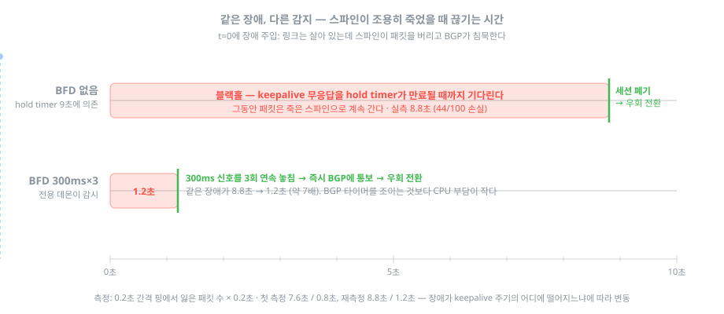

# 검증 — 실험과 실측

> 설계가 옳은지는 숫자로 확인한다. 모든 값은 이 랩(FRR 10.2.1, containerlab)에서 직접 측정했고,
> 각 실험은 저장소의 스크립트로 재현할 수 있다. 설계 기준은 [DESIGN.md](DESIGN.md).

**측정 방법** — 0.2초 간격 핑을 흘리면서 장애를 주입하고, `잃은 패킷 수 × 0.2초`를 끊긴 시간으로 삼는다.
ECMP 환경에서는 핑이 어느 스파인을 탈지 알 수 없으므로, 스크립트가 먼저 링크 카운터로 **현재 경로를 찾아낸 뒤 그쪽을 죽인다.**

## 1. ECMP — "경로가 2개"와 "반씩 나눠 간다"는 다르다

라우팅 테이블에 넥스트홉이 2개 있어도, 실제 분산은 커널의 **해시 정책**이 결정한다.
리눅스 기본값(정책 0)은 출발지·목적지 IP만 보므로, IP 쌍이 같으면 흐름이 아무리 많아도 한 링크로 몰린다.

목적지 포트만 다른 UDP 흐름 40개를 던져 링크별로 계수한 결과 (`./scripts/ecmp-hash.sh`):

| 해시 정책 | → spine1 | → spine2 | 판정 |
|---|---|---|---|
| 0 (L3: IP만) | 41 | 1 | 사실상 한쪽만 사용 |
| 1 (L4: 포트까지) | 12 | 30 | 분산됨 — 치우침은 해시의 확률적 특성, 흐름이 많아질수록 평평해진다 |

실측 출력 (2026-09-13 재측정 — 라우팅 테이블에는 넥스트홉이 분명히 2개다):

```
leaf1# show ip route 172.16.14.0/24
Routing entry for 172.16.14.0/24
  Known via "bgp", distance 20, metric 0, best
  * 10.1.1.0, via eth1, weight 1        ← spine1
  * 10.1.2.0, via eth2, weight 1        ← spine2

$ ./scripts/ecmp-hash.sh
[해시 정책 0] 출발지·목적지 IP만 보고 경로를 고른다 — 흐름 40 개:
   eth1(→spine1) +3    eth2(→spine2) +42
[해시 정책 1] 포트(L4)까지 보고 고른다 — 흐름 40 개:
   eth1(→spine1) +21    eth2(→spine2) +23
```

> 몰리는 방향과 비율은 실행마다 다르다(첫 측정 41:1 → 12:30, 재측정 3:42 → 21:23). 해시 시드가 달라서다.
> **패턴은 항상 같다** — 정책 0은 몰빵, 정책 1은 분산. 재현되는 것은 개별 숫자가 아니라 이 패턴이다.

**결론**: 리프에는 `net.ipv4.fib_multipath_hash_policy=1`이 필수다. ECMP는 해시 입력에 무엇을 넣느냐가 전부다.

## 2. 장애 수렴 — 감지 방식이 복구 시간을 결정한다

같은 "스파인 장애"라도 **어떻게 죽었느냐**에 따라 복구 시간이 40배 차이 난다 (`./scripts/failover.sh`):

| 장애 유형 | 주입 방법 | 끊긴 시간 (첫 측정 / 재측정) |
|---|---|---|
| 케이블 단선 | `ip link set down` | **0.2초 / 0.2초** |
| 스파인이 조용히 먹통 | 포워딩 차단 + 프로세스 정지 | **7.6초 / 8.8초** |
| 같은 먹통 + BFD 300ms×3 | `./scripts/bfd-apply.sh on` 후 재실행 | **0.8초 / 1.2초** |

<div align="center"></div>

실측 출력 (2026-09-13 재측정 — 세 실험 모두 스크립트가 현재 경로를 찾아 그쪽을 죽인다):

```
$ ./scripts/failover.sh link                        # ① 케이블 단선
[*] t=4s  leaf1 eth2 (→spine2) 링크 다운 — 케이블을 뽑은 상황
100 packets transmitted, 99 packets received, 1% packet loss
[=] 잃은 패킷 1개 → 약 0.2초 끊김

$ ./scripts/failover.sh freeze                      # ② 조용한 먹통 (BFD 없음)
[*] t=4s  spine2 먹통 — 포워딩을 끄고(=패킷을 버림) 프로세스를 얼린다(=BGP가 조용히 멎는다)
100 packets transmitted, 56 packets received, 44% packet loss
[=] 잃은 패킷 44개 → 약 8.8초 끊김

$ ./scripts/bfd-apply.sh on && ./scripts/failover.sh freeze     # ③ 같은 먹통 + BFD
100 packets transmitted, 94 packets received, 6% packet loss
[=] 잃은 패킷 6개 → 약 1.2초 끊김
```

> 먹통 계열의 값이 측정마다 조금 다른 것(7.6↔8.8초)은 장애가 keepalive 주기의 어디에 떨어지느냐에 따른 자연스러운 변동이다. 단선 0.2초와 BFD의 약 7~10배 개선 폭은 항상 재현된다.

- 링크가 물리적으로 죽으면 인터페이스 다운과 함께 BGP 세션도 즉시 내려간다 → 0.2초.
- 문제는 **링크는 살았는데 상대가 죽은 경우**다. BGP는 hold timer(9초)가 만료될 때까지 기다리고, 그동안 패킷은 죽은 쪽으로 계속 간다 — 블랙홀 7.6초.
- **BFD**가 이 간극을 메운다. 300ms마다 생존 신호를 주고받다 3회 연속 놓치면 즉시 BGP에 통보 → 0.8초.
  BGP 타이머를 1초로 조이는 것보다 가볍다 — BFD는 전용 데몬이 짧은 패킷만 교환하므로 CPU 부담이 작다.

## 3. VXLAN / EVPN — 랙을 넘는 L2

랙마다 서브넷이 다른 것이 Clos의 기본형이지만, 실무에서는 "랙이 달라도 같은 서브넷"(VM 이동, 클러스터 브로드캐스트)이 요구된다.
VXLAN이 이더넷 프레임을 UDP에 캡슐화해 나르고, **어느 MAC이 어느 리프 뒤에 있는지를 BGP EVPN이 광고한다** (`./scripts/evpn-apply.sh`).

실측 출력 (2026-09-13 재측정):

```
$ ./scripts/evpn-apply.sh
-- leaf1 이 아는 VNI (Remote VTEP 1 이어야 정상) --
VNI        Type VxLAN IF     # MACs   # Remote VTEPs
10010      L2   vni10010     0        1

-- v1 -> v3 (랙을 넘는 같은 서브넷 통신) --
3 packets transmitted, 3 packets received, 0% packet loss

-- leaf1 이 배운 MAC --
MAC               Type   Intf/Remote ES/VTEP
aa:c1:ab:17:72:1c remote 10.255.1.3          ← 상대 MAC을 leaf3 루프백(VTEP) 뒤로 학습
aa:c1:ab:59:71:b7 local  eth4
```

랙이 다른 v1 ↔ v3(10.10.10.0/24)이 손실 0%로 통신한다. 이 과정에서 확인한 **eBGP 패브릭 특유의 함정 세 가지**:

1. **RT(route-target) 불일치** — FRR은 RT를 `내 AS:VNI`로 자동 생성한다. 리프마다 AS가 다르면 광고하는 쪽과 기다리는 쪽이 어긋나 EVPN이 조용히 실패한다. → 패브릭 공통 고정값 `65000:VNI`로 통일 ([DESIGN §3](DESIGN.md)).
2. **스파인의 next-hop 변경** — eBGP는 기본으로 넥스트홉을 자기 주소로 바꾼다. 스파인은 VXLAN 터널의 끝이 아니므로 캡슐을 풀 수 없다. → 스파인에 `attribute-unchanged next-hop`.
3. **주소군 협상은 세션 수립 시 1회** — 이미 붙은 세션에 l2vpn evpn을 켜면 `NoNeg`. `clear bgp *`로 세션을 다시 맺어야 반영된다.

## 4. 설계를 바꾼 검증 두 건

확장 규칙을 정하며 갈림길 두 개를 랩에서 직접 돌려보고 결정했다. 판단 기준은 "**혼합 상태에서 문제가 없나 + 설정이 실제로 단순해지나**".

### BGP unnumbered — 채택

spine1↔leaf1 **한 링크만** 바꾸고 나머지는 `/31`을 유지한 혼합 상태에서 검증 (`./scripts/unnumbered-test.sh`):

- 세션이 링크로컬(fe80)로 10초 안에 수립, `Extended nexthop`(RFC 5549 — IPv6 링크로 IPv4 경로 운반) 양방향 협상 확인
- IPv4 경로의 넥스트홉이 `fe80::… via eth1`로 설치되고, `/31` 링크와 **섞인 ECMP**·서버 간 통신 모두 정상
- RA 추가 설정 불필요 (FRR 10.2.1)

채택 이유는 줄 수가 아니라 **계산이 사라진다**는 것 — 링크 주소 계산식(DESIGN §3)이 통째로 없어지고, 스파인 설정은 `neighbor ethN interface` 한 줄로 끝난다. 잃는 것은 링크 IP 기반 점검(`ping 10.1.1.0`)과 주소로 상대를 식별하는 습관 — hostname·description 규칙이 전제가 된다.

**전환 순서 함정 (실측)**: `/31`을 지우기 전에 이웃을 `interface`로 바꾸면, FRR이 세션을 IPv4로 붙여버린다. 그 상태에서 IP를 지우면 **세션은 Established인데 경로만 사라진다** — 넥스트홉이 더 이상 직접 연결된 주소가 아니기 때문. 순서는 반드시 ① `/31` 삭제 → ② 이웃 교체.

### 스파인 동적 이웃(listen range) — 검증 후 기각

`bgp listen range 10.1.1.0/24`로 이웃 목록 8줄을 1줄로 줄이고, 리프 4대가 20초 안에 스스로 재접속하는 것까지 확인했다 (`./scripts/listen-range-test.sh`). 그러나 **unnumbered 채택으로 링크에 IP가 없어지면서 "열어줄 대역" 자체가 사라져 기각.**
걱정하던 "대역 안이면 아무나 붙는" 문제도 unnumbered에서는 자연 해소된다 — link-local은 라우팅되지 않으므로 그 포트에 꽂힌 장비만 붙는다.

> 검증까지 하고 버린 기록을 남기는 이유: **기각도 결정이다.** 시간 순 결정 기록은 [CHANGELOG.md](../CHANGELOG.md).

## 5. 관측 — 장애를 "아는 데" 걸리는 시간

데이터플레인 복구(§2, BFD로 1.2초)와 **모니터링이 그 장애를 아는 시간**은 다른 축이다.
Prometheus + Grafana를 얹고([../monitoring/](../monitoring/README.md)), spine2를 조용히 얼린 뒤
leaf1의 Established 세션이 줄어든 것을 **Prometheus가 저장한 시점**까지 쟀다.

| 구분 | 감지까지 | 왜 |
|---|---|---|
| BFD 없음 | **14.1초** | BGP hold timer(9초) 만료 후 세션 down → 다음 scrape(최대 5초) |
| BFD 300ms×3 | **6.2초** | 세션은 ~1초에 down → 그래도 다음 scrape 전까지는 못 봄 |
| (대조) 데이터플레인 복구 | **1.2초** | BFD가 우회시킨 실제 통신 복구 (§2) |

**교훈**: BFD는 통신을 1.2초에 살리지만, *모니터링이 그 사실을 아는 데*는 `scrape_interval`(5초)이 하한이라 6초가 걸린다.
관측 감지 시간 ≈ (BGP down까지) + (최대 1 scrape). 더 빨리 알고 싶으면 scrape 주기를 줄여야 하고, 그건 부하와의 거래다.

이 시나리오의 관측 설계에서 **DESIGN 원칙("기대값을 상수로 박지 않는다")을 그대로 실천**했다:
수집기가 라우터를 이름 규칙으로 스스로 찾아 기대 세션 수를 계산하고(`clos_bgp_peers_expected`),
알람은 `established < expected` 한 줄이다 — 리프를 늘려도 규칙과 대시보드는 안 고친다.
구성·자작 수집기·재현 방법은 [../monitoring/README.md](../monitoring/README.md).
