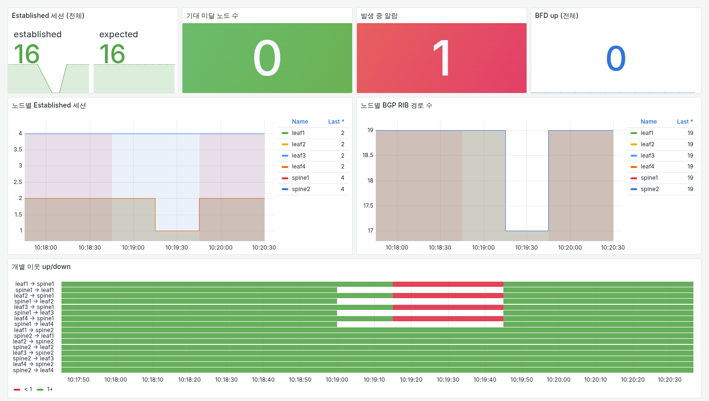
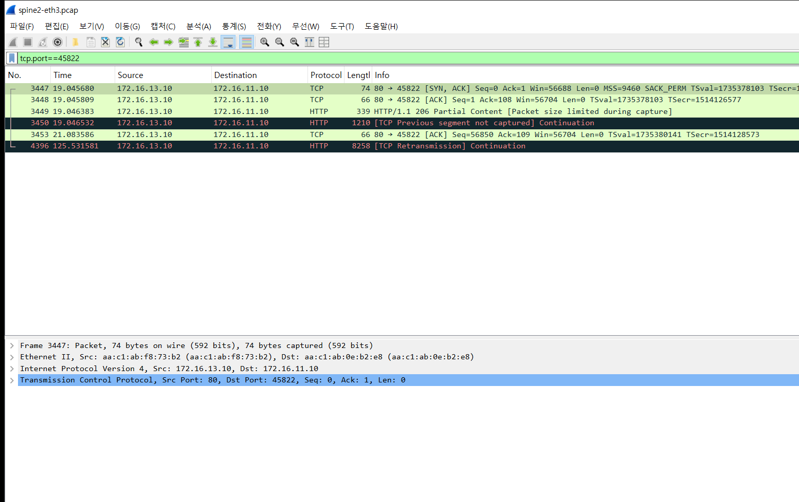
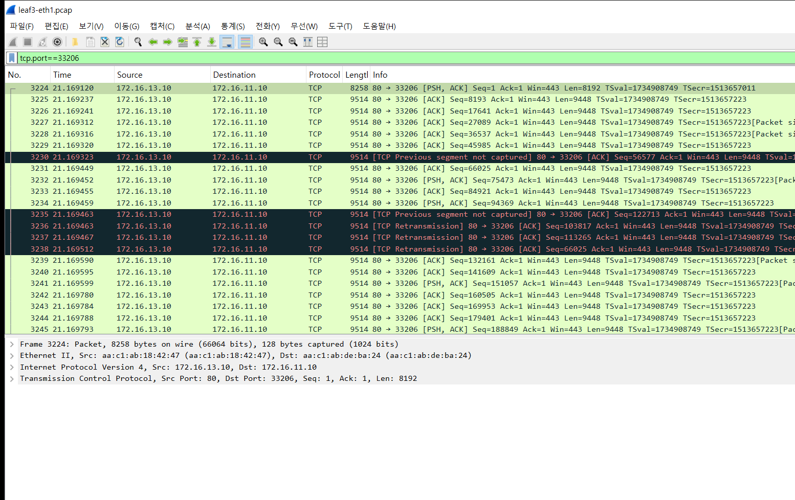
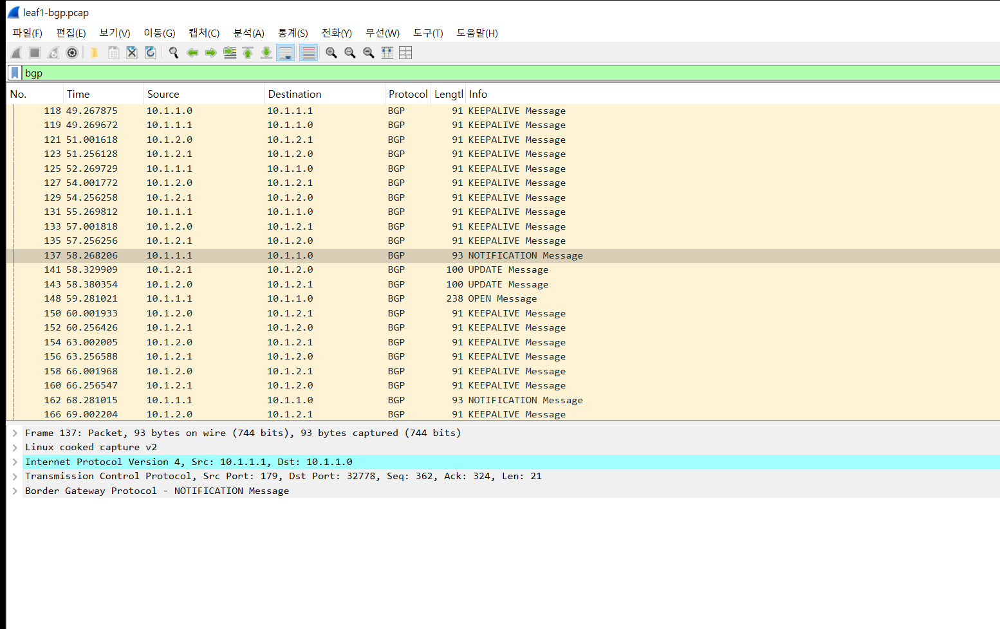
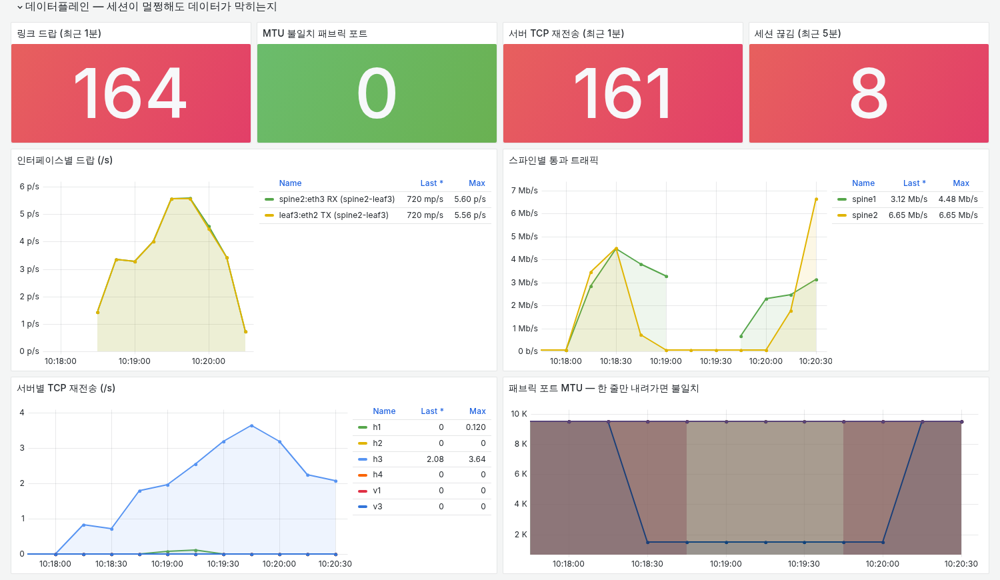
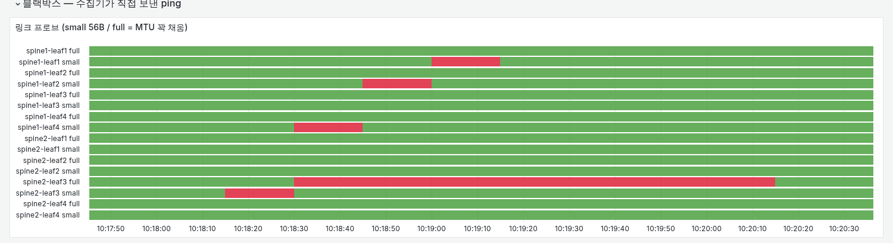

# 실험 01 — 숨어 있던 MTU 결함이 스파인 장애를 만났을 때

> [실험 목록](../README.md) · 실행 결과 [capture/rehash0/report.txt](capture/rehash0/report.txt) · [rehash1/report.txt](capture/rehash1/report.txt)

spine2의 포트 하나에 MTU가 잘못 들어가 있다. 평소에는 ECMP가 트래픽을 두 스파인에 나누니까 절반만 아프고, 운이 좋으면 아무도 모른다.
그 상태에서 spine1이 조용히 죽으면 모든 트래픽이 spine2로 몰리고, 숨어 있던 결함을 정면으로 맞는다.
**큰 장애는 하나의 고장보다 평소 숨어 있던 문제가 다른 고장 때 드러나면서 생기는 경우가 많다.** 이 장은 그 과정을 시간 순서로 잰다.

| 패킷 — 큰 프레임이 spine2 앞에서 사라진다 | 모니터링 — 같은 시간의 Grafana |
|---|---|
|  |  |

## 장애 구성

```
               ┌──── spine1 ────┐   ← P2: 조용한 먹통 (포워딩 끔 + 프로세스 정지, 링크는 up)
   h1 ── leaf1                  leaf3 ── h3 (httpd)
               └──── spine2 ────┘
                         eth3      ← P1부터: MTU 9500 → 1500 (leaf3 방향)
```

| Phase | 길이 | 상태 |
|---|---|---|
| P0 | 20초 | 정상 |
| P1 | 30초 | 숨은 결함: spine2:eth3 MTU 9500 → 1500 |
| P2 | 45초 | 여기에 spine1이 조용히 죽는다 (`ip_forward=0` + `docker pause`) |
| P3 | 30초 | spine1 복구. MTU 결함은 그대로 |
| P4 | 20초 | MTU 복구 |

그동안 h1은 h3에서 0.5초마다 HTTP로 1MB를 받고, 따로 0.5초마다 작은 ping을 보낸다. 리프의 ECMP 해시는 L4(연결마다 다른 스파인)로 맞춘다.

캡처 지점: h1:eth1, leaf3:eth1(spine1 방향), leaf3:eth2(spine2 방향), spine2:eth3(결함 포트), leaf1의 BGP.

## 실행

```bash
cd /root/labs/clos-fabric/monitoring && ./up.sh && cd .. && sleep 20 && ./scripts/evpn-apply.sh
experiments/_tools/prep-hosts.sh
cd experiments/01-hidden-mtu-meets-spine-failure
./run.sh               # 리눅스 기본 동작 (REHASH=1)
REHASH=0 ./run.sh      # 실제 스위치에 가까운 조건 (아래 설명)
```

끝나면 `report.py`가 Phase별 성공률과 모니터링 알람 시각을 정리하고, Grafana 대시보드를 실험 구간으로 렌더한다.

## 숫자

h1 → h3 성공률 (REHASH=0 기준, 괄호는 성공/시도)

| Phase | HTTP 1MB | 작은 ping |
|---|---|---|
| P0 정상 | 100% (27/27) | 100% |
| P1 숨은 결함 | **61%** (11/18) | 100% |
| P2 + spine1 먹통 | **0%** (0/17) | 91% (51/56) |
| P3 spine1 복구 | **47%** (8/17) | 100% |
| P4 MTU 복구 | 100% (27/27) | 100% |

- 작은 ping은 거의 내내 된다. 작은 패킷은 MTU 1500을 지나가기 때문이다. **ping만 보면 장애가 없다.**
- P2의 ping 실패 5번은 전부 P2+1.6초 ~ +8.3초 사이다. spine1이 죽었는데 리프가 아직 모르는 BGP hold timer(9초) 구간이다. 그 뒤로는 spine2로 우회해서 다시 된다.
- HTTP는 P2 내내 0%다. 우회한 길(spine2)에 MTU 결함이 있기 때문이다.

### 리눅스가 스스로 피해 간 경우 (REHASH=1)

| Phase | HTTP 1MB (REHASH=1) | HTTP 1MB (REHASH=0) |
|---|---|---|
| P1 숨은 결함 | **100%** (31/31) | 61% (11/18) |
| P2 + spine1 먹통 | 0% | 0% |
| P3 spine1 복구 | 81% | 47% |

같은 장애인데 리눅스 기본값(REHASH=1)에서는 P1 실패가 0이었다. 이유는 패킷 흐름 ②에 있다.

## 패킷 흐름 ① 큰 프레임만 spine2 앞에서 사라진다 (P1, REHASH=0)

같은 연결(포트 45822)을 leaf3가 보낸 쪽과 spine2가 받은 쪽에서 본다.

**leaf3:eth2 — spine2로 보낸 것**


**spine2:eth3 — spine2가 받은 것**



- leaf3는 SYN-ACK, ACK, 응답 헤더(339바이트)에 이어 **9514바이트 세그먼트** 여러 개를 보냈다 (3450~3456번).
- spine2 쪽에는 SYN-ACK, ACK, 339바이트, 1210바이트만 있다. 1500을 넘는 프레임은 하나도 없다.
  1210바이트에 `[TCP Previous segment not captured]`가 붙은 것은 그 앞의 큰 세그먼트들이 여기까지 오지 못했다는 표시다.
- leaf3 쪽에는 재전송이 0.2초, 0.4초, 0.8초 … 간격을 두 배씩 늘리며 계속 나간다 (3457~4871번). 전부 같은 크기라 전부 버려진다.
- 마지막 재전송(125.5초)만 spine2에 도착했다. 그때는 P4로 MTU가 복구된 뒤다.

받는 쪽 포트의 MTU보다 큰 프레임은 라우팅 전에 버려진다. 그래서 ICMP(Fragmentation Needed)도 나가지 않고, 보내는 쪽은 크기를 줄일 단서를 얻지 못한다.

## 패킷 흐름 ② 재전송이 다른 스파인으로 빠져나간다 (P1, REHASH=1)

REHASH=1에서 spine2를 탄 연결 하나(포트 33206)를 spine1 쪽 포트에서 본다.

**leaf3:eth1 — spine1 방향**



1. 연결은 spine2로 시작했다. leaf3:eth2에서 보면 큰 세그먼트 6개를 보낸 직후 빠른 재전송 2번이 같은 길(spine2)로 나가고 사라진다.
2. 약 0.21초 뒤(재전송 타임아웃) h3의 TCP가 패킷에 붙이는 해시값을 새로 고른다 (`net.core.txrehash`).
3. veth는 그 해시값을 리프까지 그대로 넘기고, 리프는 그 값으로 ECMP 경로를 고른다. 그래서 **다음 패킷부터 spine1로 나간다** (위 화면의 첫 줄 Seq=1부터).
4. 이후 1MB가 spine1로 흘러 전송이 끝난다. 같은 연결의 패킷이 spine2 쪽에서는 12개, spine1 쪽에서는 113개 잡혔다.

**이건 랩의 특성이다.** 실제 스위치는 헤더(5-tuple)로 해시를 계산하므로 같은 연결은 계속 같은 길로 가고 계속 실패한다.
REHASH=0은 서버의 해시 재선택을 꺼서 그 상황에 가깝게 만든 것이다 (h1·h3의 `net.core.txrehash=0`, 설정 뒤 httpd를 다시 띄워야 적용된다).
IPv6에서는 flow label을 바꿔 같은 일을 하는 기법(PLB 등)이 실제로 쓰인다.

## 패킷 흐름 ③ 리프가 spine1의 죽음을 알기까지 (P2)

leaf1의 BGP, 필터 `bgp`



| P2 기준 | 패킷 |
|---|---|
| -0.2초 | spine1 → leaf1 KEEPALIVE (마지막) |
| +2.8, +5.8초 | leaf1 → spine1 KEEPALIVE. 대답이 없다 |
| **+8.8초** | leaf1 → spine1 **NOTIFICATION** `Hold Timer Expired (4)` |
| +8.8초 | leaf1 ↔ spine2 UPDATE. spine1 경유 경로를 거둔다 |
| +9.8초 | leaf1 → spine1 OPEN. 다시 붙어 보려 하지만 대답이 없다 |

spine1은 링크가 살아 있어서 인터페이스 다운으로 알 수 없다. keepalive가 9초(hold time) 동안 안 와야 비로소 죽었다고 판단한다.
이 9초가 패킷 흐름의 ping 실패 구간과 정확히 겹친다.

## 모니터링 성적표

같은 시간대의 대시보드다 (REHASH=0).

**컨트롤플레인** — 세션·경로·이웃


**데이터플레인** — 드랍·트래픽·재전송·MTU



**블랙박스** — 수집기가 직접 보낸 ping



| 질문 | 답 |
|---|---|
| **발견했나** | 예. 두 고장 모두 알람이 울렸다 |
| **얼마나 빨리** | 숨은 결함: `FabricMTUMismatch`·`InterfaceDropping` **+9초**, `LinkLargeFrameLoss` +19초. spine1 먹통: `RouterUnreachable` **+9초**, `BGPSessionsBelowExpected` +19초 |
| **무엇으로** | 숨은 결함은 포트 MTU 값과 링크 드랍이 먼저 말해줬다. spine1은 수집기가 vtysh에 접속하지 못한 것(`RouterUnreachable`)이 BGP 세션 감소보다 10초 빨랐다 |
| **뭘 놓쳤나** | ① 새로 넣은 `LinkProbeDown`이 **spine1이 죽은 동안 울리지 않았다**. `docker pause`는 프로세스만 멈추고 커널은 ping에 계속 대답한다. 장비가 ping에 대답하는 것과 그 장비가 패킷을 넘겨주는 것은 다른 일이다. ② 리눅스 기본값(REHASH=1)에서는 P1 동안 사용자 쪽 실패가 0이었다. 알람은 울렸지만 체감 증상이 없으니 이런 결함은 쉽게 미뤄진다 |
| **뭘 추가했나** | 리프 → 스파인 링크마다 작은 ping(56B)과 MTU를 꽉 채운 ping을 보내는 블랙박스 프로브, 알람 `LinkLargeFrameLoss`(작은 건 되고 큰 건 안 됨), `LinkProbeDown`(작은 것도 안 됨) |
| **다음에 할 것** | 장비 자신이 아니라 장비 **너머**로 보내는 프로브. 예를 들어 리프에서 특정 스파인을 거쳐 다른 리프의 루프백으로 가는 ping. 그래야 포워딩이 멈춘 장비를 잡는다 |

블랙박스 타임라인에서 `spine2-leaf3 full`은 결함이 들어간 순간부터 복구될 때까지 빨갛다. 결함의 위치와 성격(큰 것만 안 됨)을 Wireshark를 열기 전에 대시보드가 말해준 셈이다.
여기저기 한 칸씩 빨간 점은 장애와 상관없는 시점에도 보인다. 한 번 실패한 ping이라 알람은 10초 지속 조건(`for: 10s`)으로 걸러낸다.

## 결론

> **숨은 결함 하나는 절반만 아프게 하고, 다른 고장이 겹치는 순간 전체를 멈춘다.**

| | |
|---|---|
| **넣은 장애** | spine2:eth3 MTU 9500 → 1500 (숨은 결함) + 그 위에 spine1 조용한 먹통 |
| **겉으로 보인 것** | 작은 ping은 거의 내내 성공. 1MB HTTP만 실패하고, spine1을 고쳐도 절반은 계속 실패 |
| **핵심 숫자** | HTTP 성공률 61% → **0%** → 47% → 100% (REHASH=0). ping 실패는 BGP hold timer 9초 구간의 5번뿐 |
| **왜 그랬나** | 1500보다 큰 프레임은 spine2 입구에서 말없이 버려진다 (ICMP 없음 → 서버는 같은 크기로 재전송만). spine1이 죽자 BGP가 9초 뒤 결함이 있는 spine2로 전부 우회했다 |
| **결정적 증거** | 같은 링크 양 끝 캡처: 보낸 쪽(leaf3:eth2)엔 9514B 세그먼트, 받은 쪽(spine2:eth3)엔 1500 이하만 |
| **모니터링** | MTU 값·링크 드랍·큰 ping 프로브가 결함을 +9초에 잡았다. 멈춘 spine1은 커널이 ping에 대답해서 프로브가 놓쳤다 → 장비를 **통과하는** 프로브가 다음 과제 |

## 파일

| 파일 | 내용 |
|---|---|
| `run.sh` | 시간표대로 장애 주입·복구, 프로브, 캡처, 리포트, 대시보드 렌더 |
| `report.py` | Phase별 성공률, Prometheus에서 알람 첫 firing 시각 |
| `capture/rehash0/` | REHASH=0 캡처 (h1, leaf3:eth2, spine2:eth3, leaf1 BGP), `report.txt`, `timeline` |
| `capture/rehash1/` | REHASH=1 캡처 (leaf3:eth1·eth2: 재전송이 빠져나가는 장면), `report.txt`, `timeline` |
| `img/` | Wireshark 화면, Grafana 렌더(`grafana-rehash*.png`)와 잘라낸 패널 |

> 이전의 실험 01(HTTP 전송 + MTU 장애, 2026-09-26)은 [_archive/01-http-mtu](../_archive/01-http-mtu/README.md)로 옮겼다. 경계값 1426/1427, VXLAN의 VTEP별 경로 캐시 같은 측정은 거기에 있다.
