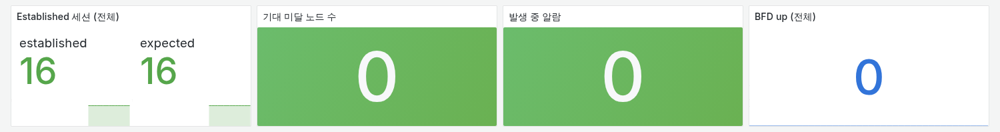
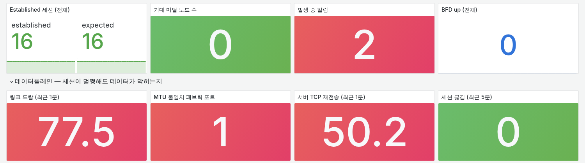
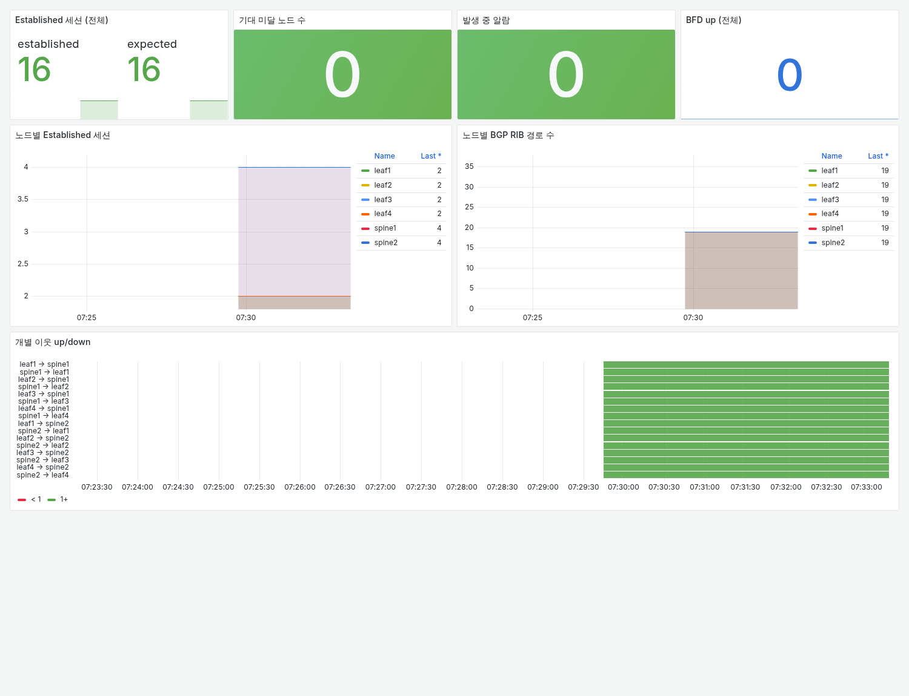
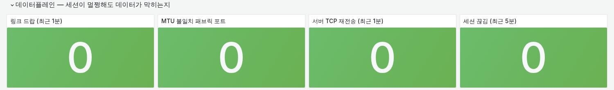
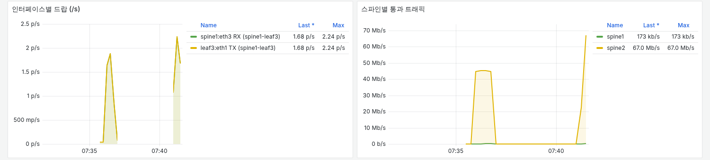
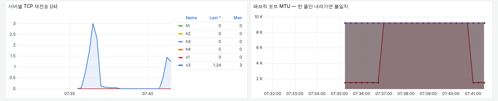

# 실험 01 부록 — 모니터링 1차 vs 2차: 세션은 멀쩡한데 데이터가 막힐 때

> [실험 01 본문](../README.md) · [실험 목록](../../README.md) · 모니터링 구성 [monitoring/](../../../monitoring/README.md) · 알람 정의 [alerts.yml](../../../monitoring/prometheus/alerts.yml)
>
> 원래 독립된 실험(관측 사각지대)이었다가 같은 MTU 장애를 다루는 실험 01에 합쳤다. 실험 01이 3차(블랙박스)까지 간 모니터링의 출발점이 이 부록이다.

1차 모니터링은 BGP 세션과 경로만 본다. 그런데 MTU 장애는 세션을 건드리지 않는다.
BGP 패킷은 작아서 MTU 1500을 문제없이 지나가기 때문이다.
같은 장애를 1차 모니터링 아래에서 넣어 무엇을 놓치는지 보고, 데이터플레인 지표를 더한 2차 모니터링이 그것을 잡는지 본다.

| 1차 모니터링 (장애 중) | 2차 모니터링 (같은 장애) |
|---|---|
|  |  |
| 세션 16/16, 알람 0. 전송은 0바이트에서 멈춰 있다 | 세션은 그대로 16/16. 알람 2개, 아래 줄에 드랍·MTU 불일치·재전송 |

## 장애 구성

```
               ┌───────── spine1 ─────────┐
               │                     eth3 │  ← MTU 9216 → 1500
   v1 ──── leaf1                         leaf3 ──── v3
  (curl)       │                          │      (httpd :8080, 68MB)
               └───────── spine2 ─────────┘

   요청은 작아서 어느 스파인이든 지나간다.
   응답(9000바이트 프레임)이 spine1을 타면 eth3에서 버려진다.
```

| 항목 | 값 |
|---|---|
| 주입 지점 | spine1:eth3 (leaf3 방향) |
| 바꾸는 값 | MTU 9216 → 1500 |
| 바탕 설정 | 언더레이 9216 / 오버레이 9000 / ECMP 해시정책 1 (`setup.sh`) |
| 관찰 구간 | v1(leaf1) → v3(leaf3), 68MB HTTP 전송, 시도마다 리프의 경로 캐시를 비움 |
| 기대하는 증상 | spine1을 타는 플로우만 멈춘다. 세션은 그대로다 |

경로 캐시를 비우는 이유: 비우지 않으면 같은 해시가 남아 시도가 전부 한 스파인으로 간다. 비워야 시도마다 spine1과 spine2로 갈린다.

### 2차 모니터링에서 더한 것

수집기(`monitoring/exporter/collector.py`)에 데이터플레인 지표를 더했다. 새 컨테이너는 없다.

| 지표 | 출처 | 잡는 것 |
|---|---|---|
| `clos_if_{rx,tx}_dropped_total` 외 바이트·에러 | 라우터의 `/proc/net/dev` | 링크에서 버려지는 패킷 |
| `clos_if_mtu` | `/sys/class/net/ethN/mtu` | 설정 불일치 |
| `clos_host_tcp_retranssegs_total` | 서버의 `/proc/net/snmp` | 서버가 체감하는 손실 |
| `clos_bgp_peer_drops_total` | FRR `connectionsDropped` | scrape 사이의 짧은 세션 끊김 (플래핑 실험용) |

인터페이스에는 `link` 라벨을 붙인다. 포트 번호가 계산식이라(spineS:ethL ↔ leafL:ethS) 토폴로지 파일 없이 정해진다.

| 알람 | 조건 |
|---|---|
| `InterfaceDropping` | 30초 사이 드랍이 늘어난 링크. veth는 드랍 하나를 양쪽 끝(보낸 쪽 TX, 받은 쪽 RX)에 모두 적으므로 링크 단위로 묶는다 |
| `FabricMTUMismatch` | 패브릭 포트 MTU가 전체 중앙값과 다르다. 기대값을 상수로 박지 않는다 |

## 실행

```bash
cd /root/labs/clos-fabric/monitoring && ./up.sh       # 관측 포함 토폴로지
cd .. && sleep 20 && ./scripts/evpn-apply.sh
cd experiments/01-hidden-mtu-meets-spine-failure/gen1-vs-gen2 && ./setup.sh      # MTU 통일, 해시정책, httpd, 테스트 파일
```

테스트 파일은 `files/video-small.mp4`(68MB 영상, `make-video.cmd`로 만든다)가 있으면 그것을 올리고,
없으면 같은 크기의 난수 파일을 만든다. 이 실험은 크기만 쓰므로 영상은 없어도 된다.

**Phase 1 — 1차 모니터링 아래에서 장애.** 2차 수집기를 올리기 전 상태에서 한다. 이미 2차로 올렸다면 `git stash`로 `monitoring/`을 되돌리고 `./up.sh`.

```bash
RENDER=v1-during-fault ./probe.sh 6
```

**Phase 2 — 2차 모니터링 아래에서 같은 장애.**

```bash
. ./lib.sh && render v2-healthy     # 정상 상태 먼저
RENDER=v2-during-fault ./probe.sh 8
```

`probe.sh`는 장애 주입 → 전송 N회(6초 제한) → 10초 대기(scrape 두 번 + 알람 평가) → 그 순간 모니터링이 본 것을 Prometheus에 묻기 → 복구 순서로 돈다.
Grafana `http://localhost:3000`의 아래쪽 데이터플레인 줄에서 시간축으로도 볼 수 있다.

**종료.**

```bash
./teardown.sh                         # 장애 복구, httpd 중지, MTU·해시정책 원복
cd ../../../monitoring && ./down.sh
```

## 숫자

2026-10-02 측정.

| | 1차 모니터링 | 2차 모니터링 |
|---|---|---|
| 전송 | 6회 중 1회 0바이트 정지 | 8회 중 5회 0바이트 정지 |
| Established 세션 | 16 / 16 | 16 / 16 |
| 울린 알람 | **0** | **2** — `FabricMTUMismatch` 1, `InterfaceDropping` 1 |
| 드랍 | 수집 안 함 (실제로는 spine1:eth3 RX 15) | spine1:eth3 RX = leaf3:eth1 TX = 73 (3분 창) |
| MTU 불일치 포트 | 수집 안 함 | spine1:eth3 1500 |
| v3 TCP 재전송 | 수집 안 함 | 48 (2분 창) |

정지 횟수가 다른 건 해시 때문이다. 시도마다 어느 스파인으로 갈지가 갈리고, spine1에 걸린 시도만 멈춘다.
세션 수는 두 번 다 16/16으로 같다. 1차 모니터링이 볼 수 있는 숫자는 장애 전후로 하나도 바뀌지 않았다.

## 화면 흐름 ① 1차 모니터링 — 전부 초록



- 위 줄: 세션 16/16, 기대 미달 노드 0, 알람 0.
- 노드별 세션(리프 2, 스파인 4)과 RIB 경로 수(전 노드 19)가 평평하다. 경로는 하나도 빠지지 않았다.
- 아래 이웃 up/down 16줄도 전부 초록이다.
- 이 순간 v1은 68MB를 0바이트째 기다리고 있었다. 실제로는 spine1:eth3에 드랍이 15개 쌓였지만, 1차 수집기는 그 카운터를 읽지 않는다.

BGP keepalive와 UPDATE는 수십~수백 바이트라 MTU 1500에 걸리지 않는다. 컨트롤플레인 지표만 보면 이 장애는 존재하지 않는다.

## 화면 흐름 ② 2차 모니터링 — 위 줄은 같고, 아래 줄이 빨갛다

정상일 때 데이터플레인 줄은 전부 0이다.



같은 장애를 넣으면:


- 위 줄의 세션 패널은 1차와 똑같이 16/16이다. 바뀐 건 알람 수(0 → 2)뿐이다.
- 데이터플레인 줄: 링크 드랍 77.5, MTU 불일치 포트 1, 서버 TCP 재전송 50.2, 세션 끊김 0.
- 세션 끊김이 0이라는 것도 단서다. 세션 문제가 아니라 데이터만 막힌 장애라는 뜻이다.
- 화면 값(최근 1분, rate 기반)은 `probe.sh`가 물은 값(드랍 3분 창 73, 재전송 2분 창 48)과 창이 달라 숫자가 조금 다르다.

## 화면 흐름 ③ 어느 링크에서 버려지나



- 왼쪽: 드랍이 찍힌 건 `spine1:eth3 RX`와 `leaf3:eth1 TX` 두 줄뿐이고 값이 똑같다(최대 2.24 p/s). 같은 링크(spine1-leaf3)의 양 끝이 같은 드랍을 하나씩 적은 것이다.
- 오른쪽: 스파인별 통과 트래픽. 전송이 된 시도는 spine2로 갔다(최대 67.0 Mb/s). spine1은 거의 0(173 kb/s)이다. spine1을 탄 응답은 leaf3에서 출발하자마자 버려지기 때문이다.
- 드랍 그래프의 봉우리가 두 번인 건 2차에서 probe를 두 번 돌렸기 때문이다. 앞쪽(07:36 무렵)이 첫 시도, 뒤쪽(07:41)이 표의 8회 시도다.

leaf3가 9000바이트 프레임을 보내면 MTU 1500인 spine1:eth3는 받는 단계에서 프레임을 버린다. 라우팅 전에 버려지므로 ICMP(Fragmentation Needed)도 나가지 않고, 보내는 쪽은 줄일 크기를 알 수 없다. 그래서 느려지는 게 아니라 0바이트에서 멈춘다.

## 화면 흐름 ④ 서버가 느끼는 손실과 설정 불일치



- 왼쪽: 재전송이 늘어난 서버는 v3 하나다(최대 3/s). 데이터를 보내는 쪽이 v3라서 재전송도 v3에 쌓인다. h1~h4, v1은 0이다.
- 오른쪽: 패브릭 포트 16개의 MTU. 15개는 9216에 겹쳐 있고 한 줄만 약 1.5K로 내려가 있다. 이 패널은 장애가 난 위치를 트래픽 없이도 가리킨다. 드랍 카운터는 누군가 보내야 오르지만 MTU 값은 그대로 남는다.

## 결론

> **컨트롤플레인만 보는 모니터링에게 데이터만 막히는 장애는 존재하지 않는다.**

| | |
|---|---|
| **넣은 장애** | spine1:eth3 MTU 9216 → 1500. 1차(세션·경로) / 2차(+ 드랍·MTU·재전송) 모니터링 아래에서 각각 |
| **겉으로 보인 것** | 68MB 전송 중 spine1을 탄 시도만 0바이트에서 멈춤. 세션은 내내 16/16 |
| **핵심 숫자** | 울린 알람 1차 **0** / 2차 **2** (`FabricMTUMismatch`, `InterfaceDropping`). 드랍 73, 재전송 48 |
| **왜 그랬나** | BGP 메시지는 작아서 MTU 1500을 지나간다 → 세션·경로가 하나도 안 바뀐다. 큰 프레임만 입구에서 버려져 ICMP도 없다 |
| **결정적 증거** | 링크 양 끝의 드랍 수가 같다 (spine1:eth3 RX = leaf3:eth1 TX), 패브릭 포트 MTU 한 줄만 1500 |
| **찾는 법** | 세션이 멀쩡한데 큰 전송이 멈춘다면 데이터플레인 지표를 본다. MTU 값은 트래픽이 없어도 위치를 가리킨다 |

## 파일

| 파일 | 내용 |
|---|---|
| `lib.sh` | 공통 변수(구간, MTU, 포트 목록), MTU 읽기/쓰기, Prometheus 질의 `q`, 전송 한 번 `fetch`, 대시보드 렌더 `render` |
| `setup.sh` | 원래 값 기록 → MTU 통일(9216/9000) → 해시정책 1 → 도구 설치 → 테스트 파일 → httpd |
| `fault.sh` | `inject [spine1\|spine2]` / `restore` / `status`. 스파인 eth3 MTU를 1500으로 |
| `probe.sh` | 장애 주입 → 전송 N회 → 모니터링이 본 것을 Prometheus에 묻는다 → 복구 |
| `teardown.sh` | 장애 복구, httpd 중지, MTU·해시정책 원복. `PURGE=1`이면 v3의 /srv 삭제 |
| `make-video.cmd` | (윈도우, 선택) ffmpeg로 `files/video-small.mp4` 생성 |
| `img/v1-during-fault.png`, `v2-healthy.png`, `v2-during-fault.png` | 대시보드 원본 렌더 |
| `img/v1-stats.png`, `v2-stats.png`, `v2-healthy-stats.png`, `v2-drops-traffic.png`, `v2-retrans-mtu.png` | 위 원본에서 잘라낸 패널 |
| `state/` | setup이 기록한 원래 값, 장애 상태 (git 제외) |
| `files/` | 테스트 영상 (git 제외) |
