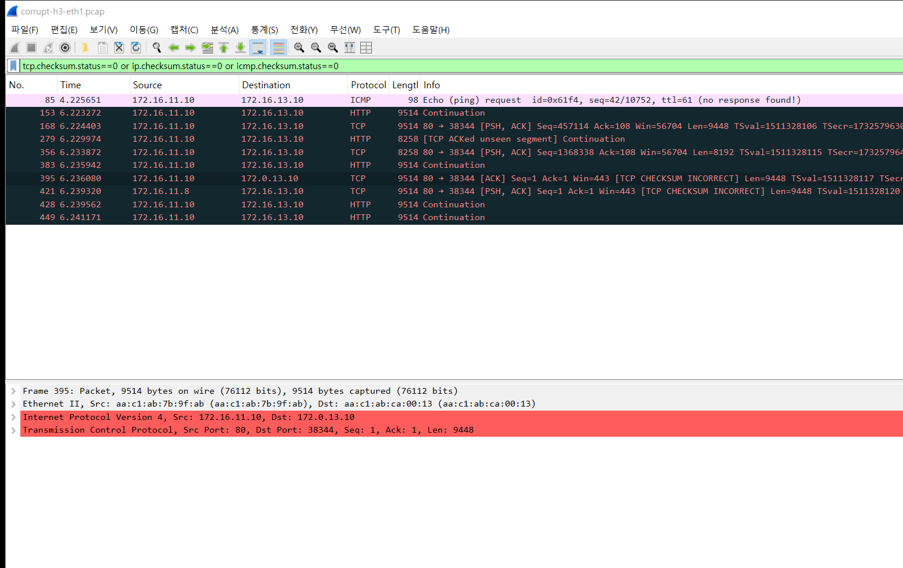
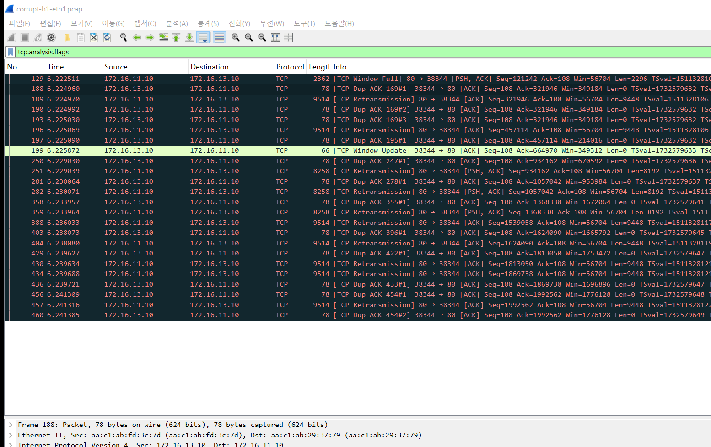
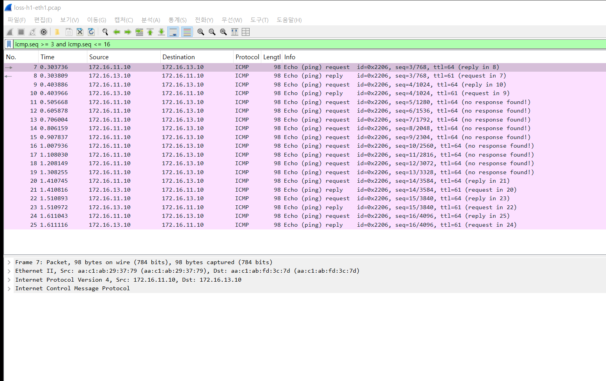
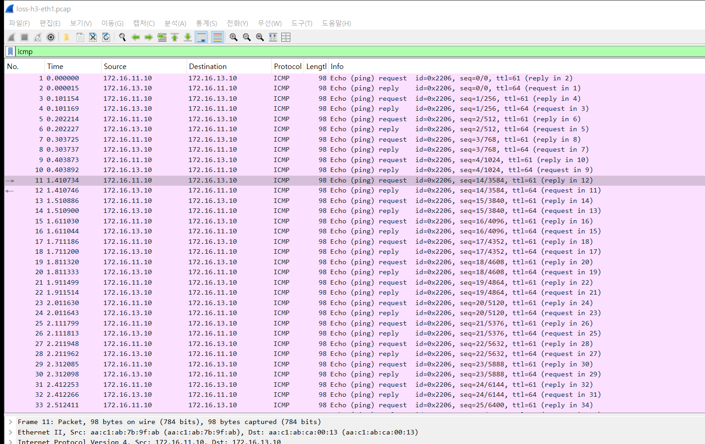
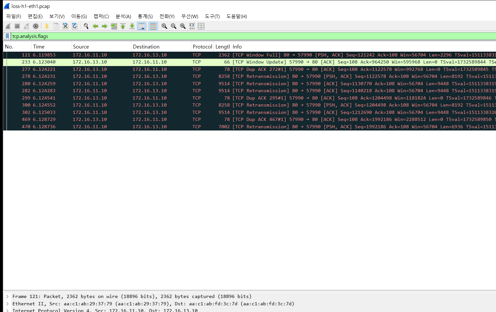

# 실험 02 — 물리 계층 불량: 깨지는 비트와 몰려오는 손실

> [실험 목록](../README.md) · 백로그 ⑨ · 실행 기록 [capture/run-output.txt](capture/run-output.txt)

케이블·광모듈·포트가 상하면 링크는 up인 채로 프레임 일부가 깨지거나 사라진다.
BGP도 붙어 있고 ping도 대부분 되니 사용자는 가끔 느리다고만 말한다.
이 장을 보고 나면 패킷 캡처에서 이런 장애가 어떤 모양으로 남는지 알아볼 수 있다.

## 장애 구성

```
  h1 ──── leaf1 ═══ spine ═══ leaf3 ──[불량 케이블]── h3
  보내는 쪽                          tc netem          받는 쪽
  (캡처 ①)                          leaf3:eth3 송신    (캡처 ②)
```

h3가 h1에서 파일 2MB를 받는다. 데이터는 h1 → leaf3 → h3로 흐르고, 마지막 구간에 장애를 건다.

| Phase | netem 설정 | 흉내 내는 것 |
|---|---|---|
| corrupt | `corrupt 4%` | 프레임 안의 비트 하나가 뒤집힌다 |
| loss | `loss gemodel 2% 30%` | 손실이 몰려서 온다. 정상→불량 2%, 불량→정상 30%인 Gilbert-Elliott 모델 |

캡처는 장애 앞뒤 두 곳이다. 같은 대화를 양쪽에서 보고 비교하는 게 이 장의 핵심이다.

## 실행

```bash
cd /root/labs/clos-fabric/experiments
_tools/prep-hosts.sh             # 랩을 새로 띄웠을 때 한 번 (curl, httpd 등)
02-physical-corruption/run.sh    # 두 Phase 를 차례로 돌리고 원복한다
```

## 숫자

| | 기준 | corrupt 4% | loss gemodel |
|---|---|---|---|
| ping 50회 손실 | — | 2% | **18%** |
| 2MB 전송 결과 | 정상 | 정상, md5 일치 | 정상, md5 일치 |
| h3 TCP 체크섬 오류 | 0 | **5** | 0 |
| h3 IP 헤더 체크섬 오류 | 0 | **4** | 0 |
| h1 재전송 | 0 | 10 | 6 |
| netem이 버린 패킷 | — | 0 | 15 |

파일은 두 경우 모두 온전히 도착했다. TCP가 깨진 것과 사라진 것을 모두 다시 보냈기 때문이다.
사용자 눈에는 장애가 아니라 약간의 지연으로 보인다. 그래서 이런 장애는 오래 숨어 있는다.

## 패킷 흐름 ① 비트가 깨질 때

### 받는 쪽 (h3) — 체크섬이 맞지 않는 프레임

필터 `tcp.checksum.status==0 or ip.checksum.status==0 or icmp.checksum.status==0`



- 10개 프레임이 걸렸다. 대부분은 TCP 데이터 안쪽 비트가 뒤집혀 TCP 체크섬이 틀렸다.
- 395번은 IP 헤더가 깨졌다. 목적지가 `172.16.13.10`이 아니라 **`172.0.13.10`** 으로 찍힌다.
- 421번은 출발지가 `172.16.11.`**`8`** 이다.
- 85번은 ping 요청이 깨졌다. 그래서 `(no response found!)`이고, 이것이 ping 손실 2%의 정체다.

395번의 IP 헤더를 펼치면 비트 하나가 어떻게 주소를 바꿨는지 보인다.

```
Internet Protocol Version 4, Src: 172.16.11.10, Dst: 172.0.13.10
    Header Checksum: 0x8084 incorrect, should be 0x8094
        [Expert Info (Error/Checksum): Bad checksum [should be 0x8094]]
    Destination Address: 172.0.13.10
```

`172.16` → `172.0`은 두 번째 옥텟에서 0x10 비트 하나가 꺼진 것이다. 체크섬도 정확히 0x10만큼 어긋났다 (0x8094 → 0x8084).
받는 커널은 이 프레임을 체크섬 검사에서 버린다 (`IpInHdrErrors`, `TcpInCsumErrors` 증가).
캡처는 커널이 버리기 전에 일어나므로, 버려질 프레임도 Wireshark에는 보인다.

### 보내는 쪽 (h1) — 중복 ACK와 재전송

필터 `tcp.analysis.flags`



보내는 쪽 캡처에는 깨진 프레임이 없다. h1은 멀쩡한 프레임을 보냈고, 깨진 건 그 뒤 구간이다.
대신 그 결과가 보인다.

1. h3가 깨진 세그먼트를 버리면 그 자리가 빈다. h3는 받은 데까지만 ACK한다. **188번 `Dup ACK 169#1`**, `Ack=321946`에서 멈춘다.
2. 같은 ACK에 SACK 블록(`SLE=331394 SRE=406978`)이 붙어 있다. 그 뒤 데이터는 받았고 빈 곳은 321946부터라는 뜻이다.
3. h1은 Dup ACK 하나만 보고 **바로 189번에서 그 자리만 재전송**한다. 전통적인 규칙(Dup ACK 3개 = fast retransmit)을 기다리지 않는다. 리눅스는 SACK 정보로 손실을 더 일찍 판단한다 (RACK).
4. 190·193번 Dup ACK #2, #3은 재전송이 도착하기 전에 이미 날아온 것들이다.

## 패킷 흐름 ② 손실이 몰려올 때

### 보내는 쪽 (h1) — 대답 없는 요청이 연달아

필터 `icmp.seq >= 3 and icmp.seq <= 16`



### 받는 쪽 (h3) — 그 요청들이 아예 없다

필터 `icmp`



- h1은 seq 5부터 13까지 9개를 0.1초 간격으로 보냈고, 전부 `(no response found!)`다.
- h3 캡처에는 seq 4(10번) 다음이 바로 seq 14(11번)다. 중간 9개는 도착하지 않았다.
- 도착 시각도 0.40초 → 1.41초로 1초가 빈다. 무작위 손실이라면 9개가 연달아 사라질 확률은 거의 없다. **몰려서 사라진다는 것 자체가 물리 계층을 의심할 단서**다.

같은 시간대의 TCP는 이렇게 보인다.



비트가 깨질 때와 달리 재전송이 덩어리로 나온다. 277번 Dup ACK 하나에 278·280·282번 세 세그먼트가 연달아 다시 나간다.
연속된 세그먼트가 한꺼번에 사라졌다는 뜻이다.

## 결론

> **링크가 up이어도 비트는 깨지고 패킷은 몰려서 사라진다. TCP가 메워 주니 사용자에겐 "가끔 느림"으로만 보인다.**

| | |
|---|---|
| **넣은 장애** | leaf3 → h3 마지막 구간에 비트 깨짐 4%, 몰려오는 손실 (Gilbert-Elliott) |
| **겉으로 보인 것** | 2MB 파일은 두 경우 모두 온전히 도착 (md5 일치). ping 손실 2% / 18% |
| **핵심 숫자** | 체크섬 오류 TCP 5·IP 4, 재전송 10 / 6, ping 9개 연속 손실 (1초 공백) |
| **왜 그랬나** | 깨진 프레임은 받는 커널이 체크섬 검사에서 버리고, 빈자리는 TCP가 SACK + 재전송으로 메운다. 손실이 덩어리로 오니 재전송도 덩어리로 나간다 |
| **결정적 증거** | 받는 쪽엔 체크섬이 틀린 프레임 (172.16 → 172.0, 비트 하나), 보내는 쪽엔 Dup ACK와 그 자리만 재전송 |
| **찾는 법** | 장비 카운터(`rx_crc_errors`, `InCsumErrors`)부터 본다. 그다음 양쪽 동시 캡처로 사라진 구간을 좁힌다. 몰려서 사라지면 물리 계층을 의심한다 |

## 파일

| 파일 | 내용 |
|---|---|
| `run.sh` | 두 Phase 실행 (주입 → 캡처 → 트래픽 → 원복) |
| `restore.sh` | 중간에 멈췄을 때 원복 |
| `capture/*.pcap` | 위 화면의 원본. `corrupt-h3-eth1.pcap`만 체크섬 검사를 위해 전체 길이, 나머지는 패킷당 200바이트 |
