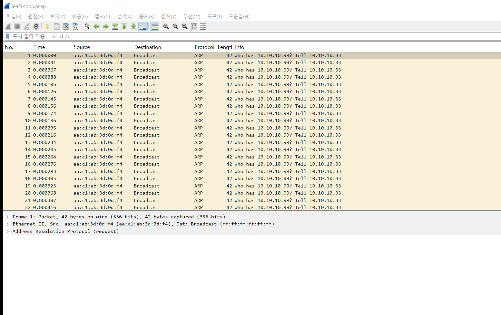
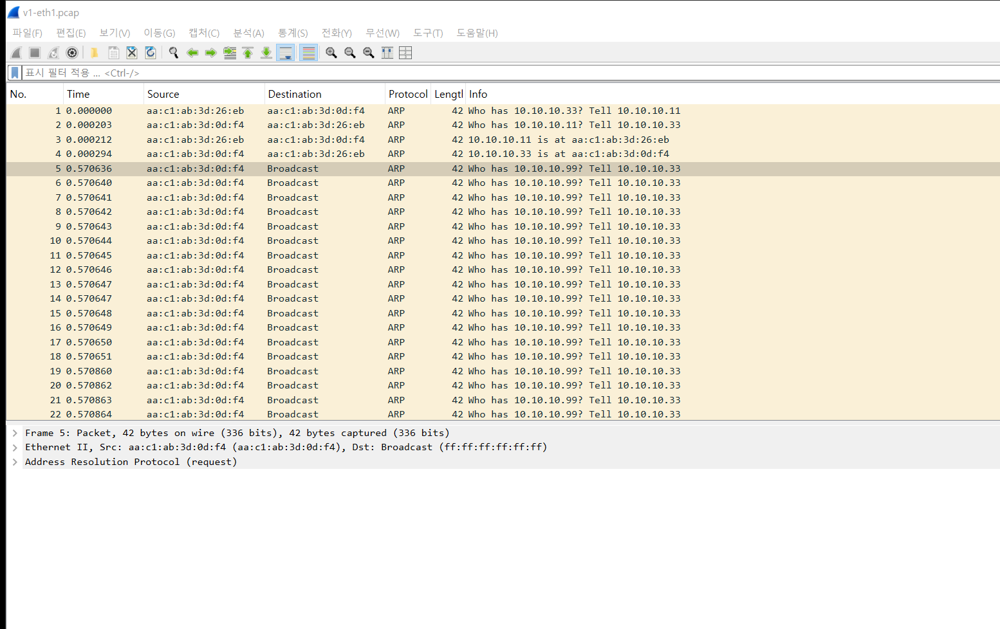
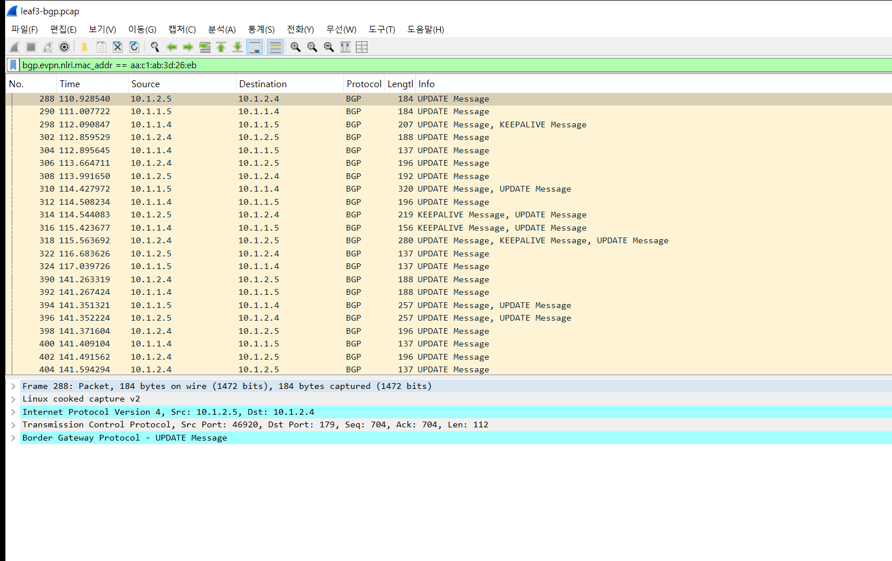

# 실험 03 — L2 루프와 브로드캐스트 스톰

> [실험 목록](../README.md) · 백로그 ⑩ · 실행 기록 [capture/run-output.txt](capture/run-output.txt)

스위치 포트 두 개를 케이블 하나로 이어버리면 L2에 고리가 생긴다.
IP 패킷에는 TTL이 있어서 루프를 돌다 결국 죽지만, **이더넷 프레임에는 TTL이 없다.**
브로드캐스트 하나가 고리를 영원히 돌면서 매번 모든 포트로 복사된다. STP가 막아주지 않으면 망 전체가 먹통이 된다.

## 장애 구성

```
                     VXLAN (VNI 10010)
   v1 ── leaf1 ════════════════════════ leaf3 ── v3
                                          │
                                    br10010 (STP 꺼짐)
                                      lpA ⇄ lpB      ← veth 한 쌍의 양 끝을 같은 브리지에
```

leaf3의 VXLAN 브리지에 veth 한 쌍의 양 끝(lpA, lpB)을 꽂는다. 케이블 하나로 같은 스위치의 두 포트를 이은 것과 같다.
v3가 없는 주소(10.10.10.99)를 ARP로 한 번 묻는다. 그 브로드캐스트 하나가 어떻게 되는지 본다.

| 캡처 지점 | 보이는 것 |
|---|---|
| leaf3:lpA | 루프 자체 |
| v1:eth1 | 다른 랙의 서버. 스톰이 VXLAN을 타고 번진다 |
| leaf3 BGP | EVPN 컨트롤플레인이 루프를 어떻게 받아들이나 |

> WSL이 통째로 멈추지 않도록 루프 양쪽에 tbf 20Mbit 제한을 걸었다. 하지만 veth에서는 제한이 듣지 않았고, 스톰은 제한 없이 돌았다.

## 실행

```bash
cd /root/labs/clos-fabric/experiments
03-broadcast-storm/run.sh        # 루프 → ARP 한 번 → 관찰 → 루프 제거 → EVPN 정리
```

## 숫자

| | 기준 | 루프만 만든 상태 | ARP 한 번 뒤 3초 |
|---|---|---|---|
| v1이 받은 패킷 | — | 2초에 2개 | **3초에 1,363,067개** |
| leaf3 MAC 표의 v3 위치 | eth4 (맞음) | eth4 | **lpB** (루프 포트) |
| v1 → v3 ping | 0% 손실 | — | **100% 손실** |
| 루프 포트에서 잡힌 프레임 | — | — | 약 690만 개 (몇십 초 동안) |

ARP 하나가 3초 만에 136만 개가 됐다. 루프를 지우자 ping은 바로 0% 손실로 돌아왔다.

## 패킷 흐름 ① 같은 프레임이 영원히 돈다

leaf3:lpA, 필터 없음



- 모든 줄이 같다. `Who has 10.10.10.99? Tell 10.10.10.33`, 출발지 MAC은 v3다.
- v3는 ARP를 **한 번** 보냈다. 나머지는 전부 브리지가 만든 복사본이다.
- 간격은 수십 마이크로초다. 루프는 CPU가 허락하는 만큼 빨리 돈다.

## 패킷 흐름 ② 다른 랙까지 번진다

v1:eth1, 필터 없음



- 1~4번은 정상이다. v1과 v3가 서로를 ARP로 확인한다.
- 5번(0.570636초)부터 v3의 ARP 브로드캐스트가 **1마이크로초 간격**으로 쏟아진다.
- v1은 leaf1에 붙어 있고 루프는 leaf3에 있다. 브로드캐스트는 VXLAN으로 모든 VTEP에 복제되므로(BUM 트래픽), **루프 하나가 같은 VNI 전체를 덮친다.**

## 패킷 흐름 ③ 유니캐스트도 죽는다 — MAC 표 오염

스톰은 단순히 대역폭만 먹는 게 아니다. 브리지의 MAC 학습을 망가뜨린다.

1. 루프를 돌던 프레임이 lpB로 들어올 때마다 출발지 MAC(v3)을 보고 v3가 lpB 뒤에 있다고 배운다.
2. leaf3의 MAC 표에서 v3 위치가 **eth4 → lpB**로 바뀐다 (run-output.txt).
3. 그 뒤 v1이 v3에게 보내는 유니캐스트도 v3가 아니라 루프로 들어간다. ping 100% 손실은 대역폭 때문이 아니라 이것 때문이다.

## 패킷 흐름 ④ EVPN이 루프를 광고한다

v1의 프레임도 같은 일을 겪는다. v1이 v3에게 ping을 보내려고 ARP 브로드캐스트를 내면, 그 프레임이 VXLAN을 넘어와 leaf3의 루프에 들어간다.
그러면 leaf3는 v1이 자기 루프 포트 뒤에 있다고 배운다.
EVPN에서 로컬로 배운 MAC은 BGP로 광고된다. **leaf3가 다른 랙에 있는 v1의 MAC을 자기 것이라고 광고하기 시작한다.**

leaf3 BGP, 필터 `bgp.evpn.nlri.mac_addr == aa:c1:ab:3d:26:eb` (v1의 MAC)



288번 UPDATE를 펼치면:

```
Border Gateway Protocol - UPDATE Message
    Next hop: 10.255.1.3                         ← leaf3 자신 (v1은 leaf1에 있는데)
        Route Type: MAC Advertisement Route (2)
        MAC Address: aa:c1:ab:3d:26:eb           ← v1의 MAC
    MAC Mobility: Movable MAC
        Sequence number: 21                      ← 이 MAC이 옮겨 다닌 횟수
```

- `10.1.2.5 → 10.1.2.4` 방향(leaf3 → spine2)은 leaf3가 v1 MAC을 자기 것이라고 광고하는 것이다.
- 반대 방향(spine → leaf3)은 leaf1이 아니라고 다시 광고한 것을 스파인이 전달하는 것이다.
- 두 리프가 번갈아 광고할 때마다 **MAC Mobility 순번**이 하나씩 오른다. 이 순번은 MAC이 정말 다른 곳으로 옮겼을 때(VM 이동 등) 최신 위치를 고르라고 있는 장치다. 루프가 그걸 악용한 셈이다.
- 순번이 21에서 시작하는 이유: 첫 실행(아래 참고)에서 이미 20까지 올라 있었다.

FRR은 짧은 시간에 너무 자주 옮기는 MAC을 중복으로 표시한다 (기본값: 180초에 5번).
루프를 지운 뒤에도 leaf1에는 v1의 MAC이 **duplicate 목록**에 남아 있었다 (순번 24/23).
**스톰이 끝나도 컨트롤플레인에 흔적이 남는다.** run.sh는 마지막에 `clear evpn dup-addr vni all`로 정리한다.

## 첫 실행에서 알게 된 것 — 스톰은 방아쇠가 필요 없다

처음에는 루프 포트에 IPv6를 그대로 두었다. 그랬더니 **ARP를 보내기도 전에** 스톰이 시작됐다.
lpA/lpB가 올라오는 순간 자기 IPv6 링크로컬 주소를 위한 Neighbor Solicitation과 MLD Report(멀티캐스트)를 내보냈고, 그것이 그대로 루프를 돌았다.

```
1  0.000000  2e:ff:92:62:1a:58 → 33:33:ff:62:1a:58  Neighbor Solicitation for fe80::2cff:92ff:fe62:1a58
2  0.000027  2e:ff:92:62:1a:58 → 33:33:ff:62:1a:58  Neighbor Solicitation for fe80::2cff:92ff:fe62:1a58
4  0.000067  9a:13:4b:9e:3e:73 → 33:33:00:00:00:16  Multicast Listener Report Message v2
```

현장에서도 같다. 케이블을 잘못 꽂는 순간 링크가 올라오면서 나가는 멀티캐스트 하나로 시작된다.
이 장의 최종 실행은 원인과 결과를 나눠 보려고 루프 포트의 IPv6를 끄고(`disable_ipv6=1`) ARP 하나로 시작했다.

## 결론

> **이더넷 프레임에는 TTL이 없어서, 고리 하나와 브로드캐스트 하나로 같은 VNI 전체가 멈춘다.**

| | |
|---|---|
| **넣은 장애** | leaf3 VXLAN 브리지(STP 꺼짐)에 veth 양 끝을 꽂아 고리를 만들고 ARP 한 번 |
| **겉으로 보인 것** | 다른 랙(v1)까지 브로드캐스트 홍수, v1 → v3 ping 100% 손실, 관리 명령도 느려짐 |
| **핵심 숫자** | ARP 1개 → 3초에 **136만 개**. 루프 포트에서 약 690만 개 |
| **왜 그랬나** | 복사본이 고리를 영원히 돌며 VXLAN으로 모든 VTEP에 복제된다. 브리지는 v3 MAC을 루프 포트에서 배우고(유니캐스트도 루프로), EVPN은 남의 MAC을 자기 것이라 광고한다 (MAC Mobility 순번 증가) |
| **결정적 증거** | 같은 출발지 MAC의 ARP가 μs 간격으로 반복, MAC 표의 v3 위치 eth4 → lpB, v1 MAC의 EVPN UPDATE 반복 |
| **찾는 법** | MAC 표에서 서버 MAC이 있을 리 없는 포트에 붙어 있으면 그 포트가 고리다. 루프를 지워도 EVPN duplicate 흔적은 남으니 정리까지 해야 한다 |

## 막는 장치 (이 랩에는 없다)

- **STP/RSTP**: 고리를 이루는 포트 하나를 막는다. 이 랩의 브리지는 `stp_state 0`이다 (evpn-apply.sh).
- **BPDU Guard**: 서버 포트에서 스위치가 보이면 포트를 내린다.
- **스톰 컨트롤**: 포트별 브로드캐스트 비율 상한.
- **EVPN 중복 감지 + freeze**: 중복으로 판정된 MAC의 광고를 멈춘다. FRR은 `dup-addr-detection freeze`로 켤 수 있다.

## 파일

| 파일 | 내용 |
|---|---|
| `run.sh` | 루프 생성 → ARP → 관찰 → 루프 제거 → EVPN 정리 |
| `restore.sh` | 중간에 멈췄을 때 루프 제거, EVPN 정리 |
| `capture/leaf3-loop.pcap`, `v1-eth1.pcap` | 스톰 시작부터 3000개 (전체는 수백만 개) |
| `capture/leaf3-bgp.pcap` | 실행 전체의 BGP |
