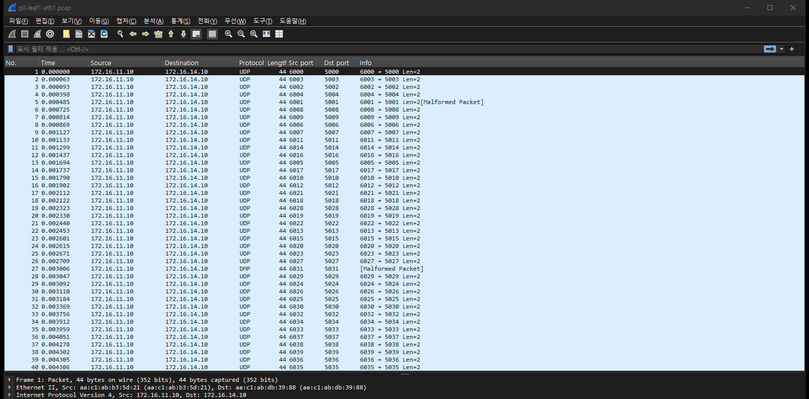
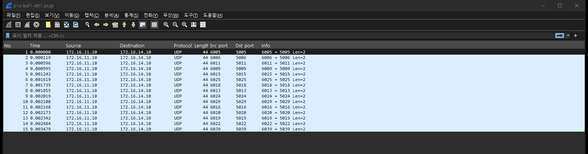
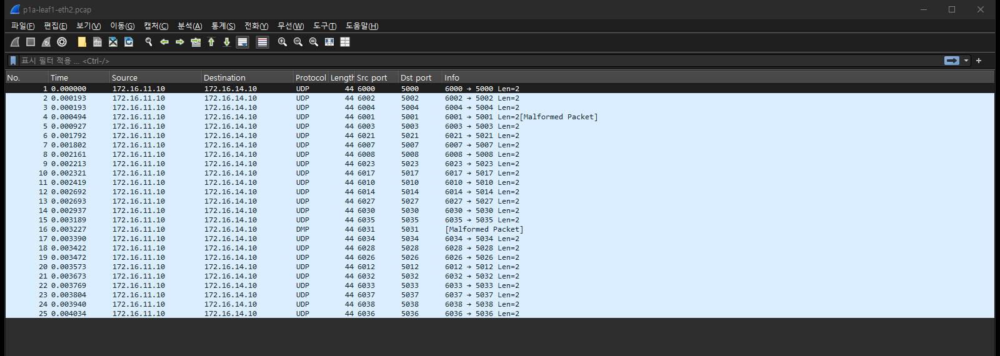

# 실험 05 — ECMP 분산: 경로가 2개인 것과 반씩 나눠 가는 것은 다르다

> [실험 목록](../README.md) · 옛 [docs/EXPERIMENTS §1](../../docs/EXPERIMENTS.md)을 패킷 캡처로 다시 잰 장 · 실행 기록 [capture/run-output.txt](capture/run-output.txt)

라우팅 테이블에 넥스트홉이 2개 있어도 트래픽이 반씩 나뉜다는 보장은 없다. 어느 링크로 보낼지는 커널의 **해시 정책**이 정한다.
이 장에서는 leaf1의 스파인 방향 두 포트를 동시에 캡처해서, 흐름 하나하나가 어느 스파인으로 갔는지 센다.
세는 김에 하나 더 확인했다. 같은 흐름을 다시 보내면 같은 링크로 가는가. 리눅스 기본 L4 해시(정책 1)에서는 그렇지 않았다.

## 구성

```
            ┌── eth1 ── spine1 ──┐
  h1 ── leaf1                    leaf4 ── h4
            └── eth2 ── spine2 ──┘
           (캡처 ①: eth1, ②: eth2)
```

```
leaf1# show ip route 172.16.14.0/24
  Known via "bgp", distance 20, metric 0, best
  * 10.1.1.0, via eth1, weight 1        ← spine1
  * 10.1.2.0, via eth2, weight 1        ← spine2
```

h1이 h4로 UDP 흐름 40개를 보낸다. 목적지 포트 5000~5039, 출발지 포트는 목적지 + 1000으로 고정해서 **두 번 보내면 5-tuple이 완전히 같다.**

| Phase | leaf1 해시 정책 | 보내는 것 | 보려는 것 |
|---|---|---|---|
| p0 | 0 (L3: 출발지·목적지 IP) | UDP 흐름 40개 | IP 쌍이 하나면 어떻게 되나 |
| p1a | 1 (L4: 포트까지) | 같은 40개 | 갈리는가 |
| p1b | 1 | 같은 40개 한 번 더 | 같은 흐름이 같은 링크로 가는가 |
| p3a·p3b | 3 (필드 지정: IP·프로토콜·포트) | 같은 40개 두 번 | 헤더만 보는 해시라면 |
| p0ip | 0 | 출발지 IP 8개(172.16.11.101~108)에서 ping 한 번씩 | IP 쌍이 여러 개면 정책 0도 갈리는가 |

## 실행

```bash
cd /root/labs/clos-fabric/experiments
05-ecmp-hash/run.sh       # 다섯 Phase 를 돌리고 해시 정책·필드, h1 보조 IP 를 되돌린다
```

## 숫자

| Phase | → spine1 (eth1) | → spine2 (eth2) | 판정 |
|---|---|---|---|
| p0 정책 0 | **40** | **0** | 한쪽만 쓴다 |
| p1a 정책 1 | 15 | 25 | 갈린다 |
| p1b 정책 1, 다시 | 19 | 21 | 갈리지만 **40개 중 18개가 p1a와 다른 링크로** 갔다 |
| p3a 정책 3 | 25 | 15 | 갈린다 |
| p3b 정책 3, 다시 | 25 | 15 | **40개 모두 p3a와 같은 링크** |
| p0ip 정책 0, 출발지 IP 8개 | 2 | 6 | IP 쌍이 다르면 정책 0도 갈린다 |

- 정책 0에서 40:0은 운이 아니다. IP 쌍(h1, h4)이 하나뿐이라 해시 입력이 40번 다 같다. 옛 측정(41:1, 3:42)도 같은 이유다.
- 정책 1과 3은 둘 다 갈린다. 차이는 **반복했을 때** 드러난다.

## 패킷 흐름 ① 정책 0 — 40개가 전부 한 링크로

leaf1:eth1 (→ spine1), 필터 없음



- 목적지 포트 5000부터 5039까지 40개가 전부 eth1에 있다. 같은 시간의 eth2 캡처는 **0패킷**이다 (`p0-leaf1-eth2.pcap`, 헤더만 있는 24바이트 파일).
- 출발지·목적지 포트 열을 보면 흐름은 분명히 40개다. 정책 0은 이 열을 보지 않는다.

## 패킷 흐름 ② 정책 1 — 갈리기는 한다

| leaf1:eth1 (→ spine1) | leaf1:eth2 (→ spine2) |
|---|---|
|  |  |

같은 40개가 15:25로 나뉘었다. 포트 열을 맞춰 보면 두 캡처에 겹치는 흐름이 없다. 흐름 하나는 한 링크로만 간다.
여기까지가 옛 문서의 결론(리프에는 정책 1이 필수)이었다.

## 패킷 흐름 ③ 같은 흐름을 다시 보내면

두 캡처에서 목적지 포트별로 어느 링크에 찍혔는지 뽑았다 (앞 10개, 1 = spine1, 2 = spine2).

| 목적지 포트 | p1a | p1b | p3a | p3b |
|---|---|---|---|---|
| 5000 | 2 | 2 | 2 | 2 |
| 5001 | 2 | **1** | 2 | 2 |
| 5002 | 2 | 2 | 1 | 1 |
| 5003 | 2 | 2 | 1 | 1 |
| 5004 | 2 | 2 | 1 | 1 |
| 5005 | 1 | 1 | 1 | 1 |
| 5006 | 1 | 1 | 1 | 1 |
| 5007 | 2 | **1** | 2 | 2 |
| 5008 | 2 | **1** | 2 | 2 |
| 5009 | 1 | **2** | 2 | 2 |
| … 40개 중 | | **18개 바뀜** | | **0개 바뀜** |

5-tuple이 똑같은데 정책 1에서는 절반 가까이가 다른 스파인으로 갔다. 정책 3에서는 하나도 안 바뀌었다.

**이유**: 리눅스의 정책 1은 패킷에 L4 해시값(`skb->hash`)이 이미 붙어 있으면 헤더를 다시 계산하지 않고 그 값을 쓴다.
그 값은 h1의 소켓이 만들어질 때 무작위로 정해진다. 그리고 veth는 그 값을 지우지 않고 리프까지 넘긴다.
그래서 leaf1이 고르는 링크는 헤더가 아니라 h1 소켓의 무작위 값에 따라 정해진다. 소켓을 새로 열면(nc를 다시 실행하면) 바뀐다.
정책 3은 지정한 헤더 필드(`fib_multipath_hash_fields=0x37`: 출발지·목적지 IP, 프로토콜, 출발지·목적지 포트)로만 계산한다. 그래서 같은 헤더는 언제나 같은 링크로 간다.

실험 01에서 TCP 재전송이 다른 스파인으로 빠져나간 것(`net.core.txrehash`)도 같은 원리다. 서버가 해시값을 바꾸면 리프의 선택도 바뀐다.

## 패킷 흐름 ④ 정책 0도 IP 쌍이 여러 개면 갈린다

h1에 보조 IP 8개를 붙이고 각 주소에서 ping을 한 번씩 보냈다.

```
spine1 로 간 출발지: 172.16.11.104 172.16.11.108
spine2 로 간 출발지: 172.16.11.101 172.16.11.102 172.16.11.103 172.16.11.105 172.16.11.106 172.16.11.107
```

세 번 실행했고 세 번 다 똑같이 갈렸다. 정책 0이 틀린 게 아니라 **입력의 다양성이 부족했던 것**이다.
서버가 수백 대인 실제 패브릭에서는 정책 0으로도 꽤 고르게 퍼진다. 이 랩처럼 서버 한 쌍이 대량으로 주고받는 경우(백업, 복제)에 한쪽으로 몰린다.

## 결론

> **넥스트홉이 2개라는 것과 트래픽이 반씩 나뉜다는 것은 다르다. 분산은 해시 정책과 입력의 다양성이 정한다.**

| | |
|---|---|
| **넣은 조건** | leaf1 해시 정책 0 / 1 / 3에서 UDP 흐름 40개를 두 번씩, 정책 0에서 출발지 IP 8개 |
| **겉으로 보인 것** | 정책 0은 한 링크만 사용. 정책 1·3은 갈리지만, 다시 보내면 정책 1만 흐름이 옮겨 다님 |
| **핵심 숫자** | 정책 0 → **40:0**, 정책 1 → 15:25 / 19:21 (**18개 바뀜**), 정책 3 → 25:15 / 25:15 (0개 바뀜), IP 8개 정책 0 → 2:6 |
| **왜 그랬나** | 정책 0은 IP 쌍만 봐서 쌍이 하나면 한쪽으로 몰린다. 정책 1은 소켓의 무작위 해시값(veth가 넘김)을 써서 같은 흐름도 길이 바뀐다. 정책 3은 헤더만 봐서 항상 같은 길이다 (실제 스위치에 가깝다) |
| **찾는 법** | 업링크 카운터를 비교하고, 두 링크를 동시에 캡처해 흐름별로 센다. `show ip route`는 경로가 2개라는 것까지만 말해 준다 |
| **기억할 것** | 백업·복제처럼 서버 한 쌍이 대량으로 주고받으면 정책 0에서 한 링크로 몰린다 |

## 파일

| 파일 | 내용 |
|---|---|
| `run.sh` | 다섯 Phase 실행, 링크별 집계, 원복 |
| `restore.sh` | 중간에 멈췄을 때 해시 정책·필드와 h1 보조 IP 원복 |
| `capture/<phase>-leaf1-eth1.pcap` | spine1 방향 |
| `capture/<phase>-leaf1-eth2.pcap` | spine2 방향 |
