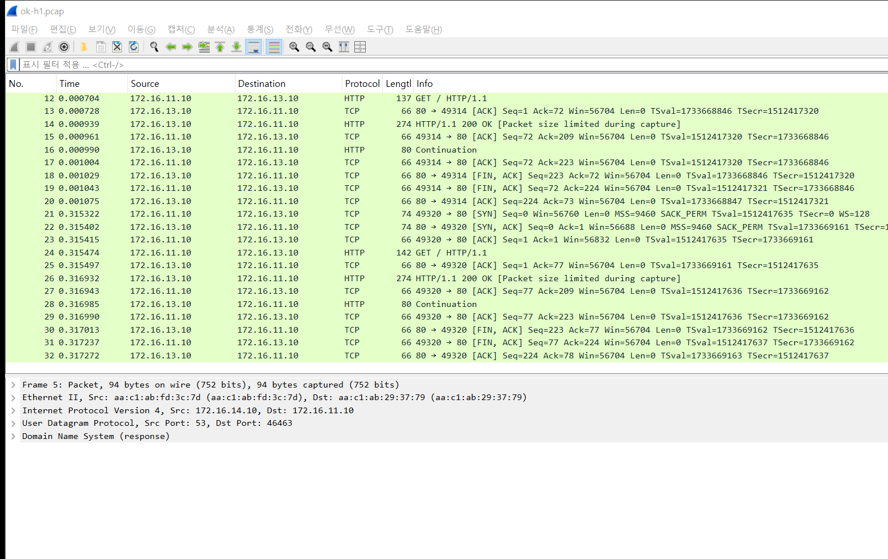
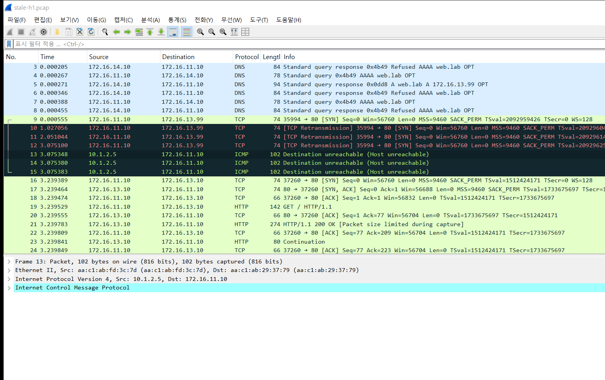
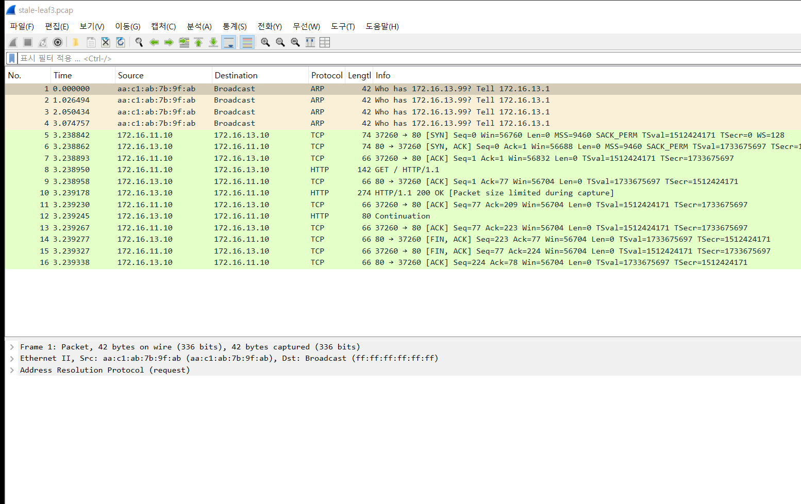
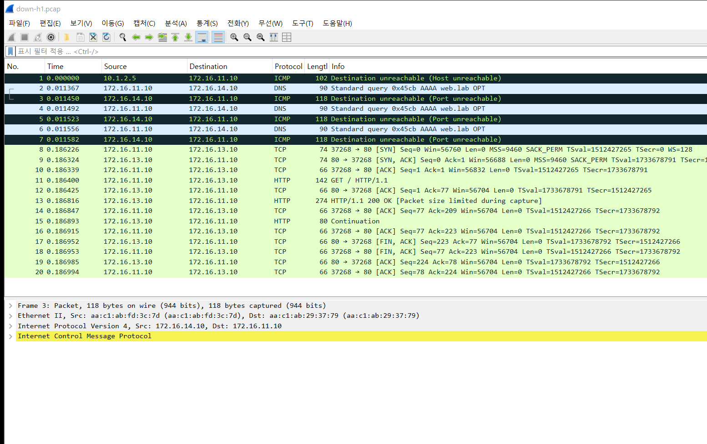
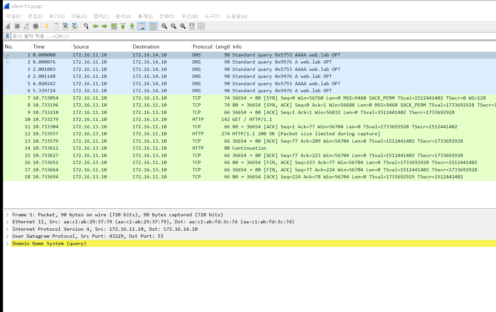

# 실험 06 — DNS 장애: IP로는 되는데 이름으로는 안 된다

> [실험 목록](../README.md) · 백로그 ⑪ · 실행 기록 [capture/run-output.txt](capture/run-output.txt)

사용자는 사이트가 안 열린다고 하는데, 엔지니어가 IP로 접속해 보면 멀쩡하다.
이름을 주소로 바꾸는 단계(DNS)가 고장 난 것이다. 그런데 DNS 장애도 한 가지가 아니다.
**어떻게 고장 났는지에 따라 실패하는 속도와 패킷 모양이 완전히 다르다.** 이 장은 그 차이를 본다.

## 장애 구성

```
  h1 (클라이언트) ──── leaf1 ═══ spine ═══ leaf4 ──── h4 (DNS 서버, dnsmasq)
                                      ╚══ leaf3 ──── h3 (웹 서버, web.lab)
```

h1은 `/etc/resolv.conf`로 h4를 DNS 서버로 쓰고, `curl http://web.lab/`으로 h3에 접속한다.

| Phase | 고장 | 이름 접속 결과 | 실패까지 | IP 접속 |
|---|---|---|---|---|
| ok | 없음 | HTTP 200 | 0.2초 | 200 |
| stale | 레코드가 없어진 서버(172.16.13.99)를 가리킴 | 실패 (curl exit 7: 연결 불가) | **3.3초** | 200 |
| down | DNS 프로세스가 죽음 | 실패 (exit 6: 이름 못 찾음) | **0.2초** | 200 |
| silent | 서버는 살아 있는데 방화벽이 53번을 조용히 버림 | 실패 (exit 6) | **10.8초** | 200 |

세 고장 모두 IP 접속은 성공한다. 하지만 실패하는 모양은 셋 다 다르다.

## 실행

```bash
cd /root/labs/clos-fabric/experiments
_tools/prep-hosts.sh       # 랩을 새로 띄웠을 때 한 번 (dnsmasq, curl, httpd)
06-dns-failure/run.sh
```

## 패킷 흐름 ① 정상 — 이름 묻기 → 답 → 접속

h1:eth1



1. h1이 **A(IPv4)와 AAAA(IPv6) 질의를 동시에** 보낸다 (1, 2번). alpine(musl)의 리졸버는 둘을 같이 묻는다.
2. 5번 응답: `A web.lab A 172.16.13.10`. 주소를 얻었다.
3. 9번부터 그 주소로 TCP 3-way handshake → GET → 200 OK.

전부 1밀리초 안에 끝난다. DNS가 정상이면 사용자는 DNS가 있다는 것조차 모른다.

> AAAA 질의에는 `Refused`가 오고 h1이 두 번 더 묻는다 (4, 7번). 이 dnsmasq 설정은 A 레코드만 갖고 있다.
> 보통은 빈 응답(NODATA)이 오지만 여기서는 Refused를 돌려줬다. 접속에는 영향이 없다.

## 패킷 흐름 ② 잘못된 레코드 — DNS는 성공, 접속이 실패

h1:eth1



- 5번: DNS는 **정상적으로 답한다.** 다만 답이 틀렸다: `172.16.13.99`.
- 9번: 그 주소로 SYN을 보낸다. 대답이 없다.
- 10·11·12번: 1초 간격으로 SYN 재전송.
- 13~15번: `Destination unreachable (Host unreachable)`, 보낸 곳은 **10.1.2.5(leaf3)** 다. 3.075초.
- 16번부터는 run.sh가 IP로 직접 접속한 것이다. 바로 성공한다.

leaf3에서 같은 시간을 보면 이유가 보인다.



leaf3는 h1의 SYN을 h3 쪽 서브넷으로 보내려고 `.99`의 MAC을 ARP로 묻는다. 1초 간격으로 네 번 묻는데 대답이 없다.
그래서 포기하고 h1에게 Host unreachable을 돌려보낸다. 그 시각이 3.075초로 h1 캡처의 13번과 같다.

**진단 포인트**: 이 경우 DNS 쪽을 보면 아무 문제가 없어 보인다. 질의도 응답도 정상이다.
DNS가 준 주소를 직접 확인해야 한다 (`nslookup web.lab` → 그 IP로 ping).

## 패킷 흐름 ③ DNS 프로세스가 죽음 — 즉시 거절

h1:eth1



- 2번 질의 → 3번 `Destination unreachable (Port unreachable)`, h4가 보냈다.
- h4라는 서버는 살아 있다. 다만 53번 포트에서 기다리는 프로그램이 없으니 커널이 이 포트는 닫혀 있다고 바로 알려준다.
- 리졸버는 이 답을 받고 곧바로 포기한다. **0.2초 만에 실패.**
- 1번 Host unreachable은 앞 Phase(stale)에서 늦게 도착한 것이다.

빨리 실패하는 건 오히려 친절한 고장이다. 사용자는 바로 에러를 보고, 로그에도 이유가 남는다.

## 패킷 흐름 ④ 응답 없음 — 조용히 기다리다 실패

h1:eth1



- 1·2번: A와 AAAA 질의. 대답이 없다.
- 3·4번 (2.0초): 같은 ID로 다시 묻는다.
- 5·6번 (4.9초, 5.3초): 한 번 더.
- 그 뒤로 아무것도 없다. 리졸버는 약 10초를 채우고 포기한다. 7번(10.73초)은 run.sh가 IP로 접속한 것이다.

방화벽이 패킷을 **DROP**하면 보낸 쪽은 패킷이 사라졌는지, 아직 오는 중인지 알 수 없다. 그래서 타임아웃까지 기다린다.
③과 비교하면 원인은 비슷한데(53번에서 답할 수 없음) 사용자 체감은 0.2초와 10.8초로 완전히 다르다.
**느리다는 신고가 들어오는 DNS 장애는 대개 이쪽이다.** 웹 페이지 하나에 이름이 여러 개 들어 있으면 10초씩 쌓인다.

## 세 장애 비교

| | stale | down | silent |
|---|---|---|---|
| DNS 응답 | 정상 (틀린 주소) | ICMP Port unreachable | 없음 |
| 실패 위치 | 접속 단계 | 이름 단계 | 이름 단계 |
| 실패까지 | 3.3초 (ARP 무응답 약 3초) | 0.2초 | 10.8초 (리졸버 타임아웃) |
| 캡처에서 찾을 것 | SYN 재전송, 라우터의 Host unreachable | Port unreachable | 같은 ID 질의의 반복, 응답 없음 |

## 진단 순서

1. **IP로 접속해 본다.** 되면 네트워크 경로가 아니라 이름 해석 문제다.
2. `nslookup 이름 서버`로 DNS 서버에 직접 묻는다. 응답이 오는지, 오는 주소가 맞는지.
3. 응답이 안 오면 클라이언트에서 캡처한다. Port unreachable인지(프로세스) 무응답인지(방화벽·경로)에 따라 볼 곳이 갈린다.
4. 응답은 오는데 접속이 안 되면 그 주소가 실제로 살아 있는지 확인한다 (stale).

## 파일

| 파일 | 내용 |
|---|---|
| `run.sh` | 네 Phase를 차례로 실행하고 원복 |
| `restore.sh` | 중간에 멈췄을 때 원복 (방화벽 규칙, dnsmasq, resolv.conf) |
| `capture/<phase>-h1.pcap` | 클라이언트 캡처 |
| `capture/<phase>-h4.pcap` | DNS 서버 캡처 |
| `capture/stale-leaf3.pcap` | 없는 서버 쪽 리프 |
