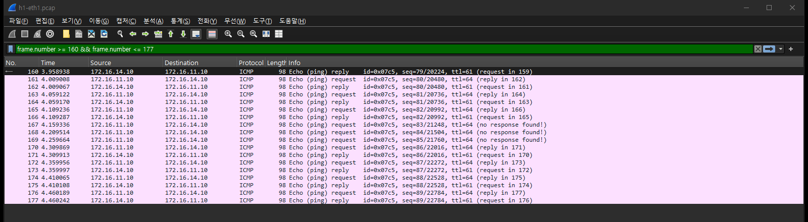
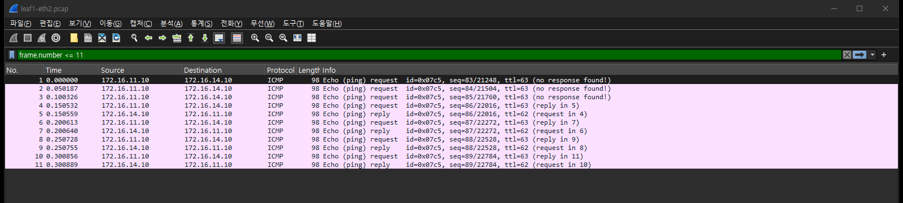
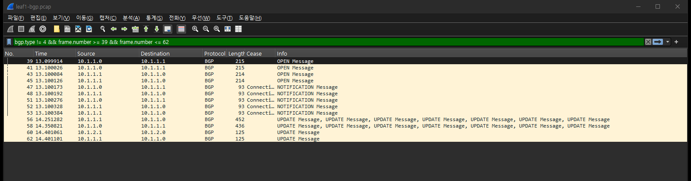

# 실험 06 — 링크 다운 수렴: 케이블이 뽑히면 0.2초

> [실험 목록](../README.md) · 옛 [docs/EXPERIMENTS §2](../../docs/EXPERIMENTS.md)를 패킷 캡처로 다시 잰 장 · 실행 기록 [capture/run-output.txt](capture/run-output.txt)

케이블이 뽑히면 양쪽 장비가 인터페이스 다운을 바로 안다. BGP 타이머를 기다릴 필요가 없다.
그래서 끊김은 0.2초 정도로 짧다. 이 장은 그 0.2초 동안 무슨 일이 있었는지를 본다.
캡처를 열어 보니 두 가지가 눈에 띄었다. 끊김의 대부분은 **반대편 리프가 소식을 듣기까지의 시간**이었다.
그리고 스파인은 경로를 거두는 대신 **다른 리프를 거쳐 돌아가는 길(valley path)**을 광고했다.

## 장애 구성

```
               ┌── eth1 ──╳── spine1 ──┐      T0: leaf1:eth1 down (케이블 단선)
   h1 ── leaf1                         leaf4 ── h4
               └── eth2 ───── spine2 ──┘
```

시작 전에 h1 → h4 ping이 어느 스파인을 타는지 링크 카운터로 찾았다. 요청(leaf1 → spine1)과 응답(leaf4 → spine1) 모두 spine1이었다.
그 길의 leaf1 쪽 링크를 내린다.

| 시각 | 일 |
|---|---|
| T0-4초 | h1 → h4 ping 시작 (0.05초 간격) |
| T0 | `leaf1:eth1 down` |
| T0+8초 | `leaf1:eth1 up` (복구하는 동안에도 끊기는지) |
| T0+31초 | 끝 |

캡처 지점: h1:eth1(ping), leaf1:eth2(남은 링크), leaf1·leaf4의 BGP. 그리고 leaf1·leaf4의 커널 라우팅 변경 로그(`ip monitor route`, [capture/leaf1-route](capture/leaf1-route)).

## 실행

```bash
cd /root/labs/clos-fabric/experiments
06-link-down-convergence/run.sh
```

## 숫자

| | 값 |
|---|---|
| 응답이 끊긴 구간 | **0.20초** (T0-0.04 ~ T0+0.16) |
| 응답 없는 요청 | 3개 / 680개 |
| leaf1이 남은 링크(eth2)로 첫 요청을 보낸 시각 | **T0+0.011** |
| leaf4가 spine1에게서 UPDATE를 받은 시각 | T0+0.054 |
| leaf4 커널 경로가 spine2만 남은 시각 | **T0+0.118** |
| 복구(T0+8) 때 끊긴 요청 | **0** |

옛 측정(0.2초, 0.2초)과 같다. 다만 그때는 0.2초 간격 ping이라 1개 손실 = 0.2초로만 볼 수 있었다. 0.05초 간격으로 다시 재니 0.20초 안의 순서가 보인다.

> 첫 실행에서는 `docker exec`로 링크를 내렸다. 명령이 실제로 실행되기까지 0.15초가 걸려 T0가 어긋났다. 지금은 `nsenter`로 노드 netns에 직접 들어가 내린다.

## 패킷 흐름 ① 요청은 나갔는데 응답이 안 온다

h1:eth1, T0 전후 (Time 4.148초 = T0)



- 166번이 T0 직전의 마지막 응답이다.
- 167·168·169번 요청(seq 83, 84, 85)에는 응답이 없다.
- 170번(seq 86, T0+0.162)부터 다시 응답이 온다.

## 패킷 흐름 ② leaf1은 바로 남은 링크로 돌렸다

leaf1:eth2 (→ spine2), 앞부분



이 캡처의 첫 패킷이 seq 83 요청이고 시각은 T0+0.011이다. 응답이 없던 세 요청이 **전부 남은 링크로 제대로 나갔다.**
leaf1에서 링크를 내리면 커널이 그 링크의 넥스트홉을 바로 죽은 것으로 표시한다. BGP가 무엇을 하기 전에 ECMP 그룹에서 빠진다.

그러니 사라진 것은 응답 쪽이다. 응답은 leaf4 → spine1로 갔고, spine1에서 leaf1로 가는 링크는 이미 끊겨 있었다.
(h4 쪽은 캡처하지 않았다. 요청이 eth2로 나간 것과 응답이 돌아온 시각으로 추론한 것이다.)

## 패킷 흐름 ③ 반대편 리프는 BGP로 소식을 듣는다

leaf4가 spine1에게서 받은 UPDATE 두 개를 펼치면 이렇다 (`tshark -O bgp -V`, leaf4-bgp.pcap 10번·33번).

```
Frame 10  (T0+0.054)  spine1 → leaf4
    Withdrawn Routes Length: 0
    Path Attribute - AS_PATH: 65001 65012 65002 65011
    NLRI: 172.16.11.0/24, 10.255.1.1/32

Frame 33  (T0+9.362, 복구 후)  spine1 → leaf4
    Path Attribute - AS_PATH: 65001 65011
    NLRI: 10.255.1.1/32, 172.16.11.0/24
```

**철회(withdraw)가 아니다.** spine1은 leaf1으로 가는 직접 경로를 잃자, leaf2(65012)와 spine2(65002)를 거쳐 leaf1(65011)로 가는 경로로 바꿔 광고했다.
스파인 → 리프 → 스파인 → 리프로 내려갔다 올라가는 길이라 **valley path**라고 부른다.

leaf4 입장에서는 spine1 경로(AS 4개)가 spine2 경로(65002 65011, AS 2개)보다 길다. 그래서 ECMP에서 빠지고 spine2만 남는다.
커널 경로가 바뀐 것은 T0+0.118이다 ([capture/leaf4-route](capture/leaf4-route)).

```
leaf4 T0+0.118  172.16.11.0/24 nhid 31 via 10.1.2.6 dev eth2 proto bgp metric 20
```

이번에는 결과적으로 같은 효과였다. 하지만 이 랩은 스파인마다 AS가 달라서(65001, 65002) 이런 우회 경로가 생긴다.
RFC 7938이 **스파인들에 같은 AS를 주라고 권하는 이유**가 이것이다. 같은 AS라면 spine1은 AS_PATH에 자기 AS(=spine2의 AS)가 있는 경로를 루프로 보고 버린다. 그러면 바로 철회가 나간다.
스파인 링크가 여러 개 끊기면 이런 우회 경로가 실제 트래픽을 리프를 거쳐 돌게 만들 수 있다 (path hunting). 설계 쪽 결정 거리로 남긴다.

## 패킷 흐름 ④ 링크가 돌아올 때 — 끊김 없음

leaf1 BGP, keepalive 제외 (Time 4.94초 = T0, 12.94초 = 링크 업)



- T0+8.160: leaf1과 spine1이 **동시에** OPEN을 보냈다 (39~45번). 서로 상대에게 연결을 걸었기 때문이다.
- 47~53번 NOTIFICATION은 `Cease / Connection Collision Resolution (7)`. 두 연결 중 하나를 정리한다 (RFC 4271 6.8).
- 1.15초 뒤(56·58번) 남은 연결로 경로를 주고받는다. leaf4에 ECMP 두 개가 돌아온 것은 T0+9.42다.

이 동안 ping은 하나도 잃지 않았다. 새 경로는 **생기기만 하고 없어지는 것이 없으므로** 복구는 무손실이다.

## 결론

ping이 타고 있던 leaf1의 링크를 내리자 응답은 0.2초 끊겼다(680개 중 3개 무응답). leaf1은 인터페이스가 내려간 것을 바로 알아 0.011초 만에 남은 링크로 돌렸다. 끊김의 대부분은 응답 방향의 leaf4가 spine1에게서 BGP UPDATE를 받아 경로를 바꾸기까지(0.118초) 걸린 시간이다. 링크를 다시 올릴 때는 경로가 새로 생기기만 하고 없어지는 것이 없어서 손실이 없었다.

뜻밖의 발견도 있었다. spine1은 경로를 거두지 않고 다른 리프를 거쳐 돌아가는 길(AS 4개짜리 valley path)을 광고했다. 스파인마다 AS가 달라서 생기는 일이고, RFC 7938이 스파인끼리 같은 AS를 쓰라고 권하는 이유다. 끊김이 0.1~0.3초 수준이면 BGP 타이머가 아니라 인터페이스 다운 감지로 수렴한 것이다.

## 파일

| 파일 | 내용 |
|---|---|
| `run.sh` | 경로 찾기 → 링크 다운 → 복구, 캡처와 시각 계산 |
| `restore.sh` | 중간에 멈췄을 때 링크를 올리고 캡처를 끈다 |
| `capture/h1-eth1.pcap` | ping (끊긴 구간) |
| `capture/leaf1-eth2.pcap` | 남은 링크로 넘어간 요청 |
| `capture/leaf1-bgp.pcap`, `leaf4-bgp.pcap` | BGP (UPDATE, 재연결 충돌) |
| `capture/leaf1-route`, `leaf4-route`, `T0`, `T1` | 커널 라우팅 변경 로그(epoch 초), 링크 다운·업 시각 |
