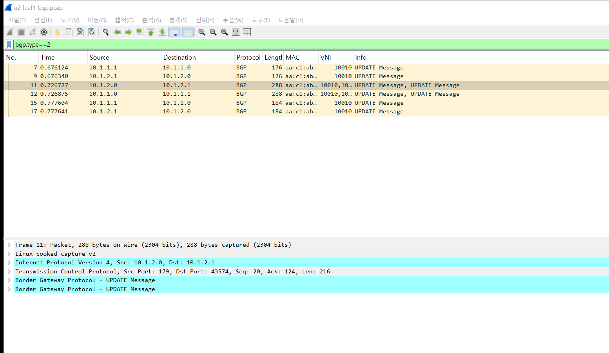
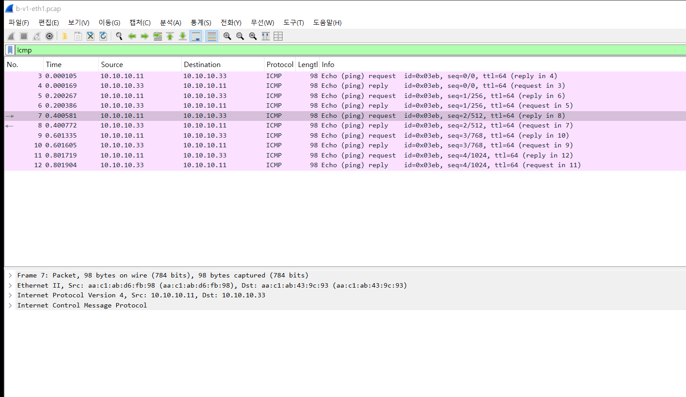
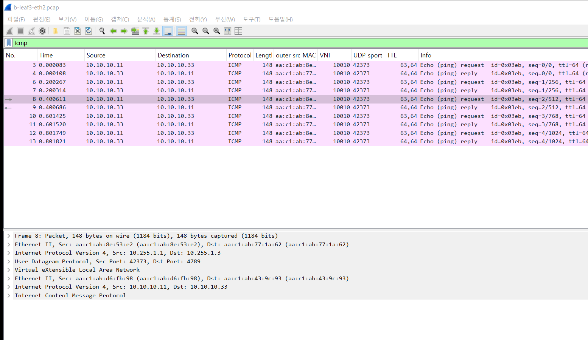
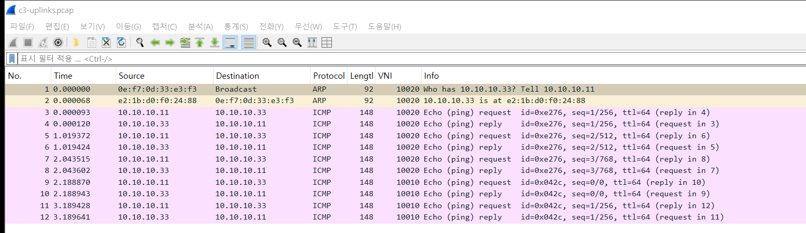
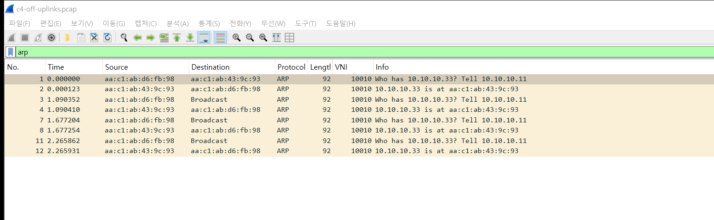
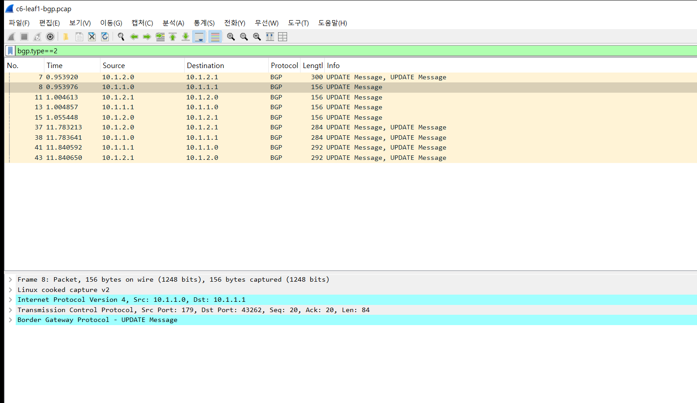

# 실험 08 — 패킷의 일생: 주소록에서 배달까지

> [실험 목록](../README.md) · 실행 기록 [capture/run-output.txt](capture/run-output.txt)

v1이 보낸 프레임 하나는 어떤 정보를 근거로, 어떤 모양으로, 어떤 길을 지나 v3에 도착할까.
그리고 그 과정은 순수 L3 라우팅보다 무엇을 더 주고 무엇을 더 가져갈까.

세 부분이 맞물린다. 주소록(EVPN 컨트롤플레인)이 길을 정하고(Part A), 패킷(VXLAN 데이터플레인)이 그 길을 탄다(Part B).
마지막으로 같은 토폴로지의 순수 L3 경로와 나란히 놓고 값어치를 잰다(Part C).

| 주소록 — v3의 MAC이 BGP UPDATE로 도착 | 배달 — 같은 ping이 VXLAN 상자에 담겨 스파인을 지난다 |
|---|---|
|  |  |

## 구성

```
            ┌──── spine1 (AS 65001) ────┐
  v1 ── leaf1                           leaf3 ── v3        EVPN-VXLAN: VNI 10010, 10.10.10.0/24
  h1 ──  (VTEP 10.255.1.1)   (VTEP 10.255.1.3) ── h3       순수 L3:   172.16.11.0/24 ↔ 172.16.13.0/24
            └──── spine2 (AS 65002) ────┘
```

| 경로 | 출발 | 도착 | 방식 |
|---|---|---|---|
| EVPN-VXLAN | v1 (leaf1, 10.10.10.11) | v3 (leaf3, 10.10.10.33) | 같은 서브넷. 리프가 프레임을 VXLAN으로 감싸 상대 리프로 보낸다 |
| 순수 L3 | h1 (leaf1, 172.16.11.10) | h3 (leaf3, 172.16.13.10) | 랙마다 다른 서브넷. 리프가 게이트웨이이고 라우팅만 한다 |

두 경로는 같은 리프와 같은 스파인을 지난다. 차이는 그 위에 무엇을 얹었느냐뿐이라 비교 기준이 된다.

## 실행

```bash
cd /root/labs/clos-fabric/experiments
_tools/prep-hosts.sh            # 랩을 새로 띄웠을 때 한 번 (iperf3)
08-packet-life-evpn/run.sh      # Part A → B → C-1~C-7, 끝에서 전부 원복
```

## Part A — 주소록 보기

### A-1 아무도 말하기 전

v1·v3의 MAC을 리프에서 지운 직후 leaf1의 주소록이다.

```
VNI: 10010
 Local VTEP IP: 10.255.1.1
 Remote VTEPs for this VNI:
  10.255.1.3 flood: HER
 Number of MACs (local and remote) known for this VNI: 0

EVPN type-3 prefix: [3]:[EthTag]:[IPlen]:[OrigIP]
 *>  [3]:[0]:[32]:[10.255.1.1]
 *>  [3]:[0]:[32]:[10.255.1.3]
```

Type-3는 이 VNI의 브로드캐스트를 받겠다는 VTEP 목록이다. 리프마다 하나씩, 둘 다 있다.
그래서 leaf1은 MAC을 하나도 몰라도 브로드캐스트(ARP 등)를 어디로 복제해 보낼지는 안다(`flood: HER`, head-end replication).
MAC 명부(Type-2)는 비어 있다.

### A-2 v3가 한 번 말하는 순간

leaf1에서 BGP를 캡처해 둔 채로 v3가 ping을 한 번 보냈다.


11번(spine2에서)과 12번(spine1에서)이 v3의 MAC을 담은 UPDATE다. 두 스파인이 각각 전달하니 같은 경로가 두 번 온다(`*>`, `*=`).
11번에서 v3 부분을 펼치면:

```
Next hop: 10.255.1.3                              ← leaf3 의 VTEP (루프백)
    Route Type: MAC Advertisement Route (2)
    Route Distinguisher: 10.255.1.3:2
    MAC Address: aa:c1:ab:43:9c:93                ← v3
Path Attribute - AS_PATH: 65002 65013
    Route Target: 65013:10010
    Tunnel type: VXLAN Encapsulation (8)
```

핵심은 넥스트홉이다. 주소록이 이 MAC으로 가는 프레임은 10.255.1.3이라는 송장 주소로 보내라고 알려 준다.
VNI 10010은 라벨 칸에 들어 있다. Wireshark는 이 칸을 MPLS 라벨로 읽어 625로 표시하는데, 625 × 16 + 10 = 10010이다.

7·9번은 그 반대 방향이다. v3의 ping에 답하느라 v1이 말했고, leaf1이 v1의 MAC을 스파인으로 광고했다.
이 랩의 Type-2는 MAC만 담고 IP는 없다(`[IPlen]` 칸이 비어 있다). 리프 브리지에 IP가 없어서 리프가 IP↔MAC을 배우지 못하기 때문이다. C-4에서 이것이 차이를 만든다.

### A-3 명부가 커널의 배달 표로 내려온다

```
leaf1$ bridge fdb show dev vni10010
aa:c1:ab:43:9c:93 dev vni10010 dst 10.255.1.3 self extern_learn
```

BGP로 받은 명부가 리눅스 브리지의 실제 배달 표에 설치됐다. `extern_learn`은 FRR이 넣었다는 표시다. 이 줄이 컨트롤플레인과 데이터플레인이 만나는 지점이다.
브리지는 v3의 MAC으로 가는 프레임을 vni10010 포트로 보내고, VXLAN 장치는 바깥 목적지를 10.255.1.3으로 채운다.

## Part B — 패킷의 일생

v1 → v3 ping 5개를 여섯 지점에서 동시에 캡처하고, seq=2 하나를 따라간다.

| 지점 | 캡처 위치 | 크기 | 바깥 MAC | 바깥 IP (TTL) | UDP 출발 포트 | VNI | 안쪽 |
|---|---|---|---|---|---|---|---|
| ① 출발 | v1:eth1 | 98 | — | — | — | — | v1 → v3 MAC, 10.10.10.11 → .33, TTL 64 |
| ② 포장 직후 | leaf1:eth2 | **148** | leaf1:eth2 → spine2 | 10.255.1.1 → 10.255.1.3 (**64**) | 42373 | 10010 | ①과 같음 |
| ③ 허브 통과 | leaf3:eth2 | 148 | **spine2 → leaf3:eth2** | 10.255.1.1 → 10.255.1.3 (**63**) | 42373 | 10010 | ①과 같음 |
| ④ 도착 | v3:eth1 | 98 | — | — | — | — | ①과 똑같다 |

**① 출발** — v1이 낸 그대로의 98바이트 프레임이다.



**② 포장 직후** — leaf1이 같은 프레임 앞에 바깥 이더넷·IP·UDP·VXLAN 헤더를 붙였다. 아래 상세 창에 겉포장 네 겹과 원래 프레임 세 겹이 차례로 보인다.


**③ 허브 통과** — spine2는 바깥 IP만 보고 길을 찾는다. 바뀐 것은 바깥 MAC(spine2 → leaf3)과 바깥 TTL(64 → 63)뿐이고, UDP 포트·VNI·안쪽 프레임은 그대로다. 스파인은 상자를 열지 않는다.



**④ 도착** — leaf3이 겉포장을 벗기고 v3에게 넘긴 프레임은 ①과 바이트 하나까지 같다(98바이트, 안쪽 TTL 64).
안쪽 TTL이 줄지 않은 것도 볼거리다. v1과 v3에게 이 통신은 라우터를 하나도 거치지 않은 같은 스위치 위의 대화다.

leaf1의 머릿속은 두 줄로 요약된다.

```
leaf1$ bridge fdb show br br10010 | grep <v3 MAC>     → dev vni10010 dst 10.255.1.3   (누구 상자에 넣을지)
leaf1$ ip route get 10.255.1.3                         → via 10.1.2.0 dev eth2         (어느 스파인으로 보낼지)
       Known via "bgp"  * 10.1.1.0 via eth1  * 10.1.2.0 via eth2                        (ECMP 두 길)
```

덧붙여 볼 것 두 가지가 있다.

- **UDP 출발 포트 42373**은 리눅스가 안쪽 흐름을 해시해서 정한 값이다. 흐름마다 이 값이 달라야 스파인 두 대로 나뉠 수 있다([실험 05](../05-ecmp-hash/README.md)). 이번에는 요청과 응답이 같은 값을 썼다.
- **응답 경로**: 이번 5개는 요청과 응답 모두 spine2를 탔다(eth1 쪽 캡처는 비어 있다). 리프의 해시 정책이 0(바깥 IP 쌍만 봄)이라 leaf1↔leaf3 쌍은 한쪽으로 몰린다. 갈 때와 올 때 길을 고르는 것은 각 리프가 따로 하는 일이라, 정책이 바뀌면 둘이 달라질 수도 있다.

## Part C — 효용과 비용

### 효용

**C-1 L2 확장** — 같은 서브넷을 두 랙에 둘 수 있는가.

| | 결과 |
|---|---|
| EVPN: v1(leaf1)과 v3(leaf3), 둘 다 10.10.10.0/24 | ping 0% 손실 |
| 순수 L3: h3(leaf3)에 h1과 같은 서브넷 주소 172.16.11.50을 붙이고 h1에게 | **100% 손실**, h3의 ARP가 `FAILED` |

순수 L3에서 172.16.11.0/24는 leaf1의 서브넷이다. h3는 h1이 같은 서브넷이라 믿고 ARP로 직접 찾지만, ARP는 leaf3 밖으로 나가지 않는다.

**C-2 이사** — v3를 leaf3에서 leaf1로 옮겼다. 옛 자리(v3:eth1)를 내리고, leaf1의 br10010에 같은 MAC·IP를 쓰는 새 자리를 붙였다. v1은 그동안 0.05초 간격으로 ping을 보냈다.

| 이사 기준 시각 | 일어난 일 |
|---|---|
| +0.00초 | 옛 자리 내림 |
| +0.24초 | leaf3이 v3의 Type-2를 철회 (MP_UNREACH), leaf1에 도착 |
| +0.46초 | 새 자리에서 첫 응답 (v1 기준 응답 공백 **0.35초**, 160개 중 6개 손실) |
| +0.51초 | leaf1이 v3의 MAC을 자기 것(넥스트홉 10.255.1.1)으로 광고 |

IP를 그대로 둔 채 0.35초 만에 따라갔다. 응답이 BGP 광고보다 먼저 돌아온 것은 v1과 새 자리가 같은 leaf1에 있어 브리지가 바로 배웠기 때문이다.
MAC Mobility 순번은 0으로 남았다. 옛 자리가 먼저 철회되고 새 자리가 나중에 나타나서 같은 MAC이 두 곳에 동시에 있던 순간이 없었기 때문이다. 순번은 두 VTEP가 같은 MAC을 동시에 광고할 때 최신 위치를 고르는 장치다([실험 03](../03-broadcast-storm/README.md)에서는 루프 때문에 이 순번이 수십까지 올랐다).
순수 L3라면 랙을 옮기는 순간 서브넷이 바뀌니 IP를 바꿔야 한다.

**C-3 멀티테넌시** — VNI 10020을 B사로 만들고, A사(VNI 10010)와 **같은 10.10.10.0/24, 같은 IP**(.11, .33)를 썼다.



| | 결과 |
|---|---|
| B사 10.10.10.11 → 10.10.10.33 (VNI 10020) | 0% 손실 |
| A사 10.10.10.11 → 10.10.10.33 (VNI 10010) | 0% 손실 |
| 10.10.10.33의 MAC | A사가 본 것 `aa:c1:ab:43:9c:93`, B사가 본 것 `e2:1b:d0:f0:24:88` |

스파인 쪽 링크에서 같은 IP 쌍이 VNI 값만 다르게 흐른다. 상자에 붙은 VNI 꼬리표가 다르니 섞이지 않는다.
VNI 10020은 리프에 브리지와 VXLAN 장치만 만들자 FRR이 알아서 광고했다(`advertise-all-vni`). 순수 L3라면 같은 주소가 두 곳에 있을 수 없다.

**C-4 외침 줄이기** — v1의 ARP 캐시를 지우고 ping을 세 번 보내 ARP를 세 번 일으켰다. leaf1 업링크에서 VXLAN 안의 ARP 요청을 셌다.

| 조건 | 패브릭으로 나간 ARP 요청 |
|---|---|
| ARP 억제(`neigh_suppress`) 끔 | 4개 |
| 켬, 리프가 IP↔MAC을 모름 (이 랩의 기본 상태) | 3개 |
| 켬, 리프 브리지에 IP를 줘 IP↔MAC을 배움 | **0개** |
| 순수 L3 (h1이 같은 횟수만큼 ARP) | 0개 |



ARP 억제는 켜 두기만 해서는 효과가 거의 없었다. 리프가 대신 대답하려면 v3의 IP와 MAC을 알아야 하는데, 이 랩의 Type-2에는 IP가 없었다(A-2).
리프 브리지에 IP를 주자 리프가 IP↔MAC을 배우고 Type-2에 IP가 실렸다(`[2]:[0]:[48]:[aa:c1:ab:43:9c:93]:[32]:[10.10.10.33]`). 그 뒤로 leaf1이 ARP에 직접 답해 패브릭으로 나가는 ARP가 0이 됐다.
순수 L3에서는 h1이 게이트웨이(leaf1) 하나만 묻고 그 ARP는 처음부터 리프 밖으로 나가지 않는다.

### 비용

**C-5 상자 무게**

| | 값 |
|---|---|
| 같은 1472바이트 ping, v1이 낸 프레임 | 1514바이트 |
| 스파인 쪽 링크의 프레임 | **1564바이트** (+50) |
| 기본 MTU 그대로 TCP (v1·v3 NIC 9500, 리프 vni10010 1500) | **0 Mbit/s** |
| MTU를 넷 다 1500으로 맞춘 TCP 4초 × 3회 | EVPN-VXLAN 1120 / 1165 / 910 · 순수 L3 1425 / 1025 / 1207 Mbit/s |

겉포장은 정확히 50바이트다(이더넷 14 + IP 20 + UDP 8 + VXLAN 8).
더 큰 비용은 MTU다. 서버 NIC는 9500인데 리프의 VXLAN 장치는 1500이라, 작은 ping은 지나가고 9000바이트짜리 TCP 세그먼트는 브리지에서 말없이 버려져 처리량이 0이 됐다. 오버레이를 쓰면 서버·VXLAN 장치·언더레이 MTU를 함께 설계해야 한다.
같은 MTU에서 처리량은 EVPN 쪽이 평균 13% 낮았지만 회차별 흔들림이 커서(순수 L3도 1025~1425) 이 랩의 숫자로 단정하기는 어렵다. veth는 CPU로 패킷을 옮기니 캡슐화 비용이 처리량으로 바로 드러난다.

**C-6 고장 지점 증가** — 언더레이는 그대로 두고 leaf3의 EVPN 광고만 껐다(`no advertise-all-vni`).



| | 결과 |
|---|---|
| leaf1의 BGP IPv4 세션 | 2 / 2 Established |
| 순수 L3 h1 → h3 | 0% 손실 |
| EVPN v1 → v3 | **100% 손실** |

길은 멀쩡한데 배달이 안 된다. leaf3이 v3의 Type-2와 자기 Type-3을 함께 철회해서, leaf1은 v3의 MAC도, 브로드캐스트를 보낼 VTEP도 잃었다.
언더레이 세션·경로·인터페이스 지표는 전부 정상이다. 순수 L3에는 없는 장애 유형이고, [실험 01](../01-hidden-mtu-meets-spine-failure/README.md)처럼 컨트롤플레인 지표만 보는 모니터링이 놓치는 종류다.

**C-7 기억해야 할 양** (leaf1 기준)

| | 지금 랩 | 늘어나는 단위 |
|---|---|---|
| 순수 L3 | BGP IPv4 경로 19개, 커널 경로 13줄 | 랙(리프)마다 /24 하나 |
| EVPN | Type-3 2개, Type-2 2개(MAC 명부 2), vni10010 fdb 6줄 | **서버(MAC)마다** Type-2 하나, IP까지 실으면 하나 더 |

지금은 서버가 둘뿐이라 EVPN 쪽이 작아 보이지만, 순수 L3는 랙이 늘 때만 늘고 EVPN은 서버가 늘 때마다 는다. 서버 수천 대 규모에서는 이 차이가 리프의 메모리와 BGP 처리량으로 돌아온다.

## 결론

EVPN-VXLAN은 같은 서브넷을 리프 너머로 늘렸고(C-1), 서버가 다른 랙으로 옮겨도 IP를 유지한 채 0.35초 만에 따라갔고(C-2), 두 고객이 같은 10.10.10.0/24를 써도 VNI 꼬리표로 갈라 섞이지 않게 했다(C-3). 리프가 IP↔MAC까지 알면 ARP도 패브릭으로 퍼뜨리지 않는다(C-4). 그 근거는 Part A의 주소록이다. leaf3이 광고한 Type-2 하나가 leaf1의 배달 표에 `dst 10.255.1.3` 한 줄로 내려앉고, 패킷은 그 줄을 따라 50바이트짜리 상자에 담겨 스파인을 지난다. 스파인은 상자를 열지 않고 바깥 MAC과 TTL만 바꾼다.

대신 패킷마다 50바이트를 더 내고, 서버와 VXLAN 장치의 MTU가 어긋나면 큰 전송이 통째로 멈춘다(C-5). 언더레이가 정상이어도 EVPN 광고 하나가 빠지면 오버레이만 죽는 장애가 새로 생기고(C-6), 서버 수만큼 상태를 기억해야 한다(C-7). 같은 서브넷 확장, 이동성, 멀티테넌시가 필요 없는 환경이라면 랙마다 서브넷을 나누는 순수 L3가 더 단순하다.

## 파일

| 파일 | 내용 |
|---|---|
| `run.sh` | Part A → B → C-1~C-7. 만든 것(netns, VNI 10020, 브리지 IP)과 바꾼 것(MTU, ARP 억제, EVPN 광고)은 끝에서 되돌린다 |
| `restore.sh` | 중간에 멈췄을 때 원복 |
| `capture/a2-leaf1-bgp.pcap` | v3의 Type-2가 도착하는 순간 |
| `capture/b-*.pcap` | 패킷의 일생, 여섯 지점 |
| `capture/c2-*.pcap` | 이사: v1의 ping, leaf1의 BGP |
| `capture/c3-uplinks.pcap` | 두 테넌트의 VNI |
| `capture/c4-*.pcap` | ARP 억제 조건별 업링크 |
| `capture/c5-*.pcap` | 1514 → 1564바이트 |
| `capture/c6-leaf1-bgp.pcap` | EVPN 광고를 끄고 켤 때의 철회와 재광고 |
| `img/` | Wireshark 화면 |
