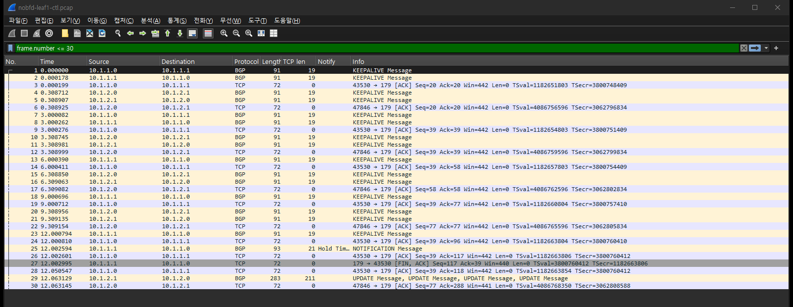
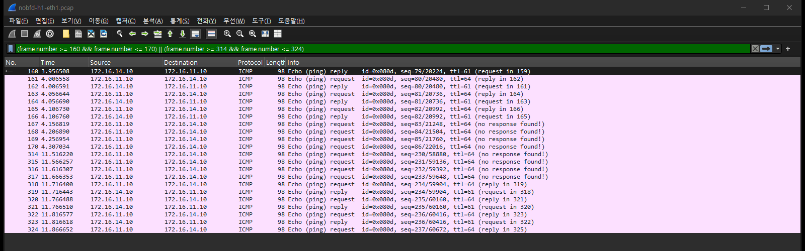
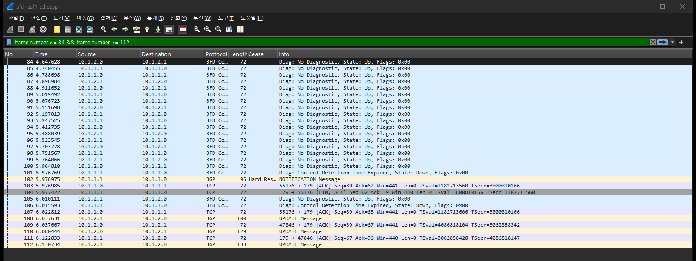

# 실험 09 — 스파인 무응답과 BFD: 링크는 살아 있는데 상대가 죽었을 때

> [실험 목록](../README.md) · 옛 [docs/EXPERIMENTS §2](../../docs/EXPERIMENTS.md)를 패킷 캡처로 다시 잰 장 · 실행 기록 [capture/run-output.txt](capture/run-output.txt)

[실험 08](../08-link-down-convergence/README.md)의 케이블 단선은 0.2초에 끝났다. 인터페이스가 내려가니 장비가 바로 알았다.
이번에는 링크가 멀쩡한 채로 스파인이 멈춘다. 리프는 상대가 죽었다는 것을 무엇으로 알 수 있을까.
BGP만 있으면 hold timer(9초)가 다 지나야 안다. BFD를 붙이면 0.9초에 안다. 같은 장애를 두 번 넣고 두 경우를 패킷으로 비교한다.

## 장애 구성

```
               ┌── eth1 ───── spine1 ──┐      T0: spine1 먹통
   h1 ── leaf1               (ip_forward=0  leaf4 ── h4
               │              + docker pause)
               └── eth2 ───── spine2 ──┘      링크는 전부 up
```

h1 → h4 ping이 타는 스파인(이번에도 요청·응답 모두 spine1)을 찾아 얼린다.
`ip_forward=0`으로 지나가는 패킷을 버리게 하고, `docker pause`로 FRR(bgpd, bfdd)을 멈춘다.

| Phase | 감지 수단 | 설정 |
|---|---|---|
| nobfd | BGP keepalive 3초 / hold 9초 | 베이스 그대로 (`timers 3 9`) |
| bfd | BFD 300ms × 3 | `scripts/bfd-apply.sh on`. 끝나면 `off` |

각 Phase: T0-4초 ping 시작(0.05초 간격) → T0 먹통 → T0+15초 복구 → 세션이 다시 붙을 때까지 대기.
캡처: h1:eth1(ping), leaf1·leaf4의 BGP와 BFD(tcp 179, udp 3784).

## 실행

```bash
cd /root/labs/clos-fabric/experiments
09-spine-freeze-bfd/run.sh     # nobfd → BFD 적용 → bfd → BFD 해제
```

## 숫자

| | nobfd | bfd |
|---|---|---|
| 응답이 끊긴 구간 | **7.61초** | **1.15초** |
| 응답 없는 요청 (0.05초 간격) | 151 / 760 | 22 / 760 |
| spine1의 마지막 신호 | KEEPALIVE, T0-1.546 | BFD, T0-0.033 |
| leaf1이 죽었다고 판단 | T0+7.457 (`Hold Timer Expired`) | T0+0.867 (`BFD Down`) |
| 마지막 신호에서 판단까지 | **9.003초** = hold time | **0.900초** = 300ms × 3 |
| leaf4가 판단 | T0+7.455 | T0+1.024 |

옛 측정은 7.6초·8.8초 / 0.8초·1.2초였다. 이번에도 그 범위다.
값이 매번 조금씩 다른 이유는 위 표의 "마지막 신호" 줄에 있다. hold timer는 **장애 순간이 아니라 마지막 keepalive부터** 센다.
이번 실행에서 spine1의 마지막 keepalive는 장애 1.5초 전이었다. 그래서 9초가 아니라 7.5초 만에 만료됐다. keepalive 주기(3초) 안에서 장애가 어디에 떨어지느냐에 따라 6~9초 사이로 움직인다.

## 패킷 흐름 ① BFD 없음 — 9초 동안 아무 일도 없다

leaf1 BGP, 앞 30개 (Time 4.546초 = T0)



- 7번(1.546초 전)이 spine1(10.1.1.0)이 보낸 마지막 KEEPALIVE다.
- leaf1은 13·18·23번에서 3초마다 KEEPALIVE를 계속 보낸다.
- **14·19·24번: spine1이 그 KEEPALIVE에 TCP ACK를 보낸다.** `docker pause`는 프로세스만 멈춘다. TCP는 커널이 처리하므로 계속 대답한다.
  TCP 연결만 보면 상대가 살아 있다. 그래서 BGP는 TCP가 끊기는 것으로는 알 수 없고, 자기 메시지(KEEPALIVE)가 안 오는 것만 센다.
- 25번(T0+7.457): `NOTIFICATION, Hold Timer Expired (4)`. 7번에서 정확히 9.003초 뒤다.
- 29번부터 spine2 쪽으로 UPDATE가 오간다. 경로가 정리된다.

h1 쪽에서는 그 9초가 이렇게 보인다.



## 패킷 흐름 ② BFD — 0.9초

leaf1 BFD + BGP, 84~112번 (Time 5.110초 = T0)



- 90번(5.077초, T0-0.033): spine1(10.1.1.0)이 보낸 마지막 BFD 패킷이다.
- 93·96·98번: leaf1은 약 300ms마다 spine1에게 BFD를 계속 보낸다. spine2와의 BFD(10.1.2.x)는 그대로 오간다.
- 101번(T0+0.867): leaf1 → spine1 `State: Down, Diag: Control Detection Time Expired`. 90번에서 **0.900초** 뒤다.
- 같은 순간 102번: BGP NOTIFICATION. 펼치면 이렇다.

```
Border Gateway Protocol - NOTIFICATION Message
    Major error Code: Cease (6)
    Minor error Code (Cease): Hard Reset (9)
    Data: 060a                 ← 안쪽 코드: Cease (6) / BFD Down (10)
```

FRR은 graceful restart 알림 기능(RFC 8538)을 협상한 세션에서 NOTIFICATION을 Hard Reset으로 감싼다. 진짜 이유는 Data에 있다. `06 0a` = Cease / BFD Down (RFC 9384).
- 108번부터 spine2 쪽 UPDATE. 이후 수렴은 nobfd와 같은 순서다. 감지 시점만 9초에서 0.9초로 당겨졌다.

leaf4는 0.157초 늦은 T0+1.024에 판단했다. BFD 패킷이 오가는 박자가 리프마다 다르기 때문이다.
h1의 끊김(1.15초)은 둘 중 **늦은 쪽**(응답 방향인 leaf4)에서 끝났다.

## 둘을 겹쳐 보면

| 시각 (T0 기준) | nobfd | bfd |
|---|---|---|
| -1.546 | spine1 마지막 KEEPALIVE | |
| -0.033 | | spine1 마지막 BFD |
| 0 | spine1 먹통 | spine1 먹통 |
| +0.867 | (기다림. spine1 커널은 ACK 중) | leaf1 BFD Down → BGP NOTIFICATION |
| +1.024 | | leaf4 BFD Down |
| +1.12 | | h1 응답 재개 |
| +7.457 | leaf1 Hold Timer Expired | |
| +7.455 | leaf4 Hold Timer Expired | |
| +7.57 | h1 응답 재개 | |

nobfd에서 leaf1과 leaf4가 거의 같은 순간(2ms 차이)에 만료된 것은 spine1이 모든 리프에게 keepalive를 같은 박자로 보냈기 때문이다.

## 결론

> **링크가 살아 있는 채로 장비가 멈추면 BGP는 최대 9초 뒤에야 알고, BFD는 0.9초에 안다.**

| | |
|---|---|
| **넣은 장애** | spine1 먹통 (`ip_forward=0` + `docker pause`). BFD 없이 한 번, BFD 300ms×3으로 한 번 |
| **겉으로 보인 것** | ping 끊김 **7.61초** vs **1.15초** |
| **핵심 숫자** | 마지막 신호에서 판단까지 9.003초 (= hold time) vs 0.900초 (= 300ms × 3). 응답 없는 요청 151 vs 22 |
| **왜 그랬나** | 링크는 up이고 커널은 TCP ACK까지 보내서 연결은 살아 보인다. BGP는 KEEPALIVE가 hold time 동안 안 오는 것으로만 안다. hold timer는 마지막 keepalive부터 세서 6~9초 사이로 흔들린다 |
| **결정적 증거** | spine1이 KEEPALIVE는 안 보내는데 TCP ACK는 보낸다. BFD에선 `Control Detection Time Expired` → BGP `Cease / Hard Reset` (Data `060a` = BFD Down) |
| **기억할 것** | 케이블 단선(실험 08)은 인터페이스 다운으로 0.2초에 안다. BFD가 필요한 건 이 경우처럼 링크는 살아 있고 상대만 멈췄을 때다 |

## 파일

| 파일 | 내용 |
|---|---|
| `run.sh` | 경로 찾기 → 먹통 → 복구, BFD 없이 한 번, BFD로 한 번 |
| `restore.sh` | 중간에 멈췄을 때 스파인을 풀고 BFD 해제 |
| `capture/<phase>-h1-eth1.pcap` | ping |
| `capture/<phase>-leaf1-ctl.pcap`, `<phase>-leaf4-ctl.pcap` | BGP + BFD |
| `capture/<phase>.T0` | 먹통 주입 시각 (epoch 초) |
