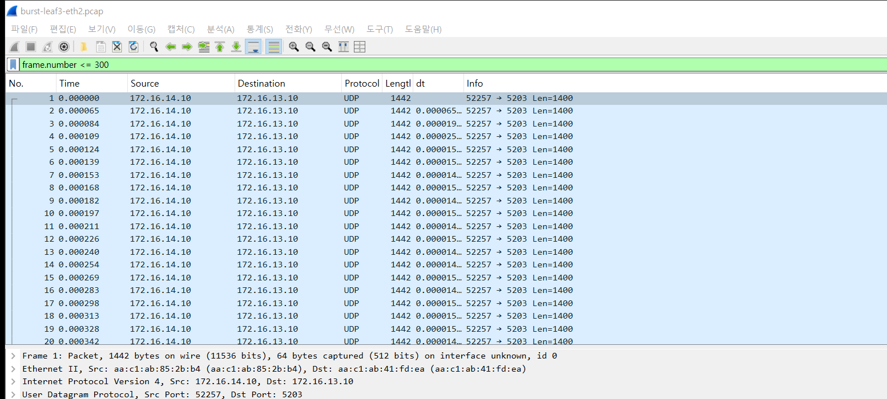
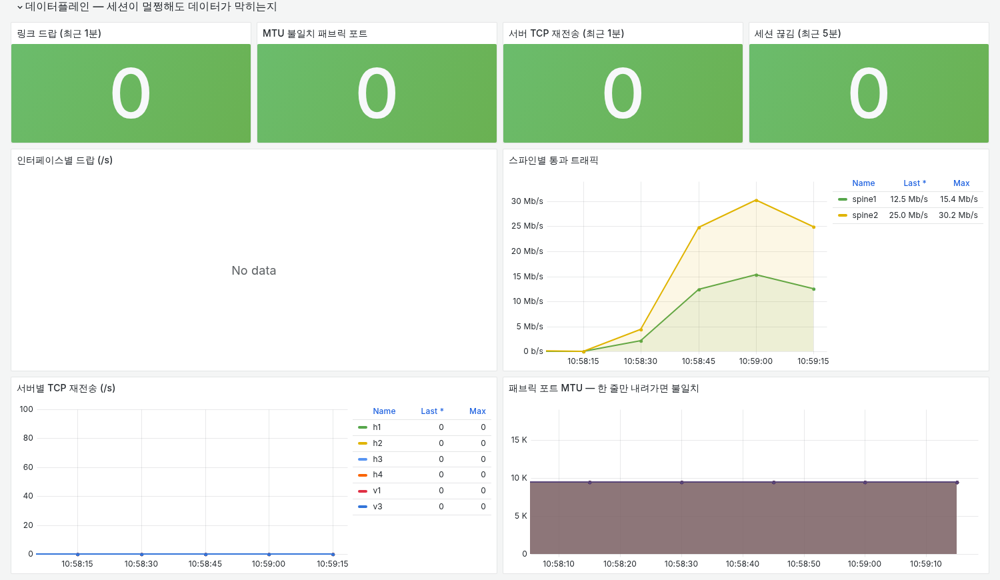
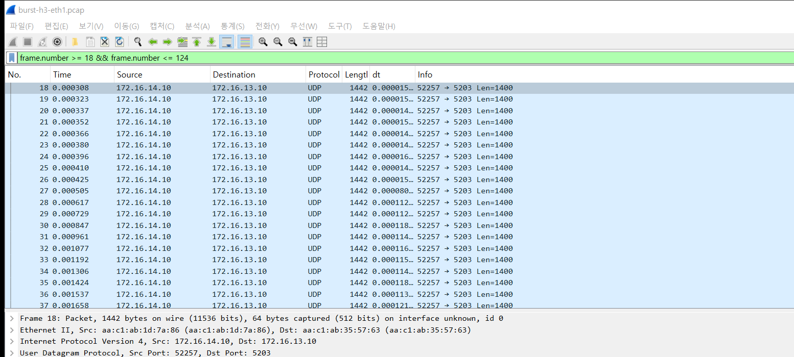
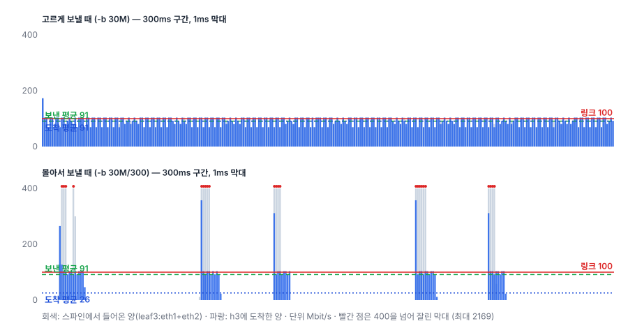

# 실험 10 — 마이크로버스트: 평균은 한가한데 패킷이 버려진다

> [실험 목록](../README.md) · 실행 기록 [capture/run-output.txt](capture/run-output.txt)

링크 사용률 그래프는 평균이다. 5초에 한 번 바이트 수를 세서 나누면, 그 5초 안에서 몇 밀리초 동안 몰려온 트래픽은 보이지 않는다.
스위치 포트의 버퍼는 몇 밀리초 분량밖에 안 되니, 그 순간에 넘친 패킷은 버려진다.
이 장은 평균이 같은 두 트래픽(고르게 / 몰아서)을 같은 포트에 흘려 보고, 패킷 캡처와 모니터링이 각각 무엇을 보는지 비교한다.

| 패킷 — 300개가 12µs 간격으로 몰려 들어온다 | 모니터링 — 같은 시간, 드랍 0 |
|---|---|
|  |  |

## 장애 구성

```
   h1 ─ leaf1 ┐
   h2 ─ leaf2 ┼═ spine1/spine2 ═ leaf3 ──[100Mbit, 버퍼 64KB]── h3 (iperf3 서버 3개)
   h4 ─ leaf4 ┘                    ↑ 캡처: eth1·eth2        ↑ 캡처: h3:eth1
                                    (들어온 것)               (도착한 것)
```

| 항목 | 값 |
|---|---|
| 병목 | leaf3:eth3 송신에 `tc tbf rate 100mbit burst 32kb limit 64kb`. 100Mbit 포트, 버퍼 약 5ms 분량 |
| 트래픽 | h1·h2·h4가 각각 h3로 UDP 30Mbit/s, 10초. 셋을 합친 평균 90Mbit/s로 링크(100)보다 낮다 |
| Phase smooth | `iperf3 -u -b 30M` — iperf3 기본 페이싱으로 1ms마다 몇 개씩 고르게 |
| Phase burst | `iperf3 -u -b 30M/300` — 평균은 같고, 300개(약 420KB)를 한 번에 몰아 보낸 뒤 쉰다 |

## 실행

```bash
cd /root/labs/clos-fabric/experiments
_tools/prep-hosts.sh        # 랩을 새로 띄웠을 때 한 번 (iperf3)
10-microburst/run.sh        # 두 Phase → Prometheus 질의 → 1ms 재집계(io.py) → 원복
```

모니터링 스택(`monitoring/up.sh`)이 떠 있어야 모니터링 쪽 숫자가 나온다.

## 숫자

| | smooth | burst |
|---|---|---|
| 셋이 보낸 평균 (캡처) | 90.9 Mbit/s | 91.4 Mbit/s |
| h3에 도착한 평균 (캡처) | 90.9 Mbit/s | **25.5 Mbit/s** |
| iperf3 손실 (h1 / h2 / h4) | 0% / 0% / 0% | **83% / 72% / 61%** |
| leaf3:eth3 버퍼에서 버려진 패킷 (`tc -s qdisc`) | 0 | **58,368** |
| 같은 포트의 `tx_dropped` (모니터링이 읽는 값) | 0 | **0** |
| 모니터링이 본 leaf3:eth3 송신 속도 (5초 scrape 최대) | 90.6 Mbit/s | **24.8 Mbit/s** |
| `InterfaceDropping` 알람 | 0 | **0** |
| 1ms 단위 최대 유입 (캡처) | 519 Mbit/s | **2,330 Mbit/s** |

보낸 양은 두 Phase가 같다. 몰아서 보내자 70% 넘게 사라졌는데, 모니터링이 본 숫자는 송신 속도가 오히려 줄어든 것(90 → 25)뿐이었다.

## 패킷 흐름 ① 버스트 하나가 들어오는 모습

burst Phase 중 버스트 하나를 leaf3의 스파인 쪽 포트(eth2)에서 본다. `dt` 열은 바로 앞 패킷과의 간격이다.


- h4가 보낸 300개가 **7.7ms 안에** 들어왔다. 간격은 중앙값 **12µs**, 1442바이트 프레임이니 순간 속도는 약 1Gbit/s다.
- 이 포트가 내보낼 수 있는 속도는 100Mbit/s다. 들어오는 속도가 나가는 속도의 10배라 버퍼가 순식간에 찬다.

## 패킷 흐름 ② 같은 버스트가 h3에 도착한 모습



- 300개 중 **124개만** 도착했다. 나머지 176개는 64KB 버퍼를 넘쳐 버려졌다.
- 1~26번은 15µs 안팎의 간격으로 빠르게 지나간다. tbf의 토큰(32KB, 약 22개 분량)이 쌓여 있던 만큼은 막힘없이 나간다.
- 28번부터는 간격이 **114µs**로 고정된다. 1442바이트 × 8 ÷ 100Mbit/s = 115µs, 포트가 낼 수 있는 최대 속도로 버퍼를 비우는 중이다.
- 버퍼(64KB, 약 44개)와 토큰, 그리고 7.7ms 동안 빠져나간 양(약 67개)을 더하면 대략 124개가 된다. 계산과 캡처가 맞는다.

## 패킷 흐름 ③ 1ms로 세면 보이고 5초로 세면 안 보인다

캡처를 1ms 단위로 다시 센 그래프다 (`io.py`). 회색은 스파인에서 들어온 양, 파랑은 h3에 도착한 양이다.



- smooth도 1ms로 보면 100을 넘는 칸이 많다(10,201칸 중 5,521칸). 하지만 넘는 양이 작아서 64KB 버퍼가 받아 주고, 버려지는 패킷이 없다.
- burst는 수 ms짜리 막대가 링크의 몇 배까지 솟고(최대 2,330Mbit/s), 그 사이는 비어 있다. 솟은 부분에서 버퍼가 넘친다.
- 보낸 평균(초록 점선, 91)은 두 줄이 같다. 5초 평균만 보는 그래프에는 이 차이가 없다.

## 모니터링이 본 것

같은 시간대 Grafana의 데이터플레인 줄이다.


링크 드랍도, 인터페이스별 드랍도 0이다. 수집기가 읽는 `/proc/net/dev`의 `tx_dropped`는 장치 드라이버가 버린 패킷만 센다. tbf 같은 큐(qdisc)에서 버린 패킷은 `tc -s qdisc`에만 남는다.
실제 스위치에서도 버퍼 드랍은 인터페이스 오류 카운터와 별개의 큐 통계(output drops, buffer discards)에 쌓이는 경우가 많다. 그 카운터를 수집하지 않으면 이 장애는 안 보인다.

송신 속도 그래프는 오히려 내려갔다(90 → 25Mbit/s). 버려진 만큼 덜 나갔기 때문이다. 링크가 한가해진 것처럼 보이지만 실제로는 70%가 사라지고 있었다.
TCP였다면 재전송이 늘었겠지만, 이번 트래픽은 UDP라 서버의 TCP 재전송 지표도 조용했다.

## 결론

평균이 90Mbit/s로 같은 트래픽을 100Mbit 포트로 보냈다. 고르게 보낼 때는 하나도 잃지 않았고, 300개씩 몰아서 보내자 70% 넘게 사라졌다. 몰려온 순간의 속도는 1ms 단위로 2Gbit/s를 넘었고, 64KB 버퍼는 그 몇 ms를 버티지 못했다. 버스트 하나를 캡처해 보면 300개가 12µs 간격으로 들어와 124개만 114µs 간격으로 나간다.

모니터링은 이 장애를 전혀 보지 못했다. 드랍은 인터페이스 카운터가 아니라 큐 통계에만 쌓였고, 5초 평균 송신 속도는 오히려 낮아져서 링크가 한가해 보였다. 사용자가 가끔 느리거나 끊긴다고 하는데 사용률 그래프가 낮다면, 큐 드랍 카운터(`tc -s qdisc`, 스위치의 output drops)를 먼저 보고, 짧은 간격의 캡처를 1ms 단위로 다시 세 봐야 한다.

## 파일

| 파일 | 내용 |
|---|---|
| `run.sh` | 병목 설정 → 두 Phase(각 10초) → Prometheus 질의 → `io.py` → 원복 |
| `restore.sh` | 중간에 멈췄을 때 원복 (tbf 제거, iperf3 종료) |
| `io.py` | 캡처를 1ms 단위로 다시 세어 `img/io-1ms.svg`를 그린다 |
| `capture/smooth-*.pcap`, `burst-*.pcap` | Phase별 1초 구간 (시작 3초 뒤부터, 원본에서 `editcap -A/-B`로 잘라 냄). 패킷당 64바이트 |
| `capture/timeline` | Phase 시작·끝 시각 |
| `img/` | Wireshark 화면, 1ms 그래프, Grafana 렌더(`grafana-full.png`)와 잘라낸 데이터플레인 줄 |
