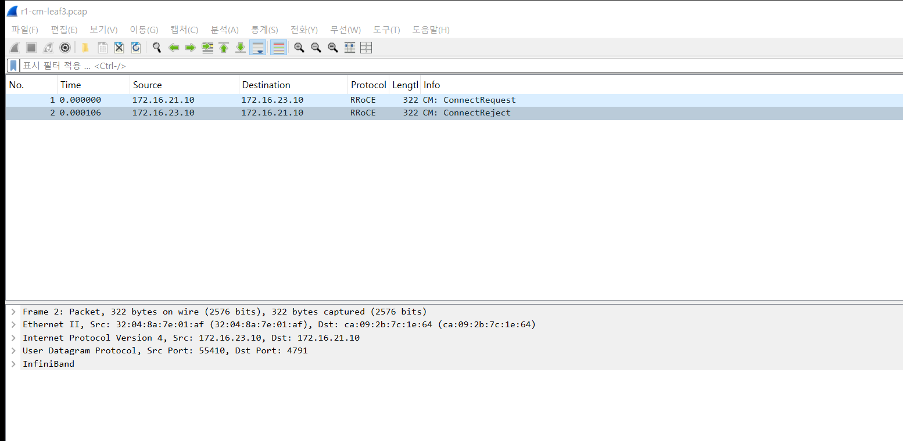
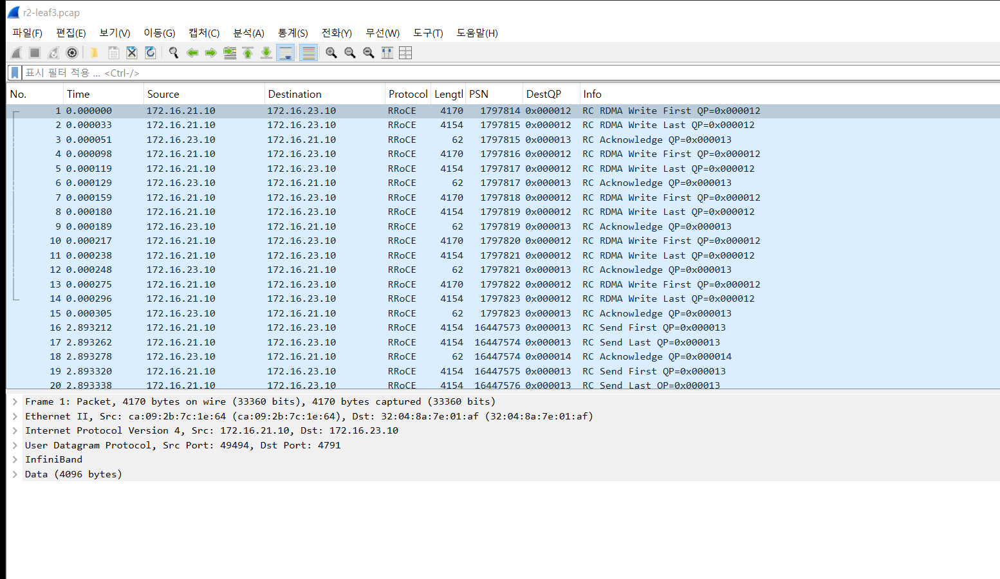
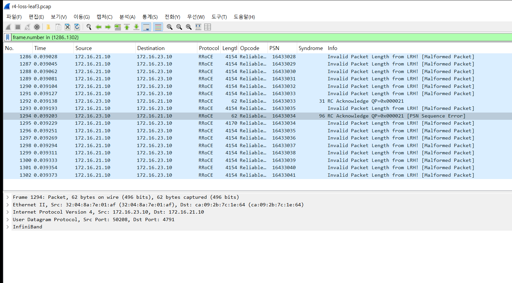
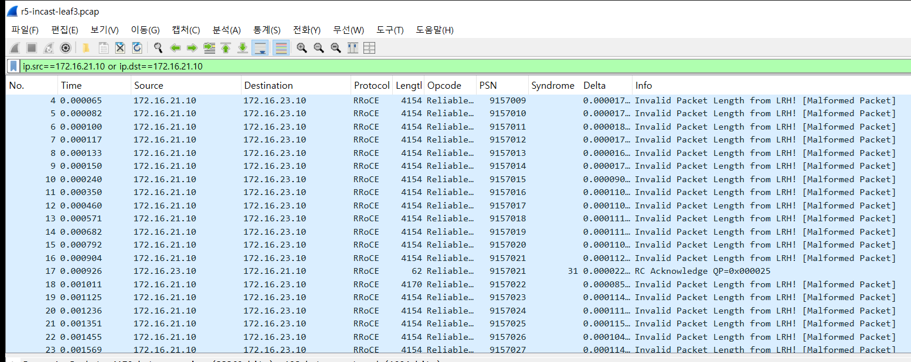

# 12 — RoCEv2: 깔고, 패킷을 보고, 근거를 들어 튜닝하기

Soft-RoCE(rxe)를 WSL 커널에 올리고, GPU 서버 역할의 g1~g4를 leaf 네 대에 하나씩 붙여 RoCEv2 트래픽을 패브릭 위로 흘린다.
설치(R1) → 패킷 해부(R2) → MTU(R3) → 손실(R4) → 인캐스트 튜닝(R5) → ECMP(R6) → 카운터(R7) 순서다.

```
        spine1          spine2
          |  \         /  |
        leaf1 leaf2 leaf3 leaf4        (eBGP 언더레이 그대로)
          |eth5 |     |     |
          g1    g2    g3    g4         g = WSL 기본 네임스페이스의 VRF + rxe 장치
     172.16.21.10 …       172.16.24.10   UDP 4791 (RoCEv2)
```

진짜 RDMA NIC가 아니라 소프트웨어 RoCE라서 절대 속도(1~2 Gb/s)는 CPU가 정한다. 그래서 숫자는 바꾸기 전후 비교로만 읽는다.
PFC는 없고, rxe는 ECN을 찍지도 반응하지도 않는다(캡처에서 DSCP/ECN = 0x00). 즉 이 랩은 손실이 나면 재전송으로 버티는 lossy RoCE다.

## 0단계 — 커널에 rxe 올리기

WSL 커널 6.6.87.2에는 ib_core·ib_uverbs는 모듈로 있지만 `rdma_rxe`가 빠져 있다. 커널을 갈아끼우지 않고 모듈만 빌드했다 ([tools/build-rxe.sh](tools/build-rxe.sh), WSL root 셸에서 직접 실행).

- 소스: Microsoft 공식 태그 `linux-msft-wsl-6.6.87.2`. `MODULE_SIG`는 꺼져 있고 `MODVERSIONS`는 켜져 있어서, 이미 설치된 모듈들이 쓰는 심볼 버전 10,767개를 모아 `Module.symvers`를 만들었다
- 첫 insmod는 `Unknown symbol ib_umem_get` — 그 심볼은 ib_uverbs에 있다. 먼저 올리면 해결
- 장치를 만들 때 `rxe_newlink: failed to add` (ENOENT) — rxe가 ICRC 계산에 쓰는 `crc32` 암호 모듈이 커널에 없다(`CONFIG_CRYPTO_CRC32 is not set`). `crc32_generic`도 같은 방법으로 빌드

그다음 막힌 곳은 netns다. 6.6의 rxe는 경로 찾기와 수신 소켓이 기본 네임스페이스에 고정돼 있다 (`rxe_net.c`의 `ip_route_output_key(&init_net, …)`, `rxe_setup_udp_tunnel(&init_net, …)`).
h서버 컨테이너 안에 rxe를 만들면 장치는 생기지만 패킷은 하나도 나가지 않는다. 그래서 서버를 기본 네임스페이스의 VRF로 만들었다 ([setup.sh](setup.sh)).

- `vgN`(VRF) 에 172.16.2N.10/32, 그 아래 veth `gN` 이 leafN 의 새 포트 eth5 에 꽂힌다. leaf 는 172.16.2N.0/24 를 BGP 로 광고
- rxe 는 veth 가 아니라 **VRF 장치에** 붙인다. VRF 포트로 들어온 패킷은 커널이 수신 장치를 VRF 장치로 바꿔 넘기므로, veth 에 붙인 rxe 는 g3 앞까지 온 패킷을 자기 것으로 못 알아보고 버렸다 (g3 rcvd_pkts 0, g1 재시도만 쌓임)
- local 표 규칙을 VRF 규칙 뒤로 옮긴다. 안 그러면 g1 → g3 이 같은 커널 안이라 패브릭을 안 타고 로컬로 꺾인다

```bash
experiments/12-roce/tools/build-rxe.sh   # 0단계, 직접 실행
experiments/12-roce/setup.sh             # g1~g4 + rxe 장치
experiments/12-roce/run.sh               # R1~R7 (run.sh R4 R5 처럼 일부만도 된다)
experiments/12-roce/restore.sh           # 되돌리기 (모듈은 남긴다)
```

## R1 — 설치와 연결

```
link rxe_g1/1 state ACTIVE physical_state LINK_UP netdev vg1
transport: InfiniBand (0)   active_mtu: 4096 (5)   link_layer: Ethernet
rxe_g1 GID[1] = 0000:0000:0000:0000:0000:ffff:ac10:150a   ← IPv4 172.16.21.10 을 IPv6 모양으로
```

RoCE 장치는 자기를 InfiniBand라고 부르고, 주소(GID)는 IP 주소를 IPv6 모양으로 감싼 것이다. 이더넷 위의 InfiniBand라는 RoCE의 정체가 여기서 그대로 보인다.

연결 수립은 두 가지를 봤다. rdma_cm(`rping`)은 패브릭을 건너 **ConnectRequest → ConnectReject(사유 28)** 로 끝났다. 요청은 g3까지 갔지만, 받는 쪽 rdma_cm이 VRF 안의 주소와 장치를 짝짓지 못해 거절한 것으로 보인다(사유 28은 받는 쪽 소비자가 거절했다는 뜻).
perftest처럼 QP 번호·PSN·rkey를 TCP로 미리 바꿔 두는 방식은 문제없이 동작한다. 그래서 R2부터는 이 방식(`-x 1`, GID 1번)을 쓴다. 첫 전송은 g1 → leaf1 → **spine2** → leaf3 → g3, 1.56 Gb/s였다.



## R2 — 패킷 해부

8KB 메시지를 Write·Send·Read로 5개씩 보냈다 (leaf3:eth5, 패킷 45개 통째로).



| 동작 | 선 위의 모양 | 읽을 것 |
|---|---|---|
| Write | `RDMA Write First`(4170B) → `Write Last`(4154B) → 받는 쪽 `Acknowledge`(62B) | First 에만 RETH 16B(상대 메모리 주소, rkey, 길이)가 붙는다. 받는 쪽 CPU 는 이 메시지가 왔는지도 모른다 |
| Send | `Send First` → `Send Last` → `Acknowledge` | RETH 가 없다. 받는 쪽이 미리 걸어 둔 수신 버퍼에 들어간다 |
| Read | g1 `RDMA Read Request`(74B) → g3 가 데이터를 `Read Response` 로 | 데이터가 요청과 반대 방향으로 흐른다 |

8KB 메시지 하나가 패킷 두 개다. RoCE MTU가 4096이라서다. Write First 4170B = 이더넷 14 + IP 20 + UDP 8 + BTH 12 + RETH 16 + 데이터 4096 + ICRC 4.
PSN은 패킷마다 1씩 오르고, ACK는 메시지 끝 PSN을 돌려준다. 전송 계층(순서 번호, 확인, 재전송)이 TCP처럼 커널이 아니라 NIC(여기서는 rxe)에 있다는 뜻이다.

## R3 — MTU와 메시지 크기

64KB 메시지를 4초씩 보냈다.

| RoCE MTU | 처리량 | 보낸 패킷 |
|---|---|---|
| 1024 | 0.63 Gb/s | 297,269 |
| 2048 | 0.76 Gb/s | 220,873 |
| 4096 | **1.92 Gb/s** | 204,755 |

메시지 크기별(MTU 4096)로는 64B 0.012, 1KB 0.29, 4KB 0.84, 16KB 1.68, 64KB 1.59, 1MB 1.34 Gb/s.

근거: 패킷 하나마다 고정 비용(헤더 74B와 rxe의 패킷 처리)이 든다. MTU를 4배로 키우니 같은 시간에 보낸 패킷 수는 30% 줄었을 뿐인데, 패킷당 데이터가 4배라 처리량이 3배가 됐다.
작은 메시지는 패킷 하나에 데이터가 조금밖에 안 실려서 처리량이 바닥이다. 튜닝 결론은 **RoCE MTU를 경로 MTU가 허락하는 최대(4096)로, 메시지는 16KB 이상**이다.
실제 NIC에서는 병목이 CPU가 아니라 링크라서 차이가 이만큼 크진 않다. 그래도 방향은 같다.

## R4 — 손실 한 번의 값

leaf3 → g3 포트에 무작위 손실을 넣고 같은 경로로 RoCE와 TCP를 5초씩 보냈다.

| 손실 | RoCE | g3 가 보낸 NAK | TCP |
|---|---|---|---|
| 0% | 1.52 Gb/s | 0 | 5.18 Gb/s |
| 0.01% | 1.54 | 18 | 3.34 |
| 0.1% | 1.60 | 210 | 4.67 |
| 1% | **0.38 (-75%)** | 572 | 4.17 (-20%) |

TCP는 회차마다 3.3~5.2로 흔들렸다. 앞선 회차에서는 1% 손실에서도 4.50 → 4.63으로 거의 그대로였다. RoCE는 두 회차 모두 1%에서 무너졌다(1.60 → 0.51, 1.52 → 0.38).



캡처(leaf3:eth5, 손실 지점 뒤)를 보면 이유가 보인다. PSN 16433033 다음에 34가 빠지고 35가 도착한다(1293번). g3는 바로 `Acknowledge [PSN Sequence Error]` NAK을 PSN 34로 보내고(1294번), g1은 **34부터 다시** 보낸다(1295번~). 이미 받은 35도 다시 온다.
이것이 go-back-N이다. TCP는 SACK으로 빠진 조각만 다시 보내지만, RoCE의 RC 전송은 빠진 지점부터 전부 다시 보낸다. 빨리 보내려고 전송 계층을 단순하게 만든 값이다.

손실 0%에서도 재시도가 63번, 중복 수신이 496번 있었다. 패브릭에서 버려진 패킷은 없으니 g3가 이미 받은 것을 g1이 다시 보낸 것이다. Soft-RoCE가 CPU 두 개를 나눠 쓰느라 ACK가 늦게 와서 송신 타이머가 먼저 터진 것으로 보인다.

## R5 — 인캐스트와 튜닝

g1·g2·g4가 동시에 g3로 보낸다. leaf3 → g3 포트를 300Mbit로 묶고(tc tbf), 큐(버퍼) 크기와 송신 쪽 설정을 바꿔 가며 6초씩 쟀다. ping은 같은 큐를 지나는 g1 → g3이다.
아래 표는 재전송 타이머 튜닝을 더해 R5만 다시 돌린 회차다. 이 회차는 WSL 전체가 느려서(혼자 보낼 때 0.74 Gb/s, TCP 1.9 Gb/s) 전체 실행 때보다 모든 값이 낮지만, 300Mbit 포트를 채우기에는 충분하다.

| 설정 | 세 대 합계 | 큐 드랍 | g3 NAK | 송신측 재전송 | ping |
|---|---|---|---|---|---|
| 버퍼 16KB (64KB 메시지) | **26 Mbit** (포트의 9%) | 28,271 | 497 | 604 | 0.28ms |
| 버퍼 64KB (64KB 메시지) | 29 Mbit | 33,432 | 399 | 504 | 0.38ms |
| 버퍼 512KB (64KB 메시지) | 135 Mbit | 38,334 | 495 | 544 | 10.7ms |
| 버퍼 4MB (64KB 메시지) | 294 Mbit | 0 | 4 | 2 | **39.7ms** |
| 64KB + 속도 제한 90M×3, burst 기본값 | 73 Mbit | 24,978 | 630 | 816 | 0.45ms |
| 64KB + 속도 제한 90M×3, burst 1 | 91 Mbit | 0 | 0 | 6 | 0.12ms |
| 64KB + 속도 제한 100M×3, burst 1 | 67 Mbit | 13,368 | 400 | 535 | 0.13ms |
| 64KB + 재전송 타이머 4.2ms (`-u 10`) | 83 Mbit | 112,231 | 1,760 | 2,942 | 1.21ms |
| 64KB + 재전송 타이머 1.0ms (`-u 8`) | 74 Mbit | 120,498 | 1,804 | 3,082 | 1.25ms |
| **64KB + 송신 창 4 (`-t 4`)** | **227 Mbit** | **0** | 12 | 12 | **0.16ms** |
| 64KB + 송신 창 16 | 204 Mbit | 1,254 | 237 | 324 | 0.11ms |

메시지 크기를 적지 않은 줄은 4KB 메시지다. 앞선 전체 실행에서는 같은 설정이 버퍼 16KB 19Mbit, 4MB 298Mbit·ping 41ms, 송신 창 4 **275Mbit(포트의 92%)·드랍 0**이었다 ([capture/run-output.txt](capture/run-output.txt)의 R5는 다시 돌린 회차로 바뀌어 있다).



캡처는 전체 실행 회차의 버퍼 64KB 구간이다(leaf3:eth5 앞 3,000패킷). g1만 골라 보면 패킷 사이가 **약 65ms씩 16번** 비고, 그 시간을 합치면 1,155ms 중 1,049ms다. g2·g4도 각각 72%, 84%를 멈춰 있었다.
NAK을 받으면 바로 다시 보내지만, 다시 보낸 패킷도 넘치는 큐에서 또 버려지면 송신자는 재전송 타이머가 터질 때까지 기다린다. 65ms는 perftest 기본 QP 타임아웃 `-u 14`(4.096µs × 2¹⁴ = 67ms)와 맞는다.
그래서 큐가 얕을수록 처리량이 무너진다. 포트는 놀고 있는데 송신자 셋이 모두 타이머를 기다리는 혼잡 붕괴다.

튜닝은 이 근거에서 나왔다.

1. **타이머를 줄인다** — 멈춘 시간이 타이머라면 타이머를 줄이면 될 것 같다. 4.2ms·1ms로 줄였더니 처리량은 74~83Mbit로 거의 그대로였고, 큐 드랍은 11~12만 개로 4배, 재전송은 3천 번으로 3.6배가 됐다(같은 4KB 메시지인 burst 기본값 줄과 비교). 넘치는 큐에 더 빨리 다시 밀어 넣었을 뿐이다. 타이머는 증상이고 원인은 큐 넘침이다.
2. **버퍼를 키운다** — 4MB에서 드랍 0, 294Mbit. 하지만 큐에 데이터가 쌓여 ping이 0.4ms에서 40ms로 100배 늘었다. 지연에 민감한 집단 통신(all-reduce)에는 나쁜 답이다.
3. **송신 속도를 제한한다** — perftest의 SW 제한은 기본으로 메시지를 몰아서 보내서, 평균은 90Mbit여도 순간 버스트가 64KB 큐를 넘쳤다(드랍 24,978). `--burst_size=1`로 패킷마다 간격을 두자 드랍이 0이 됐다. 다만 합계가 91Mbit(전체 실행 회차는 138Mbit)로 포트의 절반도 못 썼다. 소프트웨어 페이싱이 CPU를 나눠 쓰며 목표 속도를 못 낸 것이다. 목표를 포트 속도에 딱 맞춘 100M×3은 순간적으로 넘쳐 다시 드랍이 났다.
4. **동시에 띄우는 양을 버퍼에 맞춘다** — 버퍼 64KB ÷ (송신자 3대 × 4KB 메시지) ≈ 5이므로 한 대가 동시에 띄우는 메시지를 4개로 묶었다(`-t 4`). 큐가 넘칠 수 없으니 드랍 0, ping 0.16ms에 합계 227Mbit(전체 실행 회차 275Mbit, 92%)로 가장 좋았다. 창을 16으로 키우면 다시 드랍과 NAK이 생긴다.

진짜 RoCE 패브릭에서는 4번의 역할을 DCQCN(ECN 표시 → CNP → 송신 속도 감소)이, 2번의 손실 방지를 PFC가 한다. rxe에는 둘 다 없어서 송신 창으로 같은 효과를 손으로 냈다.
따로 만든 흉내 랩(roce-fabric, 파이썬으로 RoCE 패킷 모양을 만든 랩)의 DCQCN 결과(손실 0, 52/60Mbps)와 나란히 보면 DCQCN이 하는 일이 바로 이 창 조절이다.

## R6 — ECMP 엔트로피

g1 → g3에 QP를 1~16개 열고 leaf1이 스파인 두 링크로 내보낸 바이트를 셌다.

| QP | 해시 정책 0 (IP만) spine1 : spine2 | 해시 정책 1 (IP + UDP 포트) spine1 : spine2 |
|---|---|---|
| 1 | 0 : 952MB | 807 : 0 |
| 2 | 0 : 893 | 840 : 0 |
| 4 | 0 : 855 | 451 : 456 |
| 8 | 0 : 764 | 110 : 781 |
| 16 | 0 : 784 | 620 : 212 |

QP마다 UDP 출발 포트가 다르다(QP 8개 → 57452, 57636, 57822 … 58782, 캡처 `r6-qp8-pol1-leaf1.pcap`). rxe가 QP 번호의 해시로 출발 포트를 정하기 때문이다. RoCE에서 흐름을 가르는 엔트로피는 이 포트 하나뿐이다.
이 랩의 leaf는 기본값인 해시 정책 0이라 IP만 본다. 그래서 QP를 16개 열어도 전부 spine2로 갔다. 정책 1로 바꾸자 갈리기 시작했지만, QP 2개는 둘 다 한쪽(50% 확률로 겹침), QP 8개도 110:781로 한쪽이 무거웠다. 흐름이 적고 굵으면 해시로는 고르게 나뉘지 않는다.
튜닝 결론은 **해시에 L4 포트를 넣고, QP를 링크 수보다 충분히 많이** 여는 것이다. 처리량 합계가 늘지 않은 건 이 랩의 병목이 링크가 아니라 CPU라서다.

## R7 — 카운터: 패브릭 모니터링이 못 보는 것

실험 전체가 끝난 뒤의 누적값이다.

```
g3  rcvd_pkts=4945348  out_of_seq_request=3581  duplicate_request=8224
g1  sent_pkts=4817833  completer_retry_err=2598  (g2 1103, g4 1152)
leaf1~4:eth5  tx_dropped=0  rx_dropped=0          ← 모니터링 수집기가 읽는 값
```

R5에서 큐 드랍이 20만 개 넘게 났는데 패브릭 쪽 인터페이스 카운터는 전부 0이다. tc qdisc 드랍은 `tx_dropped`에 잡히지 않는다(실험 10 마이크로버스트와 같은 맹점).
대신 서버의 rxe 카운터에는 남는다. 받는 쪽 `out_of_seq_request`(= 보낸 NAK 수)와 보내는 쪽 `completer_retry_err`(= 재전송 횟수)다. RoCE 패브릭을 관측하려면 스위치 카운터만으로는 부족하고, NIC의 재전송·NAK 카운터를 같이 모아야 한다.
그래서 수집기에 4차 지표를 붙였다([monitoring/exporter/collector.py](../../monitoring/exporter/collector.py)). 수집기 컨테이너 안에서는 rxe 장치 이름만 보이고 카운터 파일은 안 보여서, 기본 네임스페이스에서 도는 도구 상자(rtool)에 docker exec로 들어가 읽는다.

| 지표 | 뜻 |
|---|---|
| `clos_rdma_sent_pkts_total`, `clos_rdma_rcvd_pkts_total` | 보낸·받은 RoCE 패킷 |
| `clos_rdma_out_of_seq_request_total` | 받는 쪽이 순서가 어긋나 보낸 NAK |
| `clos_rdma_duplicate_request_total` | 받는 쪽이 이미 받은 것을 또 받음 (불필요한 재전송) |
| `clos_rdma_completer_retry_err_total`, `clos_rdma_rcvd_seq_err_total` | 보내는 쪽 재전송, 받은 NAK |
| `clos_rdma_retry_exceeded_err_total` | 재전송 한도를 넘겨 QP 가 끊김 |

알람은 두 개다. `RoceRetransmitting`은 30초 동안 보낸 패킷 대비 재전송 비율이 0.2%를 넘으면 울린다. 실측으로 손실 0%에서 0.03%(Soft-RoCE의 타이머 재전송), 0.1% 손실에서 0.1%, 1% 손실에서 1%였다. `RoceQPFailed`는 재전송 한도 초과가 한 번이라도 나면 울린다.
지표가 나오는 것(장치별 7개)과 Prometheus가 규칙을 읽은 것까지 확인했다. 인캐스트 중에 실제로 울리는지 보려던 회차는 아래 문제로 WSL이 멈춰서 확인하지 못했다.

## 결론

WSL 커널에 빠진 모듈 두 개(rdma_rxe, crc32_generic)를 빌드해 올리고, rxe가 netns를 모르는 문제는 서버를 VRF로 만들어 피했다. 그러자 RoCEv2 패킷이 실제 eBGP 패브릭을 건넜다.
Wireshark에서 보면 RoCE는 UDP 4791 안에 InfiniBand 전송 헤더(BTH)를 넣은 것이다. 순서 번호(PSN), 확인(ACK), 재전송이 전부 NIC에 있다. Write는 상대 메모리 주소와 열쇠(rkey)를 패킷에 실어 받는 쪽 CPU를 거치지 않는다.

그 빠른 길의 값은 손실이다. 1% 손실에 TCP는 거의 그대로였는데 RoCE는 75% 떨어졌다. 빠진 패킷 하나 때문에 그 뒤를 전부 다시 보내기 때문이다.
인캐스트에서 큐가 얕으면 더 나빠서, 300Mbit 포트에 세 대가 19~26Mbit밖에 못 보냈다. 캡처를 보면 송신자들이 시간의 72~91%를 65ms 재전송 타이머만 기다리고 있었다.
그렇다고 타이머를 줄이면 넘치는 큐에 더 빨리 다시 밀어 넣을 뿐이라 드랍만 4배가 됐다. 버퍼를 4MB로 키우면 드랍은 사라지지만 지연이 100배 늘었다.
버퍼 크기에 맞춰 송신 창을 4로 묶으니 드랍 없이 포트의 76~92%를 쓰면서 지연도 0.2~0.3ms에 머물렀다. 실제 RoCE 패브릭에서 PFC와 DCQCN이 하는 일을 손으로 해 본 셈이다.

다음에 RoCE가 느리면 처리량보다 먼저 NIC의 NAK·재전송 카운터와 스위치 큐 드랍을 본다. 그다음 캡처에서 PSN Sequence Error 뒤에 수십 ms씩 비는 구간이 있는지 확인한다. 그런 구간이 있으면 원인은 링크 속도가 아니라 손실과 재전송 타이머다.
흐름이 한 스파인에 몰리면 QP마다 다른 UDP 출발 포트를 리프 해시가 보고 있는지부터 확인한다.

## 알려진 문제 — rxe 장치를 막 만든 직후 WSL 이 멈춘다

`setup.sh`로 rxe 장치를 새로 만들고 곧바로 측정하면, 첫 전송이 실패하고 잠시 뒤 WSL 전체가 응답하지 않는 일이 여섯 번 중 세 번 있었다(`Wsl/Service/0x8007274c`, `HCS_E_CONNECTION_TIMEOUT`). 커널 로그는 오류 없이 그냥 끊긴다.
장치를 만든 지 시간이 지난 뒤 단계별로 따로 돌린 측정(R1~R6, 열 번 남짓)은 한 번도 멈추지 않았다. 직접 빌드한 rxe 모듈(심볼 버전을 끌어모아 맞춘 out-of-tree 빌드)이 원인일 가능성이 크지만 확인하지 못했다.
`setup.sh` 뒤 첫 `ib_write_bw`가 실패하면 그대로 이어 가지 말고 `wsl --shutdown`으로 다시 시작하는 편이 낫다.

## 남은 것

- 위의 멈춤 원인 찾기. 커널 전체를 같은 설정으로 빌드해 모듈 짝을 정확히 맞추면 사라지는지부터 본다
- `RoceRetransmitting` 알람이 인캐스트 중 실제로 울리는지 확인
- 커널 6.6의 rxe는 netns를 모른다. 컨테이너 안에서 RoCE를 쓰려면 더 새 커널이 필요하다
